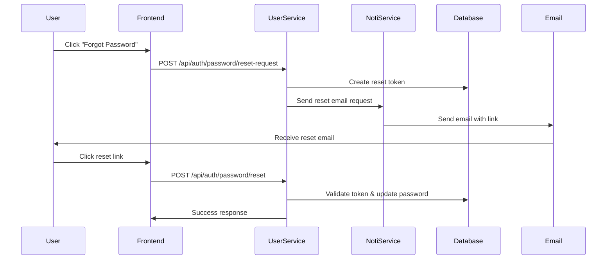

# Password Reset Implementation Plan

## Executive Summary
비밀번호 재설정 기능은 기존의 user-service와 noti-service를 활용하여 구현 가능합니다. user-service에는 이미 관리자용 비밀번호 재설정 기능이 일부 구현되어 있고, noti-service에는 이메일 발송 인프라가 구축되어 있습니다.

## Current State Analysis

### 1. Noti-Service Email Infrastructure ✅
**Location**: `/noti-service/src/main/java/com/asyncsite/notiservice/adapter/out/notification/EmailNotificationSender.java`

**Existing Capabilities**:
- Spring Mail 설정 완료 (Gmail SMTP)
- Thymeleaf 템플릿 엔진 연동
- 비동기 이메일 발송 (`CompletableFuture`)
- 템플릿 기반 HTML 이메일 지원

**Configuration** (`application.yml`):
```yaml
spring:
  mail:
    host: smtp.gmail.com
    port: 587
    username: ${MAIL_USERNAME:}
    password: ${MAIL_PASSWORD:}
```

### 2. User-Service Password Reset Components ⚠️

#### Admin Module (Partial Implementation)
**Location**: `/user-service/src/main/kotlin/com/asyncsite/userservice/admin/`

**Existing Components**:
- `ResetUserPasswordUseCase`: 관리자가 사용자 비밀번호 재설정
- `TemporaryPassword.generate()`: 임시 비밀번호 생성
- `EmailNotificationAdapter`: 이메일 발송 인터페이스 (미구현)

**Current Flow**:
1. 관리자가 특정 사용자의 비밀번호 재설정 요청
2. 임시 비밀번호 생성 및 DB 업데이트
3. 이메일 발송 (현재는 로그만 출력)

#### Auth Module (No Implementation) ❌
- 일반 사용자용 비밀번호 재설정 엔드포인트 없음
- 토큰 기반 재설정 플로우 미구현

## Implementation Requirements

### 1. User-Service Auth Module Enhancements

#### New Components Needed:
```kotlin
// Domain Layer
data class PasswordResetToken(
    val token: String,
    val userId: String,
    val expiresAt: LocalDateTime,
    val used: Boolean = false
)

// Application Port
interface RequestPasswordResetUseCase {
    fun requestPasswordReset(email: String): Result<Unit>
}

interface ResetPasswordWithTokenUseCase {
    fun resetPassword(token: String, newPassword: String): Result<Unit>
}

// Web Adapter
@RestController
@RequestMapping("/api/auth")
class PasswordResetController {
    @PostMapping("/password/reset-request")
    fun requestReset(@RequestBody request: PasswordResetRequest)
    
    @PostMapping("/password/reset")
    fun resetPassword(@RequestBody request: ResetPasswordRequest)
}
```

### 2. Service Integration Architecture



### 3. Integration Options

#### Option A: Direct HTTP Integration (Recommended) ✅
- User-Service calls Noti-Service via REST API
- Simple implementation using Spring WebClient
- Synchronous confirmation of email sent

**Pros**:
- Simple to implement
- Clear error handling
- No additional infrastructure

**Cons**:
- Tight coupling between services
- Network dependency

#### Option B: Event-Driven Integration (Future Enhancement) 
- User-Service publishes password reset event
- Noti-Service subscribes and sends email
- Requires message broker (Kafka/RabbitMQ)

**Pros**:
- Loose coupling
- Better scalability
- Resilient to service failures

**Cons**:
- Complex infrastructure
- Eventual consistency
- Requires message broker setup

## Implementation Steps

### Phase 1: Core Functionality (3-4 days)
1. **User-Service: Create Password Reset Domain**
   - PasswordResetToken entity
   - Token generation and validation logic
   - Expiration handling (24 hours)

2. **User-Service: Implement Reset Request Endpoint**
   - `/api/auth/password/reset-request`
   - Validate email exists
   - Generate secure token
   - Store in database

3. **Noti-Service: Create Password Reset Template**
   - HTML email template with reset link
   - Styling consistent with brand
   - Clear instructions for users

4. **User-Service: Integrate with Noti-Service**
   - HTTP client configuration
   - Error handling and retry logic
   - Logging for audit trail

5. **User-Service: Implement Reset Confirmation Endpoint**
   - `/api/auth/password/reset`
   - Token validation
   - Password update
   - Token invalidation

### Phase 2: Frontend Integration (2 days)
1. **Password Reset Request Page**
   - Email input form
   - Success/error messaging
   - Rate limiting display

2. **Password Reset Confirmation Page**
   - New password input
   - Password strength validation
   - Success redirect to login

### Phase 3: Security Enhancements (2 days)
1. **Rate Limiting**
   - Max 3 requests per email per hour
   - IP-based limiting

2. **Token Security**
   - Cryptographically secure token generation
   - One-time use enforcement
   - Audit logging

3. **Email Security**
   - Link expiration display
   - Security warnings
   - Account activity notification

## Database Schema Changes

### User-Service Database
```sql
CREATE TABLE password_reset_tokens (
    id VARCHAR(36) PRIMARY KEY,
    user_id VARCHAR(36) NOT NULL,
    token VARCHAR(255) NOT NULL UNIQUE,
    expires_at TIMESTAMP NOT NULL,
    used BOOLEAN DEFAULT FALSE,
    created_at TIMESTAMP DEFAULT CURRENT_TIMESTAMP,
    used_at TIMESTAMP NULL,
    ip_address VARCHAR(45),
    user_agent TEXT,
    FOREIGN KEY (user_id) REFERENCES users(id),
    INDEX idx_token (token),
    INDEX idx_expires (expires_at)
);
```

## API Specifications

### Request Password Reset
```http
POST /api/auth/password/reset-request
Content-Type: application/json

{
  "email": "user@example.com"
}

Response:
{
  "success": true,
  "message": "비밀번호 재설정 링크가 이메일로 발송되었습니다."
}
```

### Reset Password with Token
```http
POST /api/auth/password/reset
Content-Type: application/json

{
  "token": "secure-reset-token",
  "newPassword": "NewSecure@Password123"
}

Response:
{
  "success": true,
  "message": "비밀번호가 성공적으로 변경되었습니다."
}
```

## Email Template Example
```html
<!DOCTYPE html>
<html xmlns:th="http://www.thymeleaf.org">
<head>
    <title>비밀번호 재설정</title>
</head>
<body>
    <h2>AsyncSite 비밀번호 재설정</h2>
    <p>안녕하세요, <span th:text="${userName}">사용자</span>님</p>
    <p>비밀번호 재설정을 요청하셨습니다. 아래 버튼을 클릭하여 새 비밀번호를 설정하세요.</p>
    
    <a th:href="${resetLink}" style="display: inline-block; padding: 10px 20px; background-color: #007bff; color: white; text-decoration: none; border-radius: 5px;">
        비밀번호 재설정
    </a>
    
    <p>이 링크는 24시간 동안 유효합니다.</p>
    <p>비밀번호 재설정을 요청하지 않으셨다면 이 이메일을 무시하세요.</p>
    
    <hr>
    <small>이 이메일은 자동으로 발송되었습니다. 회신하지 마세요.</small>
</body>
</html>
```

## Configuration Requirements

### Environment Variables
```bash
# User-Service
NOTI_SERVICE_URL=http://localhost:8089
PASSWORD_RESET_TOKEN_EXPIRY_HOURS=24
PASSWORD_RESET_RATE_LIMIT=3

# Noti-Service
MAIL_USERNAME=asyncsite@gmail.com
MAIL_PASSWORD=app-specific-password
FRONTEND_URL=http://localhost:3000
```

## Testing Strategy

### Unit Tests
- Token generation and validation
- Password update logic
- Email template rendering

### Integration Tests
- End-to-end reset flow
- Service communication
- Database transactions

### Security Tests
- Token uniqueness
- Expiration enforcement
- Rate limiting
- SQL injection prevention

## Monitoring & Logging

### Key Metrics
- Password reset requests per hour
- Success/failure rates
- Average time to reset
- Email delivery success rate

### Audit Logging
- All reset requests with IP/User-Agent
- Token usage attempts
- Password change events
- Failed validation attempts

## Risk Analysis

### Security Risks
- **Token Leakage**: Mitigated by HTTPS, expiration, one-time use
- **Email Hijacking**: Mitigated by account activity notifications
- **Brute Force**: Mitigated by rate limiting, token complexity

### Operational Risks
- **Email Service Failure**: Need fallback mechanism or queue
- **Service Communication**: Circuit breaker pattern recommended
- **Database Load**: Index optimization required

## Timeline Estimate

| Phase | Duration | Dependencies |
|-------|----------|--------------|
| Phase 1: Core Functionality | 3-4 days | Database access, Service deployment |
| Phase 2: Frontend Integration | 2 days | Phase 1 completion |
| Phase 3: Security Enhancements | 2 days | Phase 1 & 2 completion |
| Testing & Deployment | 1-2 days | All phases complete |
| **Total** | **8-10 days** | |

## Conclusion

비밀번호 재설정 기능은 기존 인프라를 활용하여 구현 가능합니다:

1. **Noti-Service**: 이메일 발송 인프라 준비 완료
2. **User-Service**: 도메인 로직 부분 구현
3. **필요 작업**: 두 서비스 연동 및 사용자용 엔드포인트 구현

권장 구현 방식은 HTTP 기반 직접 통신으로 시작하여, 추후 이벤트 기반으로 전환하는 것입니다.