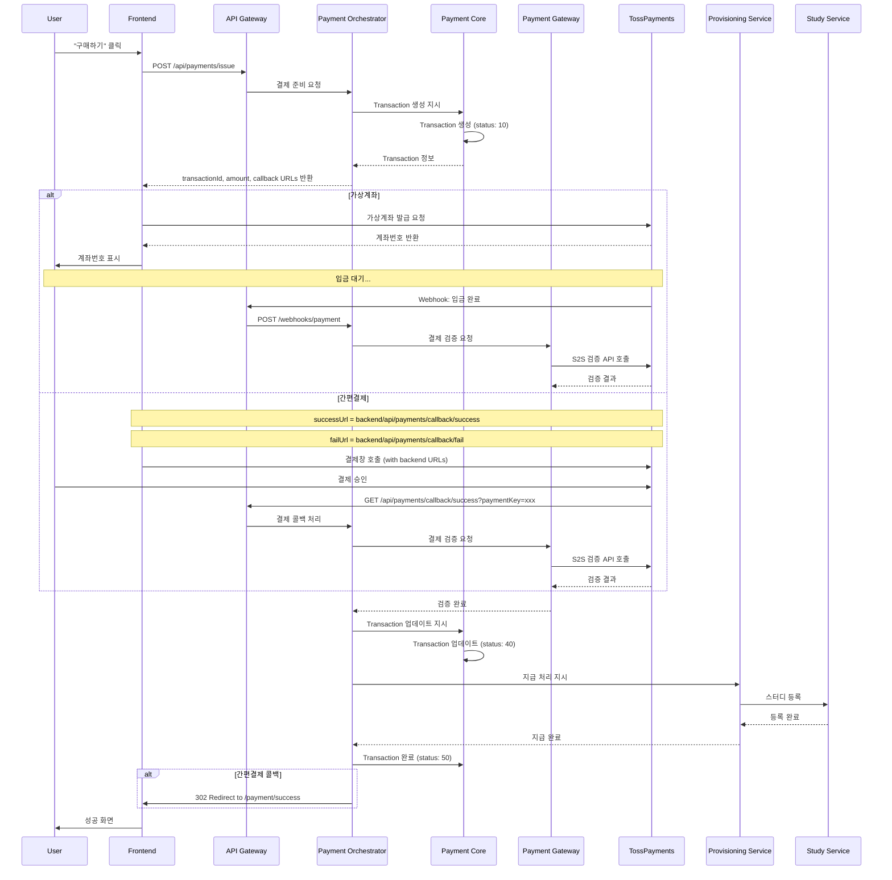

# AsyncSite Payment System Architecture

## 1. Overview

AsyncSite의 결제 시스템은 마이크로서비스 아키텍처 기반으로 설계되었으며, 디지털 상품(스터디, AI 이력서 등)의 즉시 제공을 위해 최적화되었습니다.

### Core Principles
- **Orchestration-based**: Payment Orchestrator가 전체 플로우 제어
- **Transaction-based**: 주문(Order)보다 트랜잭션(Transaction) 중심
- **Two-phase Payment**: Issue(준비) → Purchase(실행) 단계 분리
- **S2S Verification**: 모든 결제 검증은 서버 간 직접 통신
- **State Machine**: 숫자 기반 상태 관리 (10, 40, 50...)

## 2. User Flow



## 3. Backend Architecture

### 3.1 Service Structure

```
┌─────────────────────────────────────────────────────────┐
│                     API Gateway                         │
│                  (Spring Cloud Gateway)                 │
└────────────────────┬────────────────────────────────────┘
                     │
                     ▼
        ┌───────────────────────────┐
        │   Payment Orchestrator    │ ← 전체 플로우 제어
        │       (지휘자 역할)         │
        └───────────┬───────────────┘
                    │
      ┌─────────────┼─────────────┬─────────────┐
      ▼             ▼             ▼             ▼
┌──────────┐  ┌──────────────┐  ┌─────────────┐  ┌──────────┐
│ Payment  │  │Payment Gateway│  │Provisioning │  │Settlement│
│  Core    │  │   Service     │  │   Service   │  │ Service  │
│ Service  │  │               │  │             │  │          │
└──────────┘  └──────────────┘  └─────────────┘  └──────────┘
      │              │                  │              │
      └──────────────┴──────────────────┴──────────────┘
                            │
                     ┌──────┴──────┐
                     │   Database  │
                     │   (MySQL)    │
                     └─────────────┘
```

### 3.2 Service Responsibilities

#### Payment Orchestrator (신규 - 핵심)
- **전체 결제 플로우 제어**
- 서비스 간 조율 및 순서 보장
- 트랜잭션 일관성 관리
- SAGA 패턴 구현
- 실패 시 보상 트랜잭션 처리
- 상태 기반 워크플로우 실행

#### Payment Core Service
- Transaction 생명주기 관리
- 상태 전이 검증
- 비즈니스 규칙 적용
- Transaction 데이터 저장

#### Payment Gateway Service  
- PG사 어댑터 관리 (토스, 카카오페이, 네이버페이)
- **S2S API 통신 및 검증**
- Webhook 처리
- Callback URL 처리
- 응답 표준화

#### Provisioning Service
- 상품별 지급 로직
- 스터디 등록
- AI 이력서 크레딧 충전
- 지급 실패 처리

#### Settlement Service
- 정산 계산
- 수수료 처리
- 판매자 송금 관리

## 4. Transaction State Machine

### 4.1 State Definitions

| Status | Name | Description |
|--------|------|-------------|
| 10 | CREATED | 트랜잭션 생성됨 |
| 30 | PAYMENT_PENDING | 결제 대기 중 |
| 40 | PAYMENT_SUCCESS | 결제 성공 |
| 41 | PAYMENT_FAILED | 결제 실패 |
| 45 | PROVISION_PENDING | 지급 대기 중 |
| 50 | PROVISION_SUCCESS | 지급 완료 |
| 51 | PROVISION_FAILED | 지급 실패 |
| 90 | REFUND_REQUESTED | 환불 요청 |
| 95 | REFUNDED | 환불 완료 |

### 4.2 State Transitions

```
10 (CREATED) 
    → 30 (PAYMENT_PENDING)
        → 40 (PAYMENT_SUCCESS) → 45 (PROVISION_PENDING) → 50 (PROVISION_SUCCESS)
        → 41 (PAYMENT_FAILED)                          → 51 (PROVISION_FAILED)
                                                             ↓
                                                        90 (REFUND_REQUESTED)
                                                             ↓
                                                        95 (REFUNDED)
```

## 5. API Specifications

### 5.1 Payment Issue (결제 준비)

```http
POST /api/payments/issue
Content-Type: application/json
Authorization: Bearer {token}

{
  "productType": "STUDY",
  "productId": "study_123",
  "amount": 50000,
  "metadata": {
    "studyName": "테코테코 3기",
    "userId": "user_456"
  }
}

Response:
{
  "transactionId": "TXN_2024_000123",
  "amount": 50000,
  "status": 10,
  "successUrl": "https://api.asyncsite.com/api/payments/callback/success",
  "failUrl": "https://api.asyncsite.com/api/payments/callback/fail",
  "expiresAt": "2024-11-25T12:00:00Z"
}
```

### 5.2 Payment Callback (S2S 검증) - 간편결제

```http
GET /api/payments/callback/success
Query Parameters:
  - paymentKey: toss_payment_key_xxx
  - orderId: TXN_2024_000123
  - amount: 50000

Processing (Backend):
1. Orchestrator가 Payment Gateway Service 호출
2. Payment Gateway가 TossPayments S2S API로 검증
3. 검증 성공 시 Transaction 상태 업데이트
4. Frontend로 302 Redirect

Response:
HTTP/1.1 302 Found
Location: https://asyncsite.com/payment/success?orderId=TXN_2024_000123
```

### 5.3 Payment Callback (실패)

```http
GET /api/payments/callback/fail
Query Parameters:
  - code: PAY_PROCESS_CANCELED
  - message: 사용자가 결제를 취소했습니다
  - orderId: TXN_2024_000123

Response:
HTTP/1.1 302 Found
Location: https://asyncsite.com/payment/fail?code=PAY_PROCESS_CANCELED
```

### 5.4 Webhook Handler (가상계좌)

```http
POST /webhooks/payments/toss
Content-Type: application/json
X-Toss-Signature: {signature}

{
  "eventType": "PAYMENT.DONE",
  "transactionId": "TXN_2024_000123",
  "orderId": "TXN_2024_000123",
  "status": "DONE"
}

Processing (Backend):
1. Signature 검증
2. Orchestrator 호출
3. Payment Gateway Service로 S2S 검증
4. Transaction 상태 업데이트
5. Provisioning 트리거
```

## 6. Database Schema (MySQL)

### 6.1 Transaction Table

```sql
CREATE TABLE transactions (
    id CHAR(36) PRIMARY KEY,  -- UUID
    transaction_id VARCHAR(50) UNIQUE NOT NULL,
    user_id VARCHAR(50) NOT NULL,
    product_type VARCHAR(20) NOT NULL,
    product_id VARCHAR(50) NOT NULL,
    amount DECIMAL(10,2) NOT NULL,
    status INT NOT NULL,
    payment_method VARCHAR(20),
    payment_provider VARCHAR(20),
    payment_key VARCHAR(100),
    metadata JSON,  -- MySQL 5.7+ JSON type
    created_at TIMESTAMP DEFAULT CURRENT_TIMESTAMP,
    updated_at TIMESTAMP DEFAULT CURRENT_TIMESTAMP ON UPDATE CURRENT_TIMESTAMP,
    expires_at TIMESTAMP NULL,
    completed_at TIMESTAMP NULL,
    INDEX idx_status (status),
    INDEX idx_user_id (user_id),
    INDEX idx_created_at (created_at),
    INDEX idx_transaction_id (transaction_id)
) ENGINE=InnoDB DEFAULT CHARSET=utf8mb4 COLLATE=utf8mb4_unicode_ci;
```

### 6.2 Transaction History Table

```sql
CREATE TABLE transaction_history (
    id CHAR(36) PRIMARY KEY,
    transaction_id VARCHAR(50) NOT NULL,
    status INT NOT NULL,
    message TEXT,
    metadata JSON,
    created_at TIMESTAMP DEFAULT CURRENT_TIMESTAMP,
    FOREIGN KEY (transaction_id) REFERENCES transactions(transaction_id),
    INDEX idx_transaction_id (transaction_id),
    INDEX idx_created_at (created_at)
) ENGINE=InnoDB DEFAULT CHARSET=utf8mb4 COLLATE=utf8mb4_unicode_ci;
```

### 6.3 Orchestration Saga Table

```sql
CREATE TABLE payment_saga (
    id CHAR(36) PRIMARY KEY,
    transaction_id VARCHAR(50) NOT NULL,
    saga_state VARCHAR(50) NOT NULL,  -- STARTED, COMPENSATING, COMPLETED, FAILED
    current_step VARCHAR(100),
    completed_steps JSON,  -- ["CREATE_TRANSACTION", "VERIFY_PAYMENT", ...]
    compensation_steps JSON,
    error_message TEXT,
    created_at TIMESTAMP DEFAULT CURRENT_TIMESTAMP,
    updated_at TIMESTAMP DEFAULT CURRENT_TIMESTAMP ON UPDATE CURRENT_TIMESTAMP,
    FOREIGN KEY (transaction_id) REFERENCES transactions(transaction_id),
    INDEX idx_transaction_id (transaction_id),
    INDEX idx_saga_state (saga_state)
) ENGINE=InnoDB DEFAULT CHARSET=utf8mb4 COLLATE=utf8mb4_unicode_ci;
```

## 7. Clean Architecture Implementation

### 7.1 Package Structure

#### Payment Orchestrator Service
```
com.asyncsite.orchestrator/
├── adapter/
│   ├── in/
│   │   └── web/
│   │       ├── PaymentOrchestratorController.kt
│   │       └── PaymentCallbackController.kt
│   └── out/
│       ├── service/
│       │   ├── PaymentCoreAdapter.kt
│       │   ├── PaymentGatewayAdapter.kt
│       │   └── ProvisioningAdapter.kt
│       └── persistence/
│           └── SagaPersistenceAdapter.kt
├── application/
│   ├── port/
│   │   ├── in/
│   │   │   ├── OrchestatePaymentUseCase.kt
│   │   │   └── HandleCallbackUseCase.kt
│   │   └── out/
│   │       ├── PaymentCorePort.kt
│   │       ├── PaymentGatewayPort.kt
│   │       └── ProvisioningPort.kt
│   ├── service/
│   │   └── PaymentOrchestratorService.kt
│   └── saga/
│       ├── PaymentSaga.kt
│       └── CompensationHandler.kt
└── domain/
    ├── SagaState.kt
    └── WorkflowStep.kt
```

#### Payment Core Service
```
com.asyncsite.payment.core/
├── adapter/
│   ├── in/
│   │   └── grpc/
│   │       └── PaymentCoreGrpcService.kt
│   └── out/
│       └── persistence/
│           ├── TransactionPersistenceAdapter.kt
│           └── TransactionJpaEntity.kt
├── application/
│   ├── port/
│   │   ├── in/
│   │   │   ├── CreateTransactionUseCase.kt
│   │   │   └── UpdateTransactionUseCase.kt
│   │   └── out/
│   │       ├── LoadTransactionPort.kt
│   │       └── SaveTransactionPort.kt
│   └── service/
│       └── TransactionService.kt
└── domain/
    ├── Transaction.kt
    ├── TransactionStatus.kt
    └── TransactionStateMachine.kt
```

### 7.2 Domain Models

#### Orchestrator Domain
```kotlin
// orchestrator/domain/PaymentSaga.kt
data class PaymentSaga(
    val id: SagaId,
    val transactionId: TransactionId,
    val state: SagaState,
    val currentStep: WorkflowStep,
    val completedSteps: List<WorkflowStep>,
    val compensationSteps: List<CompensationStep>,
    val metadata: Map<String, Any>
) {
    fun canProceed(): Boolean = state == SagaState.STARTED
    
    fun needsCompensation(): Boolean = state == SagaState.COMPENSATING
    
    fun markStepCompleted(step: WorkflowStep): PaymentSaga {
        return copy(
            completedSteps = completedSteps + step,
            currentStep = getNextStep(step)
        )
    }
}

enum class SagaState {
    STARTED, COMPENSATING, COMPLETED, FAILED
}

enum class WorkflowStep {
    CREATE_TRANSACTION,
    VALIDATE_PAYMENT,
    VERIFY_WITH_PG,
    UPDATE_TRANSACTION,
    TRIGGER_PROVISIONING,
    COMPLETE_SAGA
}
```

#### Payment Core Domain
```kotlin
// payment.core/domain/Transaction.kt
data class Transaction(
    val id: TransactionId,
    val userId: UserId,
    val productType: ProductType,
    val productId: String,
    val amount: Money,
    val status: TransactionStatus,
    val paymentKey: String? = null,
    val history: List<StatusHistory>,
    val createdAt: Instant,
    val expiresAt: Instant
) {
    fun canTransitionTo(newStatus: TransactionStatus): Boolean {
        // 상태 전이 규칙 검증
        if (newStatus.value < 90 && newStatus.value <= status.value) {
            return false
        }
        return when (status.value) {
            10 -> newStatus.value in listOf(30, 41)  // CREATED → PENDING or FAILED
            30 -> newStatus.value in listOf(40, 41)  // PENDING → SUCCESS or FAILED
            40 -> newStatus.value in listOf(45, 90)  // SUCCESS → PROVISION or REFUND
            45 -> newStatus.value in listOf(50, 51)  // PROVISION_PENDING → COMPLETE or FAILED
            else -> false
        }
    }
    
    fun updateStatus(newStatus: TransactionStatus): Transaction {
        require(canTransitionTo(newStatus)) { 
            "Invalid status transition: ${status.value} → ${newStatus.value}" 
        }
        return copy(
            status = newStatus,
            history = history + StatusHistory(newStatus, Instant.now())
        )
    }
}
```

## 8. Orchestration Flow

### 8.1 SAGA Pattern Implementation

```kotlin
// orchestrator/application/saga/PaymentSaga.kt
class PaymentSagaOrchestrator(
    private val paymentCore: PaymentCorePort,
    private val paymentGateway: PaymentGatewayPort,
    private val provisioning: ProvisioningPort,
    private val sagaRepository: SagaRepository
) {
    fun orchestratePayment(request: PaymentRequest): SagaResult {
        val saga = PaymentSaga.start(request.transactionId)
        
        return try {
            // Step 1: Create Transaction
            val transaction = executeStep(saga, WorkflowStep.CREATE_TRANSACTION) {
                paymentCore.createTransaction(request)
            }
            
            // Step 2: Validate with Payment Gateway
            executeStep(saga, WorkflowStep.VERIFY_WITH_PG) {
                paymentGateway.verifyPayment(transaction.paymentKey)
            }
            
            // Step 3: Update Transaction Status
            executeStep(saga, WorkflowStep.UPDATE_TRANSACTION) {
                paymentCore.updateStatus(transaction.id, TransactionStatus.PAYMENT_SUCCESS)
            }
            
            // Step 4: Trigger Provisioning
            executeStep(saga, WorkflowStep.TRIGGER_PROVISIONING) {
                provisioning.provision(transaction)
            }
            
            // Step 5: Complete Saga
            saga.complete()
            SagaResult.Success(transaction)
            
        } catch (e: Exception) {
            // Compensation logic
            compensate(saga)
            SagaResult.Failed(e.message)
        }
    }
    
    private fun compensate(saga: PaymentSaga) {
        saga.completedSteps.reversed().forEach { step ->
            when (step) {
                WorkflowStep.TRIGGER_PROVISIONING -> provisioning.cancelProvision()
                WorkflowStep.UPDATE_TRANSACTION -> paymentCore.revertStatus()
                WorkflowStep.CREATE_TRANSACTION -> paymentCore.cancelTransaction()
                // ...
            }
        }
    }
}
```

### 8.2 S2S Callback Flow

```kotlin
// orchestrator/adapter/in/web/PaymentCallbackController.kt
@RestController
@RequestMapping("/api/payments/callback")
class PaymentCallbackController(
    private val orchestrator: PaymentOrchestratorService
) {
    
    @GetMapping("/success")
    fun handleSuccess(
        @RequestParam paymentKey: String,
        @RequestParam orderId: String,
        @RequestParam amount: Long
    ): ResponseEntity<Void> {
        // 1. Orchestrator가 전체 플로우 제어
        val result = orchestrator.handlePaymentCallback(
            PaymentCallback(
                transactionId = orderId,
                paymentKey = paymentKey,
                amount = amount,
                status = CallbackStatus.SUCCESS
            )
        )
        
        // 2. 프론트엔드로 리다이렉트
        return ResponseEntity
            .status(HttpStatus.FOUND)
            .location(URI.create("/payment/success?orderId=$orderId"))
            .build()
    }
}
```

## 9. Error Handling

### 9.1 Error Codes

| Code | Description | HTTP Status |
|------|-------------|-------------|
| PAY_001 | Invalid transaction state | 400 |
| PAY_002 | Transaction expired | 400 |
| PAY_003 | Payment verification failed | 400 |
| PAY_004 | Insufficient balance | 402 |
| PAY_005 | PG communication error | 502 |
| PAY_006 | Provisioning failed | 500 |

### 9.2 Retry Strategy

```yaml
resilience4j:
  retry:
    instances:
      payment-gateway:
        max-attempts: 3
        wait-duration: 1s
        retry-exceptions:
          - java.io.IOException
          - java.net.SocketTimeoutException
```

## 10. Security Considerations

### 10.1 Webhook Verification

```kotlin
fun verifyWebhookSignature(
    signature: String,
    body: String,
    secret: String
): Boolean {
    val expectedSignature = HmacUtils.hmacSha256Hex(secret, body)
    return MessageDigest.isEqual(
        signature.toByteArray(),
        expectedSignature.toByteArray()
    )
}
```

### 10.2 Idempotency

- 모든 결제 요청은 idempotency key 포함
- 중복 요청 시 기존 결과 반환
- Redis를 통한 키 관리 (TTL: 24시간)

## 11. Monitoring & Observability

### 11.1 Key Metrics

- Transaction creation rate
- Payment success rate
- Average payment duration
- Provisioning success rate
- Refund rate

### 11.2 Logging

```kotlin
logger.info("Transaction issued", 
    "transactionId" to transaction.id,
    "userId" to transaction.userId,
    "amount" to transaction.amount,
    "productType" to transaction.productType
)
```

## 12. Development Phases

### Phase 1: MVP (Week 1-2)
- [ ] Payment Core Service 구현
- [ ] 가상계좌 지원
- [ ] 토스페이먼츠 연동
- [ ] 기본 Provisioning

### Phase 2: Enhancement (Week 3-4)
- [ ] 간편결제 추가 (카카오페이, 네이버페이)
- [ ] Webhook 처리
- [ ] 환불 기능
- [ ] 모니터링 대시보드

### Phase 3: Scale (Month 2)
- [ ] Settlement Service 추가
- [ ] 배치 정산
- [ ] 고급 분석
- [ ] A/B 테스팅 지원

## 13. Testing Strategy

### 13.1 Unit Tests

```kotlin
@Test
fun `should transition from CREATED to PAYMENT_PENDING`() {
    val transaction = Transaction(
        status = TransactionStatus.CREATED,
        // ...
    )
    
    val issued = transaction.issue()
    
    assertThat(issued.status).isEqualTo(TransactionStatus.PAYMENT_PENDING)
}
```

### 13.2 Integration Tests

- 실제 토스페이먼츠 테스트 환경 사용
- Webhook 시뮬레이션
- 전체 플로우 테스트

## 14. Configuration

### 14.1 Application Properties

```yaml
payment:
  gateway:
    toss:
      client-key: ${TOSS_CLIENT_KEY}
      secret-key: ${TOSS_SECRET_KEY}
      webhook-secret: ${TOSS_WEBHOOK_SECRET}
    kakao:
      cid: ${KAKAO_CID}
      secret: ${KAKAO_SECRET}
  transaction:
    expire-minutes: 30
    max-retry: 3
```

## 15. Future Considerations

- **Subscription Model**: 정기 결제 지원
- **Multi-currency**: 해외 결제 지원
- **Fraud Detection**: 이상 거래 탐지
- **Payment Analytics**: 상세 분석 대시보드
- **B2B Payments**: 기업 결제 지원

---

*Last Updated: 2024-11-25*
*Version: 1.0.0*