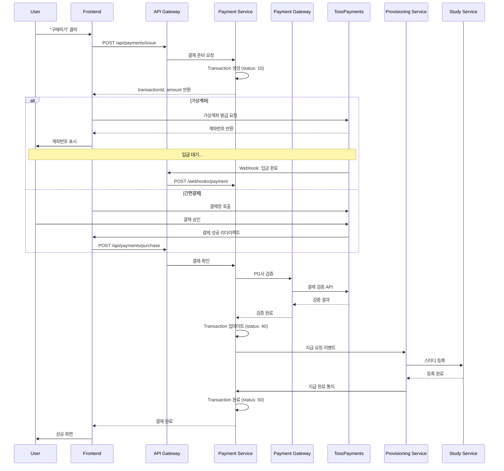

# AsyncSite Payment System Architecture

## 1. Overview

AsyncSite의 결제 시스템은 마이크로서비스 아키텍처 기반으로 설계되었으며, 디지털 상품(스터디, AI 이력서 등)의 즉시 제공을 위해 최적화되었습니다.

### Core Principles
- **Transaction-based**: 주문(Order)보다 트랜잭션(Transaction) 중심
- **Two-phase Payment**: Issue(준비) → Purchase(실행) 단계 분리
- **Event-driven Provisioning**: 결제 완료 시 자동 지급
- **State Machine**: 숫자 기반 상태 관리 (10, 40, 50...)

## 2. User Flow



## 3. Backend Architecture

### 3.1 Service Structure

```
┌─────────────────────────────────────────────────────────┐
│                     API Gateway                         │
│                  (Spring Cloud Gateway)                 │
└────────────────────┬────────────────────────────────────┘
                     │
      ┌──────────────┼──────────────────────┐
      │              │                      │
      ▼              ▼                      ▼
┌──────────┐  ┌──────────────┐      ┌─────────────┐
│ Payment  │  │Payment Gateway│      │Provisioning │
│  Core    │  │   Service     │      │   Service   │
│ Service  │  │               │      │             │
└──────────┘  └──────────────┘      └─────────────┘
      │              │                      │
      └──────────────┴──────────────────────┘
                     │
              ┌──────┴──────┐
              │   Database  │
              │ (PostgreSQL)│
              └─────────────┘
```

### 3.2 Service Responsibilities

#### Payment Core Service
- Transaction 생명주기 관리
- 상태 전이 검증
- 비즈니스 규칙 적용
- 이벤트 발행

#### Payment Gateway Service  
- PG사 어댑터 관리 (토스, 카카오페이, 네이버페이)
- API 통신 및 인증
- Webhook 처리
- 응답 표준화

#### Provisioning Service
- 상품별 지급 로직
- 스터디 등록
- AI 이력서 크레딧 충전
- 지급 실패 처리

## 4. Transaction State Machine

### 4.1 State Definitions

| Status | Name | Description |
|--------|------|-------------|
| 10 | CREATED | 트랜잭션 생성됨 |
| 30 | PAYMENT_PENDING | 결제 대기 중 |
| 40 | PAYMENT_SUCCESS | 결제 성공 |
| 41 | PAYMENT_FAILED | 결제 실패 |
| 45 | PROVISION_PENDING | 지급 대기 중 |
| 50 | PROVISION_SUCCESS | 지급 완료 |
| 51 | PROVISION_FAILED | 지급 실패 |
| 90 | REFUND_REQUESTED | 환불 요청 |
| 95 | REFUNDED | 환불 완료 |

### 4.2 State Transitions

```
10 (CREATED) 
    → 30 (PAYMENT_PENDING)
        → 40 (PAYMENT_SUCCESS) → 45 (PROVISION_PENDING) → 50 (PROVISION_SUCCESS)
        → 41 (PAYMENT_FAILED)                          → 51 (PROVISION_FAILED)
                                                             ↓
                                                        90 (REFUND_REQUESTED)
                                                             ↓
                                                        95 (REFUNDED)
```

## 5. API Specifications

### 5.1 Payment Issue (결제 준비)

```http
POST /api/payments/issue
Content-Type: application/json
Authorization: Bearer {token}

{
  "productType": "STUDY",
  "productId": "study_123",
  "amount": 50000,
  "metadata": {
    "studyName": "테코테코 3기",
    "userId": "user_456"
  }
}

Response:
{
  "transactionId": "TXN_2024_000123",
  "amount": 50000,
  "status": 10,
  "expiresAt": "2024-11-25T12:00:00Z"
}
```

### 5.2 Payment Purchase (결제 실행)

```http
POST /api/payments/purchase
Content-Type: application/json
Authorization: Bearer {token}

{
  "transactionId": "TXN_2024_000123",
  "paymentKey": "toss_payment_key_xxx",
  "method": "EASY_PAY",
  "provider": "toss"
}

Response:
{
  "transactionId": "TXN_2024_000123",
  "status": 40,
  "completedAt": "2024-11-25T10:30:00Z"
}
```

### 5.3 Webhook Handler

```http
POST /webhooks/payments/toss
Content-Type: application/json
X-Toss-Signature: {signature}

{
  "eventType": "PAYMENT.DONE",
  "transactionId": "TXN_2024_000123",
  "orderId": "TXN_2024_000123",
  "status": "DONE"
}
```

## 6. Database Schema

### 6.1 Transaction Table

```sql
CREATE TABLE transactions (
    id UUID PRIMARY KEY,
    transaction_id VARCHAR(50) UNIQUE NOT NULL,
    user_id VARCHAR(50) NOT NULL,
    product_type VARCHAR(20) NOT NULL,
    product_id VARCHAR(50) NOT NULL,
    amount DECIMAL(10,2) NOT NULL,
    status INTEGER NOT NULL,
    payment_method VARCHAR(20),
    payment_provider VARCHAR(20),
    payment_key VARCHAR(100),
    metadata JSONB,
    created_at TIMESTAMP NOT NULL,
    updated_at TIMESTAMP NOT NULL,
    expires_at TIMESTAMP,
    completed_at TIMESTAMP,
    INDEX idx_status (status),
    INDEX idx_user_id (user_id),
    INDEX idx_created_at (created_at)
);
```

### 6.2 Transaction History Table

```sql
CREATE TABLE transaction_history (
    id UUID PRIMARY KEY,
    transaction_id VARCHAR(50) NOT NULL,
    status INTEGER NOT NULL,
    message TEXT,
    metadata JSONB,
    created_at TIMESTAMP NOT NULL,
    FOREIGN KEY (transaction_id) REFERENCES transactions(transaction_id),
    INDEX idx_transaction_id (transaction_id)
);
```

## 7. Clean Architecture Implementation

### 7.1 Package Structure

```
com.asyncsite.payment/
├── adapter/
│   ├── in/
│   │   └── web/
│   │       ├── PaymentController.kt
│   │       └── WebhookController.kt
│   └── out/
│       ├── persistence/
│       │   ├── TransactionPersistenceAdapter.kt
│       │   └── TransactionJpaEntity.kt
│       ├── gateway/
│       │   ├── TossPaymentsAdapter.kt
│       │   └── KakaoPayAdapter.kt
│       └── event/
│           └── ProvisioningEventAdapter.kt
├── application/
│   ├── port/
│   │   ├── in/
│   │   │   ├── IssuePaymentUseCase.kt
│   │   │   └── PurchasePaymentUseCase.kt
│   │   └── out/
│   │       ├── LoadTransactionPort.kt
│   │       ├── SaveTransactionPort.kt
│   │       └── PaymentGatewayPort.kt
│   └── service/
│       ├── PaymentService.kt
│       └── TransactionStateMachine.kt
└── domain/
    ├── Transaction.kt
    ├── TransactionStatus.kt
    └── PaymentMethod.kt
```

### 7.2 Domain Model

```kotlin
// domain/Transaction.kt
data class Transaction(
    val id: TransactionId,
    val userId: UserId,
    val productType: ProductType,
    val productId: String,
    val amount: Money,
    val status: TransactionStatus,
    val history: List<StatusHistory>,
    val createdAt: Instant,
    val expiresAt: Instant
) {
    fun canTransitionTo(newStatus: TransactionStatus): Boolean {
        // 상태 전이 규칙 검증
        if (newStatus.value < 90 && newStatus.value <= status.value) {
            return false
        }
        return true
    }
    
    fun issue(): Transaction {
        require(status == TransactionStatus.CREATED)
        return copy(status = TransactionStatus.PAYMENT_PENDING)
    }
    
    fun purchase(): Transaction {
        require(status == TransactionStatus.PAYMENT_PENDING)
        return copy(status = TransactionStatus.PAYMENT_SUCCESS)
    }
}
```

## 8. Event Flow

### 8.1 Event Types

```kotlin
sealed class PaymentEvent {
    data class TransactionIssued(val transactionId: String) : PaymentEvent()
    data class PaymentCompleted(val transactionId: String) : PaymentEvent()
    data class ProvisioningRequested(
        val transactionId: String,
        val productType: String,
        val productId: String,
        val userId: String
    ) : PaymentEvent()
    data class RefundRequested(val transactionId: String) : PaymentEvent()
}
```

### 8.2 Event Publishing

```kotlin
// Payment Service → Provisioning Service
EventBus.publish(
    PaymentEvent.ProvisioningRequested(
        transactionId = transaction.id,
        productType = transaction.productType,
        productId = transaction.productId,
        userId = transaction.userId
    )
)
```

## 9. Error Handling

### 9.1 Error Codes

| Code | Description | HTTP Status |
|------|-------------|-------------|
| PAY_001 | Invalid transaction state | 400 |
| PAY_002 | Transaction expired | 400 |
| PAY_003 | Payment verification failed | 400 |
| PAY_004 | Insufficient balance | 402 |
| PAY_005 | PG communication error | 502 |
| PAY_006 | Provisioning failed | 500 |

### 9.2 Retry Strategy

```yaml
resilience4j:
  retry:
    instances:
      payment-gateway:
        max-attempts: 3
        wait-duration: 1s
        retry-exceptions:
          - java.io.IOException
          - java.net.SocketTimeoutException
```

## 10. Security Considerations

### 10.1 Webhook Verification

```kotlin
fun verifyWebhookSignature(
    signature: String,
    body: String,
    secret: String
): Boolean {
    val expectedSignature = HmacUtils.hmacSha256Hex(secret, body)
    return MessageDigest.isEqual(
        signature.toByteArray(),
        expectedSignature.toByteArray()
    )
}
```

### 10.2 Idempotency

- 모든 결제 요청은 idempotency key 포함
- 중복 요청 시 기존 결과 반환
- Redis를 통한 키 관리 (TTL: 24시간)

## 11. Monitoring & Observability

### 11.1 Key Metrics

- Transaction creation rate
- Payment success rate
- Average payment duration
- Provisioning success rate
- Refund rate

### 11.2 Logging

```kotlin
logger.info("Transaction issued", 
    "transactionId" to transaction.id,
    "userId" to transaction.userId,
    "amount" to transaction.amount,
    "productType" to transaction.productType
)
```

## 12. Development Phases

### Phase 1: MVP (Week 1-2)
- [ ] Payment Core Service 구현
- [ ] 가상계좌 지원
- [ ] 토스페이먼츠 연동
- [ ] 기본 Provisioning

### Phase 2: Enhancement (Week 3-4)
- [ ] 간편결제 추가 (카카오페이, 네이버페이)
- [ ] Webhook 처리
- [ ] 환불 기능
- [ ] 모니터링 대시보드

### Phase 3: Scale (Month 2)
- [ ] Settlement Service 추가
- [ ] 배치 정산
- [ ] 고급 분석
- [ ] A/B 테스팅 지원

## 13. Testing Strategy

### 13.1 Unit Tests

```kotlin
@Test
fun `should transition from CREATED to PAYMENT_PENDING`() {
    val transaction = Transaction(
        status = TransactionStatus.CREATED,
        // ...
    )
    
    val issued = transaction.issue()
    
    assertThat(issued.status).isEqualTo(TransactionStatus.PAYMENT_PENDING)
}
```

### 13.2 Integration Tests

- 실제 토스페이먼츠 테스트 환경 사용
- Webhook 시뮬레이션
- 전체 플로우 테스트

## 14. Configuration

### 14.1 Application Properties

```yaml
payment:
  gateway:
    toss:
      client-key: ${TOSS_CLIENT_KEY}
      secret-key: ${TOSS_SECRET_KEY}
      webhook-secret: ${TOSS_WEBHOOK_SECRET}
    kakao:
      cid: ${KAKAO_CID}
      secret: ${KAKAO_SECRET}
  transaction:
    expire-minutes: 30
    max-retry: 3
```

## 15. Future Considerations

- **Subscription Model**: 정기 결제 지원
- **Multi-currency**: 해외 결제 지원
- **Fraud Detection**: 이상 거래 탐지
- **Payment Analytics**: 상세 분석 대시보드
- **B2B Payments**: 기업 결제 지원

---

*Last Updated: 2024-11-25*
*Version: 1.0.0*