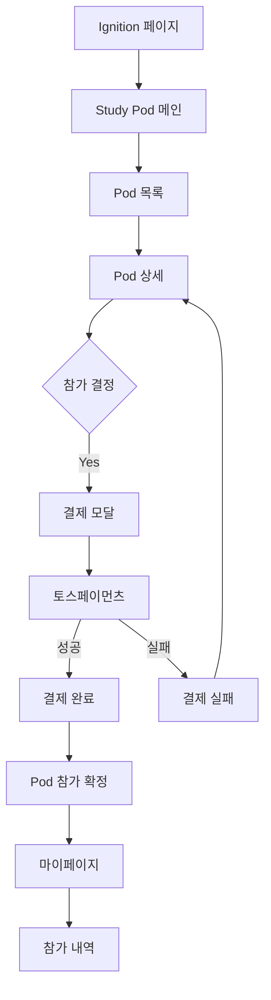

# Frontend 결제 시스템 화면 플로우 설계

## 개요
Pod Study와 결제 시스템을 프론트엔드에서 어떻게 연결하고 구현할지에 대한 상세 설계 문서입니다.

---

## 1. 전체 화면 플로우



---

## 2. 화면별 상세 설계

### 2.1 Study Pod 메인 페이지
**경로**: `/ignition/study-pod`

```typescript
// src/pages/ignition/StudyPodPage.tsx
const StudyPodPage = () => {
  return (
    <div className="study-pod-container">
      {/* 히어로 섹션 */}
      <section className="hero">
        <h1>Study Pod <Badge variant="beta">Beta</Badge></h1>
        <p>관심사가 모이면 스터디가 시작됩니다</p>
        <button className="create-pod-btn">
          <PlusIcon /> Pod 만들기
        </button>
      </section>

      {/* 진행중인 Pod 목록 */}
      <section className="active-pods">
        <h2>🔥 곧 시작하는 Pod</h2>
        <div className="pod-grid">
          {pods.map(pod => (
            <PodCard key={pod.id} pod={pod} />
          ))}
        </div>
      </section>
    </div>
  );
};
```

### 2.2 Pod Card 컴포넌트 (결제 정보 포함)
```typescript
// src/components/pod/PodCard.tsx
const PodCard = ({ pod }: { pod: Pod }) => {
  const progress = (pod.currentMembers / pod.requiredMembers) * 100;
  const isPaid = pod.participationFee > 0;
  
  return (
    <div className="pod-card">
      <div className="pod-header">
        <span className="category">{pod.category}</span>
        {isPaid && <span className="price-badge">💰 {formatPrice(pod.participationFee)}</span>}
      </div>
      
      <h3>{pod.title}</h3>
      <p>{pod.description}</p>
      
      <div className="pod-progress">
        <ProgressBar value={progress} />
        <span>{pod.currentMembers}/{pod.requiredMembers}명</span>
      </div>
      
      <div className="pod-footer">
        <button onClick={() => navigate(`/ignition/study-pod/${pod.id}`)}>
          자세히 보기 →
        </button>
      </div>
    </div>
  );
};
```

### 2.3 Pod 상세 페이지 (결제 버튼)
**경로**: `/ignition/study-pod/:id`

```typescript
// src/pages/ignition/PodDetailPage.tsx
const PodDetailPage = () => {
  const { id } = useParams();
  const [pod, setPod] = useState<Pod>(null);
  const [showPaymentModal, setShowPaymentModal] = useState(false);
  
  return (
    <div className="pod-detail">
      {/* Pod 정보 섹션 */}
      <section className="pod-info">
        <h1>{pod.title}</h1>
        <div className="meta-info">
          <span>📅 {pod.schedule}</span>
          <span>👥 {pod.currentMembers}/{pod.requiredMembers}명</span>
          <span>💰 참가비: {formatPrice(pod.participationFee)}</span>
        </div>
      </section>

      {/* 참가 신청 섹션 (중요!) */}
      <section className="join-section">
        <div className="price-info">
          <h3>참가비</h3>
          <div className="price-breakdown">
            <div className="original-price">{formatPrice(pod.participationFee)}</div>
            {pod.earlyBirdDiscount && (
              <div className="discount">
                🎯 얼리버드 할인 -20%
                <span className="final-price">
                  {formatPrice(pod.participationFee * 0.8)}
                </span>
              </div>
            )}
          </div>
        </div>

        <button 
          className="join-button primary"
          onClick={() => setShowPaymentModal(true)}
          disabled={pod.currentMembers >= pod.requiredMembers}
        >
          {pod.currentMembers >= pod.requiredMembers 
            ? '마감되었습니다' 
            : '참가 신청하기'}
        </button>
      </section>

      {/* 결제 모달 */}
      {showPaymentModal && (
        <PaymentModal 
          pod={pod}
          onClose={() => setShowPaymentModal(false)}
        />
      )}
    </div>
  );
};
```

### 2.4 결제 모달 컴포넌트
```typescript
// src/components/payment/PaymentModal.tsx
import { loadTossPayments } from '@tosspayments/payment-sdk';

const PaymentModal = ({ pod, onClose }) => {
  const [paymentMethod, setPaymentMethod] = useState('CARD');
  const [agreedToTerms, setAgreedToTerms] = useState(false);
  
  const handlePayment = async () => {
    // 1. 백엔드에 결제 요청
    const { orderId, amount } = await createPaymentRequest({
      podId: pod.id,
      userId: user.id,
      amount: pod.participationFee
    });
    
    // 2. 토스페이먼츠 SDK 호출
    const tossPayments = await loadTossPayments(
      process.env.REACT_APP_TOSS_CLIENT_KEY
    );
    
    await tossPayments.requestPayment(paymentMethod, {
      amount,
      orderId,
      orderName: `${pod.title} 참가비`,
      customerName: user.name,
      customerEmail: user.email,
      successUrl: `${window.location.origin}/payment/success`,
      failUrl: `${window.location.origin}/payment/fail`,
    });
  };
  
  return (
    <Modal isOpen onClose={onClose}>
      <div className="payment-modal">
        <h2>결제하기</h2>
        
        {/* 주문 정보 */}
        <div className="order-summary">
          <h3>주문 내역</h3>
          <div className="order-item">
            <span>{pod.title}</span>
            <span>{formatPrice(pod.participationFee)}</span>
          </div>
        </div>
        
        {/* 결제 수단 선택 */}
        <div className="payment-methods">
          <h3>결제 수단</h3>
          <RadioGroup value={paymentMethod} onChange={setPaymentMethod}>
            <Radio value="CARD">신용/체크카드</Radio>
            <Radio value="TRANSFER">계좌이체</Radio>
            <Radio value="KAKAO_PAY">카카오페이</Radio>
            <Radio value="TOSS_PAY">토스페이</Radio>
          </RadioGroup>
        </div>
        
        {/* 약관 동의 */}
        <div className="terms">
          <Checkbox 
            checked={agreedToTerms}
            onChange={setAgreedToTerms}
          >
            결제 약관 및 환불 정책에 동의합니다
          </Checkbox>
        </div>
        
        {/* 결제 버튼 */}
        <button 
          className="pay-button"
          onClick={handlePayment}
          disabled={!agreedToTerms}
        >
          {formatPrice(pod.participationFee)} 결제하기
        </button>
      </div>
    </Modal>
  );
};
```

### 2.5 결제 성공/실패 페이지
```typescript
// src/pages/payment/PaymentSuccessPage.tsx
const PaymentSuccessPage = () => {
  const [searchParams] = useSearchParams();
  const orderId = searchParams.get('orderId');
  const [paymentInfo, setPaymentInfo] = useState(null);
  
  useEffect(() => {
    // 백엔드에 결제 완료 확인
    confirmPayment(orderId).then(setPaymentInfo);
  }, [orderId]);
  
  return (
    <div className="payment-success">
      <div className="success-icon">✅</div>
      <h1>결제가 완료되었습니다!</h1>
      
      <div className="payment-details">
        <h3>결제 정보</h3>
        <dl>
          <dt>주문번호</dt>
          <dd>{paymentInfo?.orderId}</dd>
          <dt>결제금액</dt>
          <dd>{formatPrice(paymentInfo?.amount)}</dd>
          <dt>Pod 이름</dt>
          <dd>{paymentInfo?.podTitle}</dd>
        </dl>
      </div>
      
      <div className="next-steps">
        <h3>다음 단계</h3>
        <ul>
          <li>✉️ 이메일로 상세 안내를 보내드렸습니다</li>
          <li>📅 스터디 시작 전 리마인더를 받으실 수 있습니다</li>
          <li>👥 Pod 참가자들과 소통할 수 있는 채널이 열렸습니다</li>
        </ul>
      </div>
      
      <div className="actions">
        <button onClick={() => navigate('/my/pods')}>
          내 Pod 보기
        </button>
        <button onClick={() => navigate('/ignition/study-pod')}>
          다른 Pod 둘러보기
        </button>
      </div>
    </div>
  );
};
```

---

## 3. 마이페이지 결제 관리

### 3.1 내 Pod & 결제 내역
**경로**: `/my/pods`

```typescript
// src/pages/my/MyPodsPage.tsx
const MyPodsPage = () => {
  const [activeTab, setActiveTab] = useState<'participating' | 'payments'>('participating');
  
  return (
    <div className="my-pods">
      <Tabs value={activeTab} onChange={setActiveTab}>
        <Tab value="participating">참가 중인 Pod</Tab>
        <Tab value="payments">결제 내역</Tab>
      </Tabs>
      
      {activeTab === 'participating' && <ParticipatingPods />}
      {activeTab === 'payments' && <PaymentHistory />}
    </div>
  );
};

// 결제 내역 컴포넌트
const PaymentHistory = () => {
  const [payments, setPayments] = useState<Payment[]>([]);
  
  return (
    <div className="payment-history">
      <table>
        <thead>
          <tr>
            <th>날짜</th>
            <th>Pod</th>
            <th>금액</th>
            <th>상태</th>
            <th>액션</th>
          </tr>
        </thead>
        <tbody>
          {payments.map(payment => (
            <tr key={payment.id}>
              <td>{formatDate(payment.paidAt)}</td>
              <td>{payment.podTitle}</td>
              <td>{formatPrice(payment.amount)}</td>
              <td>
                <StatusBadge status={payment.status} />
              </td>
              <td>
                {payment.status === 'COMPLETED' && (
                  <button onClick={() => downloadReceipt(payment.id)}>
                    영수증
                  </button>
                )}
                {payment.canRefund && (
                  <button onClick={() => requestRefund(payment.id)}>
                    환불요청
                  </button>
                )}
              </td>
            </tr>
          ))}
        </tbody>
      </table>
    </div>
  );
};
```

### 3.2 리더 대시보드 (정산 관리)
**경로**: `/leader/dashboard`

```typescript
// src/pages/leader/LeaderDashboard.tsx
const LeaderDashboard = () => {
  const [settlements, setSettlements] = useState<Settlement[]>([]);
  const [stats, setStats] = useState<LeaderStats>(null);
  
  return (
    <div className="leader-dashboard">
      {/* 수익 요약 */}
      <section className="revenue-summary">
        <Card>
          <h3>이번 달 수익</h3>
          <div className="amount">{formatPrice(stats.monthlyRevenue)}</div>
          <div className="breakdown">
            <span>정산 예정: {formatPrice(stats.pending)}</span>
            <span>정산 완료: {formatPrice(stats.settled)}</span>
          </div>
        </Card>
      </section>
      
      {/* 정산 내역 */}
      <section className="settlement-history">
        <h2>정산 내역</h2>
        <table>
          <thead>
            <tr>
              <th>Pod</th>
              <th>참가자</th>
              <th>총 수익</th>
              <th>내 수익 (80%)</th>
              <th>정산일</th>
              <th>상태</th>
            </tr>
          </thead>
          <tbody>
            {settlements.map(settlement => (
              <tr key={settlement.id}>
                <td>{settlement.podTitle}</td>
                <td>{settlement.participantCount}명</td>
                <td>{formatPrice(settlement.totalAmount)}</td>
                <td className="highlight">
                  {formatPrice(settlement.leaderAmount)}
                </td>
                <td>{formatDate(settlement.settledAt)}</td>
                <td>
                  <StatusBadge status={settlement.status} />
                </td>
              </tr>
            ))}
          </tbody>
        </table>
      </section>
    </div>
  );
};
```

---

## 4. 상태 관리 (Zustand)

### 4.1 Payment Store
```typescript
// src/stores/paymentStore.ts
import { create } from 'zustand';

interface PaymentStore {
  // 상태
  currentPayment: Payment | null;
  paymentHistory: Payment[];
  isProcessing: boolean;
  
  // 액션
  initiatePayment: (pod: Pod) => Promise<void>;
  confirmPayment: (orderId: string) => Promise<void>;
  requestRefund: (paymentId: string) => Promise<void>;
  fetchPaymentHistory: () => Promise<void>;
}

export const usePaymentStore = create<PaymentStore>((set, get) => ({
  currentPayment: null,
  paymentHistory: [],
  isProcessing: false,
  
  initiatePayment: async (pod) => {
    set({ isProcessing: true });
    try {
      const payment = await paymentAPI.create({
        podId: pod.id,
        amount: pod.participationFee,
      });
      set({ currentPayment: payment });
    } finally {
      set({ isProcessing: false });
    }
  },
  
  confirmPayment: async (orderId) => {
    const payment = await paymentAPI.confirm(orderId);
    set({ 
      currentPayment: payment,
      paymentHistory: [...get().paymentHistory, payment]
    });
  },
  
  // ... 기타 액션들
}));
```

---

## 5. API 서비스 레이어

### 5.1 Payment Service
```typescript
// src/services/payment/paymentService.ts
import { loadTossPayments, TossPayments } from '@tosspayments/payment-sdk';
import axios from '@/lib/axios';

class PaymentService {
  private tossPayments: TossPayments | null = null;
  
  async initialize() {
    this.tossPayments = await loadTossPayments(
      process.env.REACT_APP_TOSS_CLIENT_KEY!
    );
  }
  
  // Pod 결제 요청
  async createPodPayment(podId: string, userId: string) {
    const { data } = await axios.post('/api/v1/payments', {
      podId,
      userId,
      type: 'POD_PARTICIPATION'
    });
    return data;
  }
  
  // 토스페이먼츠 결제 실행
  async executeTossPayment(payment: Payment, method: PaymentMethod) {
    if (!this.tossPayments) await this.initialize();
    
    return this.tossPayments!.requestPayment(method, {
      amount: payment.amount,
      orderId: payment.orderId,
      orderName: payment.orderName,
      customerName: payment.customerName,
      customerEmail: payment.customerEmail,
      successUrl: `${window.location.origin}/payment/success?orderId=${payment.orderId}`,
      failUrl: `${window.location.origin}/payment/fail?orderId=${payment.orderId}`,
    });
  }
  
  // 결제 확인
  async confirmPayment(orderId: string, paymentKey: string) {
    const { data } = await axios.post('/api/v1/payments/confirm', {
      orderId,
      paymentKey
    });
    return data;
  }
  
  // 환불 요청
  async requestRefund(paymentId: string, reason: string) {
    const { data } = await axios.post(`/api/v1/payments/${paymentId}/refund`, {
      reason
    });
    return data;
  }
}

export const paymentService = new PaymentService();
```

---

## 6. 라우팅 설정

### 6.1 Router 업데이트
```typescript
// src/router/router.tsx
const router = createBrowserRouter([
  {
    path: '/',
    element: <RootLayout />,
    children: [
      // ... 기존 라우트
      
      // Pod Study 라우트
      {
        path: 'ignition',
        children: [
          {
            path: 'study-pod',
            children: [
              { index: true, element: <StudyPodPage /> },
              { path: ':id', element: <PodDetailPage /> },
              { path: 'create', element: <CreatePodPage /> },
            ]
          }
        ]
      },
      
      // 결제 관련 라우트
      {
        path: 'payment',
        children: [
          { path: 'success', element: <PaymentSuccessPage /> },
          { path: 'fail', element: <PaymentFailPage /> },
        ]
      },
      
      // 마이페이지
      {
        path: 'my',
        element: <RequireAuth />,
        children: [
          { path: 'pods', element: <MyPodsPage /> },
          { path: 'payments', element: <PaymentHistoryPage /> },
        ]
      },
      
      // 리더 대시보드
      {
        path: 'leader',
        element: <RequireLeader />,
        children: [
          { path: 'dashboard', element: <LeaderDashboard /> },
          { path: 'settlements', element: <SettlementPage /> },
        ]
      }
    ]
  }
]);
```

---

## 7. 환경 변수 설정

### 7.1 .env 파일
```bash
# Toss Payments
REACT_APP_TOSS_CLIENT_KEY=test_ck_D5GePWvyJnrK0W0k6q8gLzN97Eoq
REACT_APP_TOSS_SECRET_KEY=test_sk_zXLkKEypNArWmo50nX3lmeaxYG5R

# API Endpoints  
REACT_APP_API_URL=http://localhost:8080/api
REACT_APP_PAYMENT_API_URL=http://localhost:8084/api/v1/payments
```

---

## 8. 구현 체크리스트

### Phase 1: 기본 구현 (1주)
- [ ] Pod 목록 페이지
- [ ] Pod 상세 페이지
- [ ] 결제 모달 컴포넌트
- [ ] 토스페이먼츠 SDK 연동
- [ ] 결제 성공/실패 페이지

### Phase 2: 고급 기능 (2주)
- [ ] 마이페이지 결제 내역
- [ ] 환불 요청 기능
- [ ] 리더 대시보드
- [ ] 정산 내역 조회
- [ ] 영수증 다운로드

### Phase 3: 최적화 (3주)
- [ ] 결제 상태 실시간 업데이트
- [ ] 에러 핸들링 고도화
- [ ] 결제 분석 대시보드
- [ ] A/B 테스트
- [ ] 성능 최적화

---

## 9. UX 최적화 포인트

### 9.1 Social Proof
```typescript
// 실시간 참가자 표시
const LiveIndicator = () => (
  <div className="live-indicator">
    <span className="pulse-dot" />
    <span>지금 12명이 보고 있어요</span>
  </div>
);

// 최근 참가자
const RecentJoiners = () => (
  <div className="recent-joiners">
    <span>방금 김**님이 참가했어요 (2분 전)</span>
  </div>
);
```

### 9.2 Urgency & Scarcity
```typescript
// 마감 임박 알림
const UrgencyBanner = ({ remainingSlots }) => (
  <div className="urgency-banner">
    🔥 마감 임박! {remainingSlots}자리만 남았어요
  </div>
);

// 타이머
const CountdownTimer = ({ deadline }) => (
  <div className="countdown">
    ⏰ 얼리버드 할인 종료까지: {timeRemaining}
  </div>
);
```

---

## 10. 핵심 포인트 정리

### 🎯 가장 중요한 화면들

1. **Pod 상세 페이지** → 결제 전환의 핵심
   - 명확한 가격 정보
   - 큰 CTA 버튼
   - Social Proof 요소

2. **결제 모달** → 간편한 결제 경험
   - 토스페이먼츠 SDK 통합
   - 다양한 결제 수단
   - 명확한 약관 동의

3. **결제 성공 페이지** → 다음 행동 유도
   - 축하 메시지
   - 다음 단계 안내
   - 추가 Pod 추천

4. **마이페이지** → 신뢰 구축
   - 결제 내역 투명 공개
   - 쉬운 환불 프로세스
   - 영수증 제공

---

*작성일: 2025년 8월 7일*  
*작성자: AsyncSite Frontend Team*  
*문서 버전: 1.0*