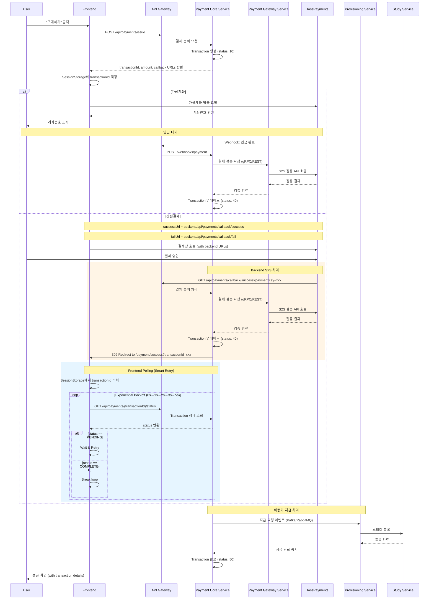

# AsyncSite Payment System Architecture

## 1. Overview

AsyncSite의 결제 시스템은 마이크로서비스 아키텍처 기반으로 설계되었으며, 디지털 상품(스터디, AI 이력서 등)의 즉시 제공을 위해 최적화되었습니다.

### Core Principles
- **Service Separation**: Payment Core와 Gateway 명확히 분리
- **Transaction-based**: 주문(Order)보다 트랜잭션(Transaction) 중심
- **Two-phase Payment**: Issue(준비) → Purchase(실행) 단계 분리
- **S2S Verification**: 모든 결제 검증은 서버 간 직접 통신
- **State Machine**: 숫자 기반 상태 관리 (10, 40, 50...)

## 2. User Flow



## 3. Backend Architecture

### 3.1 Service Structure

```
┌─────────────────────────────────────────────────────────┐
│                     API Gateway                         │
│                  (Spring Cloud Gateway)                 │
└────────────────────┬────────────────────────────────────┘
                     │
      ┌──────────────┼──────────────┬──────────────┐
      ▼              ▼              ▼              ▼
┌──────────────┐ ┌──────────────┐ ┌─────────────┐ ┌──────────┐
│Payment Core  │ │Payment Gateway│ │Provisioning │ │Settlement│
│   Service    │◄►│   Service     │ │   Service   │ │ Service  │
│  (메인 로직)  │ │  (PG사 통신)   │ │  (지급 처리)  │ │ (정산)    │
└──────────────┘ └──────────────┘ └─────────────┘ └──────────┘
      │              │                  │              │
      └──────────────┴──────────────────┴──────────────┘
                            │
                     ┌──────┴──────┐
                     │   Database  │
                     │   (MySQL)    │
                     └─────────────┘
```

### 3.2 Service Responsibilities

#### Payment Core Service (메인 컨트롤러)
- **전체 결제 플로우 제어**
- Transaction 생명주기 관리
- 상태 전이 검증 및 관리
- 비즈니스 규칙 적용
- Payment Gateway Service 호출 및 조율
- Provisioning Service 트리거
- Callback/Webhook 엔드포인트 제공
- Transaction 데이터 저장

#### Payment Gateway Service (PG사 통신 전담)
- PG사 어댑터 관리 (토스, 카카오페이, 네이버페이)
- **S2S API 통신 및 검증**
- PG사별 API 추상화
- 응답 표준화
- PG사 인증 관리
- 결제 검증 로직

#### Provisioning Service
- 상품별 지급 로직
- 스터디 등록
- AI 이력서 크레딧 충전
- 지급 실패 처리
- 지급 완료 후 Payment Core에 통지

#### Settlement Service
- 정산 계산
- 수수료 처리
- 판매자 송금 관리
- 정산 리포트 생성

## 4. Transaction State Machine

### 4.1 State Definitions

| Status | Name | Description |
|--------|------|-------------|
| 10 | CREATED | 트랜잭션 생성됨 |
| 30 | PAYMENT_PENDING | 결제 대기 중 |
| 40 | PAYMENT_SUCCESS | 결제 성공 |
| 41 | PAYMENT_FAILED | 결제 실패 |
| 45 | PROVISION_PENDING | 지급 대기 중 |
| 50 | PROVISION_SUCCESS | 지급 완료 |
| 51 | PROVISION_FAILED | 지급 실패 |
| 90 | REFUND_REQUESTED | 환불 요청 |
| 95 | REFUNDED | 환불 완료 |

### 4.2 State Transitions

```
10 (CREATED) 
    → 30 (PAYMENT_PENDING)
        → 40 (PAYMENT_SUCCESS) → 45 (PROVISION_PENDING) → 50 (PROVISION_SUCCESS)
        → 41 (PAYMENT_FAILED)                          → 51 (PROVISION_FAILED)
                                                             ↓
                                                        90 (REFUND_REQUESTED)
                                                             ↓
                                                        95 (REFUNDED)
```

## 5. API Specifications

### 5.1 Payment Issue (결제 준비)

```http
POST /api/payments/issue
Content-Type: application/json
Authorization: Bearer {token}

{
  "productType": "STUDY",
  "productId": "study_123",
  "amount": 50000,
  "metadata": {
    "studyName": "테코테코 3기",
    "userId": "user_456"
  }
}

Response:
{
  "transactionId": "TXN_2024_000123",
  "amount": 50000,
  "status": 10,
  "successUrl": "https://api.asyncsite.com/api/payments/callback/success",
  "failUrl": "https://api.asyncsite.com/api/payments/callback/fail",
  "expiresAt": "2024-11-25T12:00:00Z"
}
```

### 5.2 Payment Callback (S2S 검증) - 간편결제

```http
GET /api/payments/callback/success
Query Parameters:
  - paymentKey: toss_payment_key_xxx
  - orderId: TXN_2024_000123
  - amount: 50000

Processing (Backend):
1. Payment Core Service가 요청 수신
2. Payment Gateway Service 호출하여 S2S 검증
3. 검증 성공 시 Transaction 상태 업데이트
4. Frontend로 302 Redirect

Response:
HTTP/1.1 302 Found
Location: https://asyncsite.com/payment/success?orderId=TXN_2024_000123
```

### 5.3 Payment Callback (실패)

```http
GET /api/payments/callback/fail
Query Parameters:
  - code: PAY_PROCESS_CANCELED
  - message: 사용자가 결제를 취소했습니다
  - orderId: TXN_2024_000123

Response:
HTTP/1.1 302 Found
Location: https://asyncsite.com/payment/fail?code=PAY_PROCESS_CANCELED
```

### 5.4 Webhook Handler (가상계좌)

```http
POST /webhooks/payments/toss
Content-Type: application/json
X-Toss-Signature: {signature}

{
  "eventType": "PAYMENT.DONE",
  "transactionId": "TXN_2024_000123",
  "orderId": "TXN_2024_000123",
  "status": "DONE"
}

Processing (Backend):
1. Payment Core가 Signature 검증
2. Payment Gateway Service로 S2S 검증
3. Transaction 상태 업데이트
4. Provisioning Service에 지급 이벤트 발행
5. 지급 완료 대기
```

## 6. Database Schema (MySQL)

### 6.1 Transaction Table

```sql
CREATE TABLE transactions (
    id CHAR(36) PRIMARY KEY,  -- UUID
    transaction_id VARCHAR(50) UNIQUE NOT NULL,
    user_id VARCHAR(50) NOT NULL,
    product_type VARCHAR(20) NOT NULL,
    product_id VARCHAR(50) NOT NULL,
    amount DECIMAL(10,2) NOT NULL,
    status INT NOT NULL,
    payment_method VARCHAR(20),
    payment_provider VARCHAR(20),
    payment_key VARCHAR(100),
    metadata JSON,  -- MySQL 5.7+ JSON type
    created_at TIMESTAMP DEFAULT CURRENT_TIMESTAMP,
    updated_at TIMESTAMP DEFAULT CURRENT_TIMESTAMP ON UPDATE CURRENT_TIMESTAMP,
    expires_at TIMESTAMP NULL,
    completed_at TIMESTAMP NULL,
    INDEX idx_status (status),
    INDEX idx_user_id (user_id),
    INDEX idx_created_at (created_at),
    INDEX idx_transaction_id (transaction_id)
) ENGINE=InnoDB DEFAULT CHARSET=utf8mb4 COLLATE=utf8mb4_unicode_ci;
```

### 6.2 Transaction History Table

```sql
CREATE TABLE transaction_history (
    id CHAR(36) PRIMARY KEY,
    transaction_id VARCHAR(50) NOT NULL,
    status INT NOT NULL,
    message TEXT,
    metadata JSON,
    created_at TIMESTAMP DEFAULT CURRENT_TIMESTAMP,
    FOREIGN KEY (transaction_id) REFERENCES transactions(transaction_id),
    INDEX idx_transaction_id (transaction_id),
    INDEX idx_created_at (created_at)
) ENGINE=InnoDB DEFAULT CHARSET=utf8mb4 COLLATE=utf8mb4_unicode_ci;
```


## 7. Clean Architecture Implementation

### 7.1 Package Structure

#### Payment Core Service
```
com.asyncsite.payment.core/
├── adapter/
│   ├── in/
│   │   └── web/
│   │       ├── PaymentController.kt
│   │       ├── PaymentCallbackController.kt
│   │       └── WebhookController.kt
│   └── out/
│       ├── persistence/
│       │   ├── TransactionPersistenceAdapter.kt
│       │   └── TransactionJpaEntity.kt
│       ├── gateway/
│       │   └── PaymentGatewayAdapter.kt
│       └── event/
│           └── ProvisioningEventAdapter.kt
├── application/
│   ├── port/
│   │   ├── in/
│   │   │   ├── IssuePaymentUseCase.kt
│   │   │   ├── HandleCallbackUseCase.kt
│   │   │   └── ProcessWebhookUseCase.kt
│   │   └── out/
│   │       ├── LoadTransactionPort.kt
│   │       ├── SaveTransactionPort.kt
│   │       ├── PaymentGatewayPort.kt
│   │       └── ProvisioningEventPort.kt
│   └── service/
│       ├── PaymentService.kt
│       └── TransactionStateMachine.kt
└── domain/
    ├── Transaction.kt
    ├── TransactionStatus.kt
    └── PaymentMethod.kt
```

#### Payment Gateway Service
```
com.asyncsite.payment.gateway/
├── adapter/
│   ├── in/
│   │   └── grpc/
│   │       └── PaymentGatewayGrpcService.kt
│   └── out/
│       ├── toss/
│       │   └── TossPaymentsAdapter.kt
│       ├── kakao/
│       │   └── KakaoPayAdapter.kt
│       └── naver/
│           └── NaverPayAdapter.kt
├── application/
│   ├── port/
│   │   ├── in/
│   │   │   ├── VerifyPaymentUseCase.kt
│   │   │   └── ProcessRefundUseCase.kt
│   │   └── out/
│   │       └── PaymentProviderPort.kt
│   └── service/
│       └── PaymentGatewayService.kt
└── domain/
    ├── PaymentProvider.kt
    ├── PaymentVerification.kt
    └── RefundRequest.kt
```

### 7.2 Domain Models

#### Payment Core Domain
```kotlin
// payment.core/domain/Transaction.kt
data class Transaction(
    val id: TransactionId,
    val userId: UserId,
    val productType: ProductType,
    val productId: String,
    val amount: Money,
    val status: TransactionStatus,
    val paymentKey: String? = null,
    val history: List<StatusHistory>,
    val createdAt: Instant,
    val expiresAt: Instant
) {
    fun canTransitionTo(newStatus: TransactionStatus): Boolean {
        // 상태 전이 규칙 검증
        if (newStatus.value < 90 && newStatus.value <= status.value) {
            return false
        }
        return when (status.value) {
            10 -> newStatus.value in listOf(30, 41)  // CREATED → PENDING or FAILED
            30 -> newStatus.value in listOf(40, 41)  // PENDING → SUCCESS or FAILED
            40 -> newStatus.value in listOf(45, 90)  // SUCCESS → PROVISION or REFUND
            45 -> newStatus.value in listOf(50, 51)  // PROVISION_PENDING → COMPLETE or FAILED
            else -> false
        }
    }
    
    fun updateStatus(newStatus: TransactionStatus): Transaction {
        require(canTransitionTo(newStatus)) { 
            "Invalid status transition: ${status.value} → ${newStatus.value}" 
        }
        return copy(
            status = newStatus,
            history = history + StatusHistory(newStatus, Instant.now())
        )
    }
}
```

## 8. Event Flow & Integration

### 8.1 Service Communication

```kotlin
// payment.core/application/service/PaymentService.kt
class PaymentService(
    private val transactionRepository: SaveTransactionPort,
    private val paymentGateway: PaymentGatewayPort,
    private val provisioningEvent: ProvisioningEventPort
) {
    suspend fun issuePayment(request: PaymentRequest): Transaction {
        // 1. Transaction 생성
        val transaction = Transaction.create(request)
        transactionRepository.save(transaction)
        
        // 2. Callback URLs 생성
        return transaction.withCallbackUrls(
            successUrl = "${baseUrl}/api/payments/callback/success",
            failUrl = "${baseUrl}/api/payments/callback/fail"
        )
    }
    
    suspend fun handleCallback(
        paymentKey: String,
        orderId: String,
        amount: Long
    ): CallbackResult {
        // 1. Transaction 조회
        val transaction = transactionRepository.findById(orderId)
        
        // 2. Payment Gateway로 S2S 검증
        val verification = paymentGateway.verify(
            VerificationRequest(paymentKey, orderId, amount)
        )
        
        if (verification.isSuccess) {
            // 3. Transaction 상태 업데이트
            transaction.updateStatus(TransactionStatus.PAYMENT_SUCCESS)
            transactionRepository.save(transaction)
            
            // 4. Provisioning 이벤트 발행
            provisioningEvent.publish(
                ProvisioningEvent(
                    transactionId = transaction.id,
                    productType = transaction.productType,
                    productId = transaction.productId,
                    userId = transaction.userId
                )
            )
        }
        
        return CallbackResult(verification.isSuccess, transaction)
    }
}
```

### 8.2 S2S Callback Flow

```kotlin
// payment.core/adapter/in/web/PaymentCallbackController.kt
@RestController
@RequestMapping("/api/payments/callback")
class PaymentCallbackController(
    private val paymentService: PaymentService
) {
    
    @GetMapping("/success")
    suspend fun handleSuccess(
        @RequestParam paymentKey: String,
        @RequestParam orderId: String,
        @RequestParam amount: Long
    ): ResponseEntity<Void> {
        // 1. Payment Core Service가 처리
        val result = paymentService.handleCallback(paymentKey, orderId, amount)
        
        // 2. 프론트엔드로 리다이렉트
        return ResponseEntity
            .status(HttpStatus.FOUND)
            .location(URI.create("/payment/success?orderId=$orderId"))
            .build()
    }
}
```

## 9. Payment Response Handling Strategy

### 9.1 Core Problem: Asynchronous Payment Processing

결제 시스템의 핵심 과제는 **비동기 처리와 즉시 응답의 간극**을 해결하는 것입니다.

#### 타이밍 문제
```
[Timeline]
T+0ms: 토스페이먼츠에서 결제 승인
T+1ms: 토스 → Frontend 리다이렉트 (GET /payment/success)
T+10ms: Frontend 도착, Transaction 조회 시도 ⚠️ 아직 PENDING!
T+50ms: 토스 → Backend Callback 도착
T+100ms: Backend DB 업데이트 완료
```

#### 결제 유형별 문제점
- **가상계좌**: 입금 시점 예측 불가 (몇 분 ~ 3일)
- **간편결제**: 리다이렉트로 원래 요청 컨텍스트 손실
- **공통 문제**: Frontend가 Backend보다 빨리 도착

### 9.2 Solution: Transaction ID + Smart Polling

#### Core Concept
```
1. 결제 준비 → Transaction ID 즉시 발급
2. 로컬 스토리지에 Transaction ID 저장
3. 결제 후 리다이렉트 → Transaction 상태 조회
4. Exponential Backoff으로 Smart Polling
```

#### Frontend Implementation
```typescript
// hooks/usePaymentResult.ts
const usePaymentResult = (transactionId: string) => {
  const [state, setState] = useState({
    status: 'CHECKING',
    transaction: null,
    attemptCount: 0
  });

  useEffect(() => {
    let mounted = true;
    let timeoutId: NodeJS.Timeout;

    const checkTransaction = async () => {
      // Exponential Backoff: 0s → 1s → 2s → 3s → 5s
      const delays = [0, 1000, 2000, 3000, 5000];
      const delay = delays[Math.min(state.attemptCount, delays.length - 1)];
      
      if (delay > 0) {
        await new Promise(resolve => {
          timeoutId = setTimeout(resolve, delay);
        });
      }
      
      if (!mounted) return;
      
      try {
        const result = await api.getTransaction(transactionId);
        
        if (result.status === 'PENDING' && state.attemptCount < 20) {
          setState(prev => ({
            ...prev,
            attemptCount: prev.attemptCount + 1
          }));
          checkTransaction(); // 재귀 호출
        } else {
          setState({
            status: 'RESOLVED',
            transaction: result,
            attemptCount: state.attemptCount
          });
        }
      } catch (error) {
        setState({
          status: 'ERROR',
          transaction: null,
          error
        });
      }
    };

    checkTransaction();

    return () => {
      mounted = false;
      clearTimeout(timeoutId);
    };
  }, [transactionId]);

  return state;
};
```

#### Payment Result Page
```typescript
const PaymentResultPage: React.FC = () => {
  const transactionId = sessionStorage.getItem('currentTransaction');
  const { status, transaction } = usePaymentResult(transactionId);
  
  // 처리 중 UI (불안감 해소)
  if (status === 'CHECKING') {
    return (
      <ProcessingView>
        <Spinner />
        <h2>결제를 확인하고 있습니다</h2>
        <p>잠시만 기다려주세요... (보통 2-3초)</p>
        <ProgressIndicator attemptCount={attemptCount} />
      </ProcessingView>
    );
  }
  
  // 성공
  if (status === 'RESOLVED' && transaction?.status === 'COMPLETED') {
    return <PaymentSuccessView transaction={transaction} />;
  }
  
  // 타임아웃 (30초 후)
  if (status === 'RESOLVED' && transaction?.status === 'PENDING') {
    return (
      <DelayedView>
        <h2>결제 처리가 지연되고 있습니다</h2>
        <p>잠시 후 주문 내역에서 확인해주세요</p>
        <Link to="/orders">주문 내역 보기</Link>
      </DelayedView>
    );
  }
  
  return <PaymentErrorView />;
};
```

### 9.3 Backend API Design for Polling

#### Transaction Status Endpoint
```kotlin
// payment.core/adapter/in/web/TransactionController.kt
@RestController
@RequestMapping("/api/payments")
class TransactionController(
    private val transactionService: TransactionService
) {
    
    @GetMapping("/{transactionId}/status")
    suspend fun getTransactionStatus(
        @PathVariable transactionId: String
    ): ResponseEntity<TransactionStatusResponse> {
        val transaction = transactionService.findById(transactionId)
        
        return ResponseEntity.ok(
            TransactionStatusResponse(
                transactionId = transaction.id,
                status = transaction.status.name,
                statusCode = transaction.status.value,
                amount = transaction.amount,
                completedAt = transaction.completedAt,
                // 프론트엔드 힌트
                isSettled = transaction.status.value >= 40,
                needsPolling = transaction.status.value < 40,
                message = getStatusMessage(transaction.status)
            )
        )
    }
}

data class TransactionStatusResponse(
    val transactionId: String,
    val status: String,
    val statusCode: Int,
    val amount: Long,
    val completedAt: Instant?,
    val isSettled: Boolean,
    val needsPolling: Boolean,
    val message: String
)
```

### 9.4 Alternative: Server-Sent Events (Optional)

Phase 2에서 실시간성이 중요해지면 SSE 추가 가능:

```kotlin
// payment.core/adapter/in/web/PaymentEventController.kt
@RestController
@RequestMapping("/api/payments")
class PaymentEventController {
    
    @GetMapping("/{transactionId}/events", produces = [MediaType.TEXT_EVENT_STREAM_VALUE])
    fun streamTransactionEvents(
        @PathVariable transactionId: String
    ): Flux<ServerSentEvent<TransactionEvent>> {
        return transactionEventService
            .subscribe(transactionId)
            .map { event ->
                ServerSentEvent.builder<TransactionEvent>()
                    .id(event.id)
                    .event(event.type)
                    .data(event)
                    .build()
            }
    }
}
```

### 9.5 Polling Strategy Comparison

| Strategy | 초기 지연 | 재시도 간격 | 최대 시도 | 타임아웃 | 적용 케이스 |
|----------|----------|------------|----------|----------|------------|
| **Immediate** | 0ms | 2초 고정 | 30회 | 60초 | 트래픽 적음 |
| **Delayed** | 1000ms | 2초 고정 | 30회 | 60초 | 안정성 중요 |
| **Exponential** ✅ | 0ms | 0→1→2→3→5초 | 20회 | 45초 | **추천** |
| **Optimistic** | 0ms | 1→2→4→8초 | 10회 | 30초 | UX 중요 |

### 9.6 Best Practices

1. **Transaction ID 중심 설계**
   - 모든 결제는 Transaction ID로 추적
   - SessionStorage/LocalStorage 활용
   - URL에 Transaction ID 포함 가능

2. **처리 중 UI 필수**
   - 사용자 불안감 해소
   - 진행 상황 시각화
   - 예상 시간 안내

3. **Graceful Degradation**
   - 타임아웃 시 안내 페이지
   - 주문 내역으로 유도
   - 고객센터 연락처 제공

4. **Error Recovery**
   - 네트워크 에러 시 재시도
   - Transaction 조회 실패 시 fallback
   - 명확한 에러 메시지

## 10. Error Handling

### 9.1 Error Codes

| Code | Description | HTTP Status |
|------|-------------|-------------|
| PAY_001 | Invalid transaction state | 400 |
| PAY_002 | Transaction expired | 400 |
| PAY_003 | Payment verification failed | 400 |
| PAY_004 | Insufficient balance | 402 |
| PAY_005 | PG communication error | 502 |
| PAY_006 | Provisioning failed | 500 |

### 9.2 Retry Strategy

```yaml
resilience4j:
  retry:
    instances:
      payment-gateway:
        max-attempts: 3
        wait-duration: 1s
        retry-exceptions:
          - java.io.IOException
          - java.net.SocketTimeoutException
```

## 10. Security Considerations

### 10.1 Webhook Verification

```kotlin
fun verifyWebhookSignature(
    signature: String,
    body: String,
    secret: String
): Boolean {
    val expectedSignature = HmacUtils.hmacSha256Hex(secret, body)
    return MessageDigest.isEqual(
        signature.toByteArray(),
        expectedSignature.toByteArray()
    )
}
```

### 10.2 Idempotency

- 모든 결제 요청은 idempotency key 포함
- 중복 요청 시 기존 결과 반환
- Redis를 통한 키 관리 (TTL: 24시간)

## 11. Monitoring & Observability

### 11.1 Key Metrics

- Transaction creation rate
- Payment success rate
- Average payment duration
- Provisioning success rate
- Refund rate

### 11.2 Logging

```kotlin
logger.info("Transaction issued", 
    "transactionId" to transaction.id,
    "userId" to transaction.userId,
    "amount" to transaction.amount,
    "productType" to transaction.productType
)
```

## 12. Development Phases

### Phase 1: MVP (Week 1-2)
- [ ] Payment Core Service 구현
  - Transaction 관리
  - 상태 머신 구현
  - Callback/Webhook 엔드포인트
- [ ] Payment Gateway Service 구현
  - 토스페이먼츠 어댑터
  - S2S 검증 로직
- [ ] 가상계좌 지원
- [ ] 기본 Provisioning 이벤트

### Phase 2: Enhancement (Week 3-4)
- [ ] 간편결제 추가
  - 카카오페이 어댑터
  - 네이버페이 어댑터
- [ ] Webhook 고도화
- [ ] 환불 기능
- [ ] 모니터링 대시보드

### Phase 3: Scale (Month 2)
- [ ] Settlement Service 추가
- [ ] 배치 정산
- [ ] 서비스 간 Circuit Breaker
- [ ] 성능 최적화

## 13. Testing Strategy

### 13.1 Unit Tests

```kotlin
@Test
fun `should transition from CREATED to PAYMENT_PENDING`() {
    val transaction = Transaction(
        status = TransactionStatus.CREATED,
        // ...
    )
    
    val issued = transaction.issue()
    
    assertThat(issued.status).isEqualTo(TransactionStatus.PAYMENT_PENDING)
}
```

### 13.2 Integration Tests

- 실제 토스페이먼츠 테스트 환경 사용
- Webhook 시뮬레이션
- 전체 플로우 테스트

## 14. Configuration

### 14.1 Application Properties

```yaml
payment:
  gateway:
    toss:
      client-key: ${TOSS_CLIENT_KEY}
      secret-key: ${TOSS_SECRET_KEY}
      webhook-secret: ${TOSS_WEBHOOK_SECRET}
    kakao:
      cid: ${KAKAO_CID}
      secret: ${KAKAO_SECRET}
  transaction:
    expire-minutes: 30
    max-retry: 3
```

## 15. Future Considerations

### 기능 확장
- **Subscription Model**: 정기 결제 지원
- **Multi-currency**: 해외 결제 지원
- **Fraud Detection**: 이상 거래 탐지
- **Payment Analytics**: 상세 분석 대시보드
- **B2B Payments**: 기업 결제 지원

### 아키텍처 진화
- **Payment Orchestrator**: 복잡한 플로우 발생 시 Orchestrator 추가 고려
- **SAGA Pattern**: 분산 트랜잭션 필요 시 도입
- **Event Sourcing**: 결제 이력 추적 강화
- **CQRS**: 읽기/쓰기 분리로 성능 최적화

---

*Last Updated: 2024-11-25*
*Version: 2.0.0* (Orchestrator 제거, Core/Gateway 분리 구조)