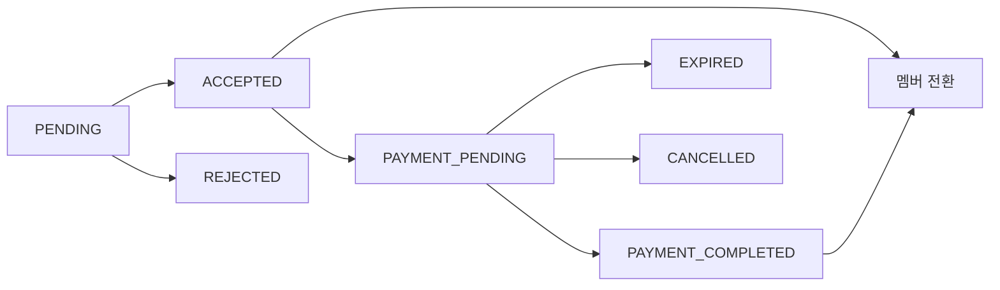

# 스터디 결제 플로우 설계 문서

## 📌 개요
AsyncSite 스터디 시스템에 결제 기능을 통합하기 위한 설계 문서입니다.  
현재 "신청 → 승인 → 멤버" 플로우에 결제 단계를 추가하여 유료 스터디를 지원합니다.

## 🔄 현재 플로우 분석

### 기존 플로우 (As-Is)
```
1. 사용자가 스터디 신청 (StudyApplicationPage)
   ↓
2. 스터디 리더가 수동 승인 (StudyManagementPage)
   ↓
3. 자동으로 멤버 전환 (Application → Member)
   ↓
4. 스터디 참여 확정
```

### 문제점
- **결제 단계 부재**: 유료 스터디에 대한 결제 프로세스 없음
- **상태 관리 미흡**: ACCEPTED 상태에서 바로 멤버로 전환
- **비용 타입 미활용**: CostType (FREE/PAID/FREE_WITH_VENUE)이 정의되어 있으나 실제 활용 안 됨

## 🎯 제안 플로우 (To-Be)

### 1. 무료 스터디 플로우
```
신청 → 승인 → 멤버 전환 (기존과 동일)
```

### 2. 유료 스터디 플로우
```
신청 → 승인 → 결제 대기 → 결제 완료 → 멤버 전환
       ↓
    (3일 후) → 자동 취소
```

### 3. 부분 유료 스터디 플로우 (FREE_WITH_VENUE)
```
신청 → 승인 → 선택적 결제 → 멤버 전환
              (장소비 등 선택)
```

## 📊 상태 관리 설계

### ApplicationStatus 확장
```typescript
export enum ApplicationStatus {
  PENDING = 'PENDING',               // 신청 대기
  ACCEPTED = 'ACCEPTED',             // 승인됨
  PAYMENT_PENDING = 'PAYMENT_PENDING', // 결제 대기 (신규)
  PAYMENT_COMPLETED = 'PAYMENT_COMPLETED', // 결제 완료 (신규)  
  REJECTED = 'REJECTED',             // 거절됨
  CANCELLED = 'CANCELLED',           // 취소됨
  EXPIRED = 'EXPIRED'                // 만료됨 (신규)
}
```

### 상태 전이 다이어그램


## 💻 프론트엔드 구현 방안

### Phase 1: 마이페이지 결제 버튼 추가
**위치**: `/src/pages/user/ProfilePage.tsx`

```typescript
// 승인된 신청 섹션 추가
{myStudiesGrouped?.acceptedApplications && (
  <div className={styles.studyGroup}>
    <h3>결제 대기 중인 스터디</h3>
    {acceptedApplications.map(study => (
      <div key={study.applicationId} className={styles.studyCard}>
        <h4>{study.studyTitle}</h4>
        <p className={styles.paymentNotice}>
          승인되었습니다! 결제를 완료하면 참여가 확정됩니다.
        </p>
        <p className={styles.deadline}>
          결제 마감: {study.paymentDeadline}
        </p>
        <CheckoutButton
          variant="primary"
          size="medium"
          checkoutData={createStudyCheckoutRequest({
            studyId: study.studyId,
            studyName: study.studyTitle,
            price: study.price,
            applicationId: study.applicationId,
            cohortId: study.cohortId,
            // ... 기타 필요 데이터
          })}
          onCheckoutComplete={handlePaymentSuccess}
          onCheckoutError={handlePaymentError}
          label="결제하고 참여 확정"
        />
      </div>
    ))}
  </div>
)}
```

### Phase 2: 결제 성공 후 처리
```typescript
const handlePaymentSuccess = async (response: CheckoutResponse) => {
  try {
    // 1. 백엔드에 결제 확인 요청
    await studyService.confirmPayment({
      applicationId: response.metadata.applicationId,
      paymentId: response.paymentId,
      checkoutId: response.checkoutId
    });
    
    // 2. 스터디 목록 새로고침
    await refetchMyStudies();
    
    // 3. 성공 메시지
    showToast('결제가 완료되었습니다! 스터디 참여가 확정되었습니다.', 'success');
    
    // 4. 참여 중인 스터디 탭으로 이동
    setActiveTab('participating');
  } catch (error) {
    console.error('Payment confirmation failed:', error);
    showToast('결제는 완료되었으나 참여 확정 중 오류가 발생했습니다. 고객센터에 문의해주세요.', 'error');
  }
};
```

## 🔧 백엔드 API 요구사항

### 1. 승인 시 결제 정보 포함
```http
POST /api/studies/{studyId}/applications/{applicationId}/accept
{
  "requirePayment": true,
  "paymentAmount": 150000,
  "discountRate": 10,
  "paymentDeadline": "2024-02-15T23:59:59Z",
  "cohortId": "cohort-2024-q1"
}
```

### 2. 결제 확인 및 멤버 전환
```http
POST /api/studies/{studyId}/confirm-payment
{
  "applicationId": "app-123",
  "paymentId": "pay-456",
  "checkoutId": "checkout-789"
}

Response:
{
  "success": true,
  "memberId": "member-001",
  "message": "Successfully enrolled in study"
}
```

### 3. 승인된 신청 조회 (결제 대기)
```http
GET /api/users/me/applications?status=ACCEPTED&paymentPending=true

Response:
{
  "applications": [
    {
      "applicationId": "app-123",
      "studyId": "study-001",
      "studyTitle": "React 심화 스터디",
      "status": "ACCEPTED",
      "paymentRequired": true,
      "paymentAmount": 150000,
      "paymentDeadline": "2024-02-15T23:59:59Z",
      "cohortId": "cohort-2024-q1",
      "cohortName": "2024년 1기"
    }
  ]
}
```

## 🎨 UX 고려사항

### 1. 결제 마감 알림
- 결제 마감 D-1 이메일 발송
- 마이페이지 상단 배너 표시
- 푸시 알림 (모바일)

### 2. 결제 실패 처리
- 3회까지 재시도 허용
- 실패 시 명확한 안내 메시지
- 고객센터 연결 버튼

### 3. 환불 정책
- 스터디 시작 전: 100% 환불
- 스터디 시작 후 7일 이내: 50% 환불
- 7일 이후: 환불 불가

## 🚀 구현 우선순위

### Phase 1 (즉시 구현 가능)
- [x] 마이페이지에 ACCEPTED 상태 분리 표시
- [x] 결제 버튼 UI 추가
- [x] CheckoutButton 컴포넌트 통합

### Phase 2 (백엔드 협업 필요)
- [ ] 결제 확인 API 구현
- [ ] 멤버 전환 로직 구현
- [ ] 결제 만료 처리 배치

### Phase 3 (운영 기능)
- [ ] 환불 프로세스
- [ ] 결제 내역 관리
- [ ] 영수증 발급

## 📝 테스트 시나리오

### 1. 정상 플로우
1. 유료 스터디 신청
2. 리더가 승인
3. 마이페이지에서 결제 버튼 확인
4. 결제 완료
5. 참여 중인 스터디로 이동 확인

### 2. 예외 케이스
- 결제 마감 시간 초과
- 결제 중 취소
- 중복 결제 시도
- 네트워크 오류

## 🔍 모니터링 지표

1. **결제 전환율**: 승인 → 결제 완료 비율
2. **결제 포기율**: 결제 시작 → 취소 비율
3. **평균 결제 소요 시간**: 승인 → 결제 완료까지 시간
4. **결제 실패율**: 기술적 오류로 인한 실패

## 📌 참고사항

- 현재 CheckoutService는 Real 모드만 지원 (Mock 제거됨)
- PaymentIntent 기반 세션 관리 구현됨
- 네이버페이/카카오페이 통합 준비 완료
- 도메인별 (study/documento/job-navigator) 결제 지원

## 🔗 관련 문서
- [Checkout Service Architecture](./CHECKOUT_SERVICE_ARCHITECTURE.md)
- [Payment System v2](./PAYMENT_SYSTEM_V2.md)
- [Study Application Flow](../project/STUDY_APPLICATION_FLOW.md)

---

*작성일: 2024년 9월 13일*  
*작성자: AsyncSite Development Team*