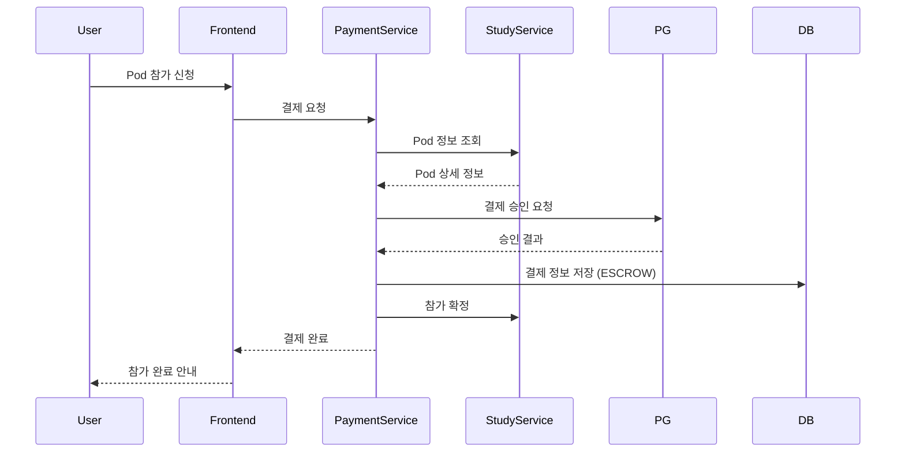
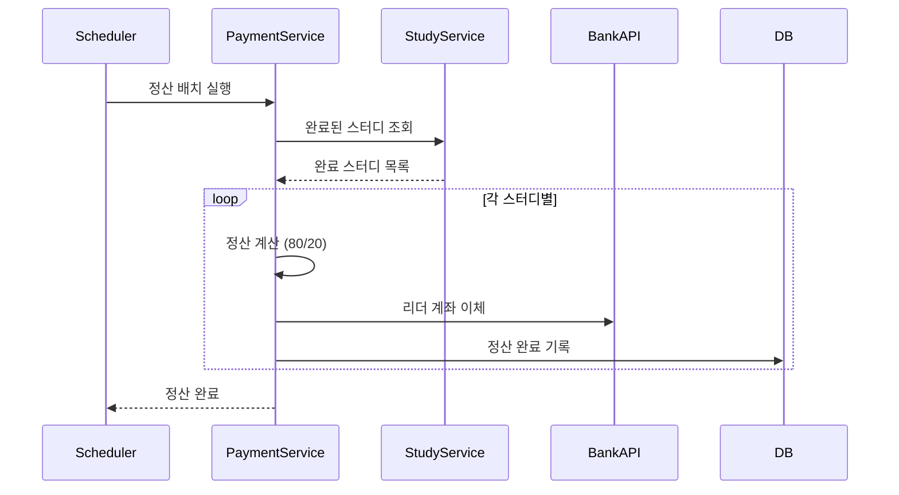

# AsyncSite 결제 시스템 아키텍처 설계

## 목차
1. [개요](#1-개요)
2. [현재 아키텍처 분석](#2-현재-아키텍처-분석)
3. [결제 시스템 요구사항](#3-결제-시스템-요구사항)
4. [아키텍처 설계](#4-아키텍처-설계)
5. [구현 전략](#5-구현-전략)
6. [기술 스택 선정](#6-기술-스택-선정)
7. [API 설계](#7-api-설계)
8. [보안 고려사항](#8-보안-고려사항)
9. [로드맵](#9-로드맵)

---

## 1. 개요

### 1.1 목적
AsyncSite 플랫폼의 지속가능한 수익 모델 구축을 위한 결제 시스템 아키텍처 설계

### 1.2 핵심 목표
- ✅ **Pod Study** 유료화 지원 (참가비 수납 → 리더 정산)
- ✅ **Hexagonal Architecture** 준수
- ✅ **MSA 환경** 최적화
- ✅ **확장 가능한** 설계

### 1.3 비즈니스 컨텍스트
```
[Pod Study 결제 흐름]
참가자 결제 → 에스크로 → 스터디 완료 → 리더 정산 (80%) + 플랫폼 수수료 (20%)
```

---

## 2. 현재 아키텍처 분석

### 2.1 Core Platform (MSA Infrastructure)
```
┌─────────────────┐
│  API Gateway    │ → Spring Cloud Gateway
├─────────────────┤
│ Eureka Server   │ → Service Discovery
├─────────────────┤
│    Security     │ → OAuth2 Resource Server (JWT)
└─────────────────┘
```

### 2.2 Study Service (Hexagonal Architecture)
```
study-service/
├── domain/          # 순수 비즈니스 로직
│   ├── study/
│   ├── membership/
│   └── operation/
├── application/     # Use Case 구현
│   └── service/
└── adapter/         # 외부 연동
    ├── in/web/     # REST Controllers
    └── out/persistence/  # JPA
```

### 2.3 기술 스택
- **Backend**: Java 17, Spring Boot 3.x
- **Frontend**: React 19, TypeScript
- **Database**: MySQL (예정)
- **Cache**: Redis

---

## 3. 결제 시스템 요구사항

### 3.1 기능 요구사항

#### Phase 1: 기본 결제 (Pod Study)
- 참가비 결제 (신용카드, 계좌이체)
- 결제 취소/환불
- 결제 내역 조회

#### Phase 2: 에스크로
- 참가비 임시 보관
- 조건부 정산 (스터디 완료 시)
- 분쟁 조정 메커니즘

#### Phase 3: 정산 시스템
- 리더 정산 (80%)
- 플랫폼 수수료 (20%)
- 세금계산서 발행

#### Phase 4: 확장
- 구독 모델
- 멤버십 시스템
- 기업 결제 (B2B)

### 3.2 비기능 요구사항
- **보안**: PCI DSS 준수
- **성능**: 결제 처리 < 3초
- **가용성**: 99.9% uptime
- **확장성**: 동시 결제 1,000건/분

---

## 4. 아키텍처 설계

### 4.1 Payment Service (신규 마이크로서비스)

#### 4.1.1 Hexagonal Architecture 적용
```
payment-service/
├── domain/
│   ├── payment/
│   │   ├── Payment.java              # 결제 도메인 모델
│   │   ├── PaymentStatus.java        # PENDING, COMPLETED, FAILED, REFUNDED
│   │   ├── PaymentMethod.java        # CARD, TRANSFER, VIRTUAL_ACCOUNT
│   │   └── PaymentValidator.java
│   ├── escrow/
│   │   ├── Escrow.java               # 에스크로 도메인
│   │   ├── EscrowStatus.java         # HOLDING, RELEASED, REFUNDED
│   │   └── EscrowPolicy.java         # 정산 정책
│   └── settlement/
│       ├── Settlement.java           # 정산 도메인
│       ├── SettlementRule.java       # 정산 규칙 (80/20)
│       └── TaxInvoice.java
│
├── application/
│   ├── port/
│   │   ├── in/
│   │   │   ├── ProcessPaymentUseCase.java
│   │   │   ├── RefundPaymentUseCase.java
│   │   │   ├── SettlePaymentUseCase.java
│   │   │   └── QueryPaymentUseCase.java
│   │   └── out/
│   │       ├── PaymentGatewayPort.java      # PG사 연동
│   │       ├── PaymentPersistencePort.java  # DB 저장
│   │       ├── NotificationPort.java        # 알림 발송
│   │       └── TaxServicePort.java          # 세금계산서
│   └── service/
│       ├── PaymentService.java
│       ├── EscrowService.java
│       └── SettlementService.java
│
└── adapter/
    ├── in/
    │   └── web/
    │       ├── PaymentController.java
    │       ├── PaymentWebhookController.java  # PG 웹훅
    │       └── dto/
    └── out/
        ├── pg/
        │   ├── toss/
        │   │   └── TossPaymentAdapter.java
        │   └── nicepay/
        │       └── NicePayAdapter.java
        ├── persistence/
        │   ├── PaymentJpaAdapter.java
        │   └── entity/
        └── notification/
            └── EmailNotificationAdapter.java
```

### 4.2 시스템 통합 아키텍처

```
┌──────────────┐     ┌──────────────┐     ┌──────────────┐
│   Frontend   │────▶│  API Gateway │────▶│Payment Service│
└──────────────┘     └──────────────┘     └───────┬──────┘
                                                   │
                            ┌──────────────────────┼──────────────────────┐
                            │                      │                      │
                            ▼                      ▼                      ▼
                     ┌──────────────┐      ┌──────────────┐      ┌──────────────┐
                     │ Study Service│      │   PG API     │      │   Database   │
                     └──────────────┘      └──────────────┘      └──────────────┘
```

### 4.3 결제 프로세스 플로우

#### 4.3.1 Pod Study 결제 플로우


#### 4.3.2 정산 플로우


---

## 5. 구현 전략

### 5.1 도메인 모델 설계

#### Payment Domain
```java
@Entity
public class Payment {
    @Id
    private String paymentId;
    private String orderId;
    private String userId;
    private String podId;
    private BigDecimal amount;
    private PaymentMethod method;
    private PaymentStatus status;
    private LocalDateTime createdAt;
    private LocalDateTime paidAt;
    
    // Business Logic
    public void approve(String pgApprovalId) {
        if (this.status != PaymentStatus.PENDING) {
            throw new InvalidPaymentStateException();
        }
        this.status = PaymentStatus.COMPLETED;
        this.paidAt = LocalDateTime.now();
    }
    
    public void refund(BigDecimal refundAmount) {
        if (!canRefund()) {
            throw new RefundNotAllowedException();
        }
        this.status = PaymentStatus.REFUNDED;
    }
}
```

#### Escrow Domain
```java
@Entity
public class Escrow {
    @Id
    private String escrowId;
    private String paymentId;
    private String podId;
    private BigDecimal amount;
    private EscrowStatus status;
    private LocalDateTime releaseDate;
    
    public void release() {
        if (this.status != EscrowStatus.HOLDING) {
            throw new InvalidEscrowStateException();
        }
        this.status = EscrowStatus.RELEASED;
        this.releaseDate = LocalDateTime.now();
    }
}
```

#### Settlement Domain
```java
@Entity
public class Settlement {
    @Id
    private String settlementId;
    private String podId;
    private String leaderId;
    private BigDecimal totalAmount;
    private BigDecimal leaderAmount;  // 80%
    private BigDecimal platformFee;   // 20%
    private SettlementStatus status;
    
    public static Settlement create(Pod pod, List<Payment> payments) {
        BigDecimal total = payments.stream()
            .map(Payment::getAmount)
            .reduce(BigDecimal.ZERO, BigDecimal::add);
            
        return Settlement.builder()
            .podId(pod.getId())
            .leaderId(pod.getLeaderId())
            .totalAmount(total)
            .leaderAmount(total.multiply(new BigDecimal("0.8")))
            .platformFee(total.multiply(new BigDecimal("0.2")))
            .status(SettlementStatus.PENDING)
            .build();
    }
}
```

### 5.2 Use Case 구현

```java
@Service
@RequiredArgsConstructor
public class ProcessPaymentService implements ProcessPaymentUseCase {
    private final PaymentGatewayPort paymentGateway;
    private final PaymentPersistencePort persistence;
    private final StudyServicePort studyService;
    
    @Override
    @Transactional
    public PaymentResult processPayment(PaymentCommand command) {
        // 1. Pod 정보 조회
        PodInfo pod = studyService.getPodInfo(command.getPodId());
        
        // 2. 결제 도메인 생성
        Payment payment = Payment.create(command, pod);
        
        // 3. PG사 결제 요청
        PGResponse pgResponse = paymentGateway.requestPayment(payment);
        
        // 4. 결제 승인 처리
        payment.approve(pgResponse.getApprovalId());
        
        // 5. 에스크로 생성
        Escrow escrow = Escrow.create(payment);
        
        // 6. 저장
        persistence.save(payment);
        persistence.save(escrow);
        
        // 7. 스터디 서비스 알림
        studyService.confirmParticipation(pod.getId(), command.getUserId());
        
        return PaymentResult.success(payment);
    }
}
```

---

## 6. 기술 스택 선정

### 6.1 결제 게이트웨이 (PG)

#### 토스페이먼츠 (추천) ⭐
```yaml
장점:
  - 개발자 친화적 API
  - 우수한 문서화
  - 에스크로 기본 지원
  - 정산 API 제공
  - React SDK 제공

수수료:
  - 신용카드: 2.9% + VAT
  - 계좌이체: 1.8% + VAT
  - 에스크로: +0.3%
```

#### 대안: 나이스페이
```yaml
장점:
  - 낮은 수수료
  - 안정적인 서비스
  
단점:
  - 복잡한 연동
  - 레거시 API
```

### 6.2 Frontend 결제 모듈

```typescript
// services/payment/paymentService.ts
import { loadTossPayments } from '@tosspayments/payment-sdk';

export class PaymentService {
  private tossPayments: TossPayments;
  
  async initialize() {
    this.tossPayments = await loadTossPayments(
      process.env.REACT_APP_TOSS_CLIENT_KEY
    );
  }
  
  async requestPayment(pod: Pod, user: User): Promise<PaymentResult> {
    const payment = await this.tossPayments.requestPayment('카드', {
      amount: pod.participationFee,
      orderId: generateOrderId(),
      orderName: `${pod.title} 참가비`,
      customerName: user.name,
      successUrl: `${window.location.origin}/payment/success`,
      failUrl: `${window.location.origin}/payment/fail`,
    });
    
    return payment;
  }
}
```

### 6.3 Database Schema

```sql
-- 결제 테이블
CREATE TABLE payments (
    payment_id VARCHAR(50) PRIMARY KEY,
    order_id VARCHAR(50) UNIQUE NOT NULL,
    user_id VARCHAR(50) NOT NULL,
    pod_id VARCHAR(50),
    amount DECIMAL(10, 2) NOT NULL,
    method ENUM('CARD', 'TRANSFER', 'VIRTUAL_ACCOUNT'),
    status ENUM('PENDING', 'COMPLETED', 'FAILED', 'REFUNDED'),
    pg_approval_id VARCHAR(100),
    created_at TIMESTAMP DEFAULT CURRENT_TIMESTAMP,
    paid_at TIMESTAMP,
    INDEX idx_user_id (user_id),
    INDEX idx_pod_id (pod_id),
    INDEX idx_status (status)
);

-- 에스크로 테이블
CREATE TABLE escrows (
    escrow_id VARCHAR(50) PRIMARY KEY,
    payment_id VARCHAR(50) NOT NULL,
    pod_id VARCHAR(50) NOT NULL,
    amount DECIMAL(10, 2) NOT NULL,
    status ENUM('HOLDING', 'RELEASED', 'REFUNDED'),
    release_date TIMESTAMP,
    created_at TIMESTAMP DEFAULT CURRENT_TIMESTAMP,
    FOREIGN KEY (payment_id) REFERENCES payments(payment_id)
);

-- 정산 테이블
CREATE TABLE settlements (
    settlement_id VARCHAR(50) PRIMARY KEY,
    pod_id VARCHAR(50) NOT NULL,
    leader_id VARCHAR(50) NOT NULL,
    total_amount DECIMAL(10, 2) NOT NULL,
    leader_amount DECIMAL(10, 2) NOT NULL,
    platform_fee DECIMAL(10, 2) NOT NULL,
    status ENUM('PENDING', 'PROCESSING', 'COMPLETED'),
    settled_at TIMESTAMP,
    created_at TIMESTAMP DEFAULT CURRENT_TIMESTAMP
);
```

---

## 7. API 설계

### 7.1 Payment API

```yaml
# 결제 요청
POST /api/v1/payments
Request:
  {
    "podId": "pod-123",
    "amount": 50000,
    "method": "CARD"
  }
Response:
  {
    "paymentId": "pay-456",
    "status": "PENDING",
    "paymentUrl": "https://..."
  }

# 결제 완료 웹훅
POST /api/v1/payments/webhook
Request:
  {
    "paymentKey": "...",
    "orderId": "...",
    "status": "DONE"
  }

# 결제 조회
GET /api/v1/payments/{paymentId}
Response:
  {
    "paymentId": "pay-456",
    "amount": 50000,
    "status": "COMPLETED",
    "paidAt": "2025-08-07T10:00:00Z"
  }

# 환불 요청
POST /api/v1/payments/{paymentId}/refund
Request:
  {
    "reason": "스터디 취소",
    "refundAmount": 50000
  }
```

### 7.2 Settlement API

```yaml
# 정산 조회 (리더)
GET /api/v1/settlements/leader/{leaderId}
Response:
  {
    "settlements": [
      {
        "settlementId": "set-789",
        "podTitle": "알고리즘 스터디",
        "amount": 280000,
        "status": "COMPLETED",
        "settledAt": "2025-08-10T00:00:00Z"
      }
    ]
  }

# 정산 실행 (Admin)
POST /api/v1/settlements/execute
Request:
  {
    "podIds": ["pod-123", "pod-456"]
  }
```

---

## 8. 보안 고려사항

### 8.1 PCI DSS 준수
- ❌ 카드 정보 직접 저장 금지
- ✅ PG사 토큰화 사용
- ✅ HTTPS 필수
- ✅ 결제 로그 암호화

### 8.2 보안 체크리스트
```yaml
필수:
  - [ ] SSL/TLS 인증서
  - [ ] API 인증 (JWT)
  - [ ] Rate Limiting
  - [ ] Webhook 서명 검증
  - [ ] SQL Injection 방지
  - [ ] XSS 방지

권장:
  - [ ] 결제 이상 탐지
  - [ ] 실시간 모니터링
  - [ ] 정기 보안 감사
```

### 8.3 민감 정보 관리
```java
// application.yml
payment:
  pg:
    toss:
      client-key: ${TOSS_CLIENT_KEY}
      secret-key: ${TOSS_SECRET_KEY}
      webhook-secret: ${TOSS_WEBHOOK_SECRET}
```

---

## 9. 로드맵

### Phase 1: MVP (2주)
```yaml
목표: Pod Study 기본 결제
구현:
  - [ ] Payment Service 기본 구조
  - [ ] 토스페이먼츠 연동
  - [ ] 결제/취소 API
  - [ ] Frontend 결제 UI
테스트:
  - [ ] 테스트 결제
  - [ ] 환불 프로세스
```

### Phase 2: 에스크로 (1개월)
```yaml
목표: 안전한 거래 보장
구현:
  - [ ] 에스크로 도메인
  - [ ] 자동 정산 로직
  - [ ] 분쟁 조정 프로세스
운영:
  - [ ] 정산 일정 설정
  - [ ] 예외 처리 정책
```

### Phase 3: 정산 시스템 (2개월)
```yaml
목표: 자동화된 정산
구현:
  - [ ] 정산 배치 시스템
  - [ ] 세금계산서 발행
  - [ ] 리더 대시보드
  - [ ] 정산 리포트
```

### Phase 4: 확장 (3개월)
```yaml
목표: 다양한 수익 모델
구현:
  - [ ] 구독 모델
  - [ ] 멤버십 시스템
  - [ ] B2B 결제
  - [ ] 해외 결제
```

---

## 10. 성공 지표

### 10.1 기술 지표
- 결제 성공률 > 95%
- 평균 결제 시간 < 3초
- 시스템 가용성 > 99.9%
- 정산 정확도 100%

### 10.2 비즈니스 지표
- 월 거래액
- 평균 거래 단가
- 결제 전환율
- 환불률 < 5%

---

## 11. 리스크 및 대응

### 11.1 기술적 리스크
| 리스크 | 영향도 | 대응 방안 |
|--------|--------|-----------|
| PG사 장애 | 높음 | Multi-PG 전략 |
| 결제 실패 | 중간 | 재시도 메커니즘 |
| 정산 오류 | 높음 | 이중 검증 시스템 |

### 11.2 비즈니스 리스크
| 리스크 | 영향도 | 대응 방안 |
|--------|--------|-----------|
| 환불 폭증 | 높음 | 명확한 환불 정책 |
| 분쟁 발생 | 중간 | 중재 프로세스 |
| 규제 변경 | 높음 | 법률 자문 |

---

## 12. 다음 단계

### 즉시 실행 가능한 액션
1. **토스페이먼츠 가입** 및 테스트 키 발급
2. **Payment Service** 프로젝트 생성
3. **기본 API** 구현 (결제 요청/조회)
4. **Frontend 통합** 테스트

### 검토 필요 사항
1. 법무 검토 (이용약관, 환불정책)
2. 세무 검토 (세금계산서, 원천징수)
3. PG사 계약 조건 협상

---

*작성일: 2025년 8월 7일*  
*작성자: AsyncSite Architecture Team*  
*문서 버전: 1.0*  
*상태: Review Required*