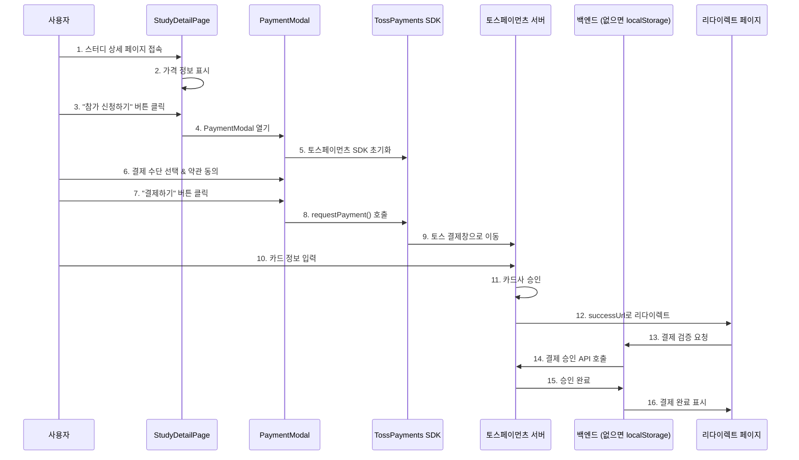

# 토스페이먼츠 결제 통합 상세 플로우 (AsyncSite 적용)

## 🎯 핵심: 실제 코드와 화면으로 보는 결제 플로우

---

## 1. 전체 시퀀스 다이어그램



---

## 2. 단계별 상세 구현

### Step 1: 스터디 상세 페이지에서 시작
```typescript
// src/pages/StudyDetailPage.tsx
const StudyDetailPage = () => {
  const study = getStudyByIdOrSlug('tecoteco'); // 테코테코 스터디
  const [showPaymentModal, setShowPaymentModal] = useState(false);
  
  return (
    <div className="study-detail">
      <h1>테코테코 3기</h1>
      
      {/* 가격 정보 표시 */}
      <div className="price-section">
        <span className="label">참가비</span>
        <span className="price">₩50,000</span>
      </div>
      
      {/* 참가 신청 버튼 */}
      <button 
        className="enroll-btn"
        onClick={() => setShowPaymentModal(true)} // 👈 모달 열기
      >
        참가 신청하기
      </button>
      
      {/* 결제 모달 */}
      {showPaymentModal && (
        <PaymentModal 
          study={study}
          onClose={() => setShowPaymentModal(false)}
        />
      )}
    </div>
  );
};
```

### Step 2: PaymentModal에서 SDK 초기화
```typescript
// src/components/payment/PaymentModal.tsx
import { loadTossPayments } from '@tosspayments/payment-sdk';

const PaymentModal = ({ study, onClose }) => {
  const [tossPayments, setTossPayments] = useState(null);
  
  // 컴포넌트 마운트 시 SDK 초기화
  useEffect(() => {
    (async () => {
      const tp = await loadTossPayments(
        'test_ck_D5GePWvyJnrK0W0k6q8gLzN97Eoq' // 👈 클라이언트 키
      );
      setTossPayments(tp);
    })();
  }, []);
  
  return (
    <div className="payment-modal">
      <h2>결제하기</h2>
      {/* ... */}
    </div>
  );
};
```

### Step 3: 결제 정보 입력 UI
```typescript
const PaymentModal = ({ study, onClose }) => {
  const [paymentMethod, setPaymentMethod] = useState('카드');
  const [agreedToTerms, setAgreedToTerms] = useState(false);
  
  return (
    <div className="payment-modal">
      {/* 주문 정보 */}
      <div className="order-info">
        <h3>주문 내역</h3>
        <div className="item">
          <span>테코테코 3기</span>
          <span>₩50,000</span>
        </div>
      </div>
      
      {/* 결제 수단 선택 */}
      <div className="payment-methods">
        <h3>결제 수단</h3>
        <label>
          <input 
            type="radio" 
            value="카드"
            checked={paymentMethod === '카드'}
            onChange={(e) => setPaymentMethod(e.target.value)}
          />
          신용/체크카드
        </label>
        <label>
          <input 
            type="radio" 
            value="계좌이체"
            checked={paymentMethod === '계좌이체'}
            onChange={(e) => setPaymentMethod(e.target.value)}
          />
          실시간 계좌이체
        </label>
        <label>
          <input 
            type="radio" 
            value="가상계좌"
            checked={paymentMethod === '가상계좌'}
            onChange={(e) => setPaymentMethod(e.target.value)}
          />
          가상계좌
        </label>
      </div>
      
      {/* 약관 동의 */}
      <div className="terms">
        <label>
          <input 
            type="checkbox"
            checked={agreedToTerms}
            onChange={(e) => setAgreedToTerms(e.target.checked)}
          />
          구매조건 확인 및 결제진행에 동의
        </label>
      </div>
      
      {/* 결제 버튼 */}
      <button 
        className="pay-button"
        onClick={handlePayment} // 👈 핵심 함수
        disabled={!agreedToTerms}
      >
        ₩50,000 결제하기
      </button>
    </div>
  );
};
```

### Step 4: 토스페이먼츠 결제창 호출 (핵심!)
```typescript
const handlePayment = async () => {
  if (!tossPayments) {
    alert('결제 모듈을 불러오는 중입니다...');
    return;
  }
  
  // 주문 ID 생성 (유니크해야 함)
  const orderId = `ORDER_${Date.now()}_${Math.random().toString(36).substr(2, 9)}`;
  
  try {
    // 🔥 토스페이먼츠 결제창 호출
    await tossPayments.requestPayment(paymentMethod, {
      // 필수 파라미터
      amount: 50000,                                    // 결제 금액
      orderId: orderId,                                 // 주문 ID (유니크)
      orderName: '테코테코 3기 참가비',                   // 주문명
      
      // 고객 정보
      customerName: '김개발',                           // 실제로는 로그인 사용자 정보
      customerEmail: 'dev@asyncsite.com',
      
      // 리다이렉트 URL (중요!)
      successUrl: `${window.location.origin}/payment/success`, // 성공 시
      failUrl: `${window.location.origin}/payment/fail`,       // 실패 시
      
      // 추가 옵션
      validHours: 24,                                  // 가상계좌 입금 기한
      cashReceipt: {                                   // 현금영수증
        type: '소득공제'
      }
    });
    
    // 👆 여기서 토스 결제창으로 이동됨!
    // 사용자가 결제를 완료하면 successUrl로 리다이렉트
    
  } catch (error) {
    // 사용자가 결제창을 닫은 경우
    console.error('결제 취소 또는 오류:', error);
  }
};
```

### Step 5: 토스페이먼츠 결제창 (외부)
```
🔸 여기서부터는 토스페이먼츠가 제공하는 화면입니다
🔸 사용자는 AsyncSite를 떠나 토스 결제 페이지로 이동합니다

1. 카드 번호 입력
2. 유효기간 입력  
3. CVC 입력
4. 비밀번호 입력
5. [결제하기] 클릭
6. 카드사 인증 (OTP, 앱 인증 등)
7. 결제 승인
```

### Step 6: 결제 성공 후 리다이렉트
```typescript
// src/pages/payment/PaymentSuccessPage.tsx
// URL: /payment/success?paymentKey=xyz&orderId=ORDER_123&amount=50000

const PaymentSuccessPage = () => {
  const [searchParams] = useSearchParams();
  const [isVerifying, setIsVerifying] = useState(true);
  const [paymentData, setPaymentData] = useState(null);
  
  useEffect(() => {
    verifyPayment();
  }, []);
  
  const verifyPayment = async () => {
    // URL 파라미터 추출
    const paymentKey = searchParams.get('paymentKey');  // 토스가 준 결제 키
    const orderId = searchParams.get('orderId');        // 우리가 만든 주문 ID
    const amount = searchParams.get('amount');          // 결제 금액
    
    try {
      // 🔥 백엔드가 있다면: 결제 승인 API 호출
      if (process.env.REACT_APP_API_URL) {
        const response = await fetch('/api/payments/confirm', {
          method: 'POST',
          headers: { 'Content-Type': 'application/json' },
          body: JSON.stringify({
            paymentKey,
            orderId,
            amount: parseInt(amount)
          })
        });
        
        const data = await response.json();
        setPaymentData(data);
        
      } else {
        // 🔥 백엔드가 없다면: localStorage에 저장 (MVP)
        const payment = {
          paymentKey,
          orderId,
          amount,
          studyId: 1, // 테코테코
          status: 'completed',
          paidAt: new Date().toISOString()
        };
        
        // 결제 내역 저장
        const payments = JSON.parse(localStorage.getItem('payments') || '[]');
        payments.push(payment);
        localStorage.setItem('payments', JSON.stringify(payments));
        
        // 스터디 참가 처리
        const enrolledStudies = JSON.parse(localStorage.getItem('enrolledStudies') || '[]');
        if (!enrolledStudies.includes(1)) {
          enrolledStudies.push(1);
          localStorage.setItem('enrolledStudies', JSON.stringify(enrolledStudies));
        }
        
        setPaymentData(payment);
      }
      
    } catch (error) {
      console.error('결제 검증 실패:', error);
      alert('결제 확인 중 오류가 발생했습니다.');
    } finally {
      setIsVerifying(false);
    }
  };
  
  if (isVerifying) {
    return <div>결제를 확인하는 중입니다...</div>;
  }
  
  return (
    <div className="payment-success">
      <div className="success-icon">✅</div>
      <h1>결제가 완료되었습니다!</h1>
      
      <div className="payment-details">
        <dl>
          <dt>주문번호</dt>
          <dd>{paymentData?.orderId}</dd>
          
          <dt>결제금액</dt>
          <dd>₩{parseInt(paymentData?.amount).toLocaleString()}</dd>
          
          <dt>결제일시</dt>
          <dd>{new Date(paymentData?.paidAt).toLocaleString()}</dd>
        </dl>
      </div>
      
      <div className="next-steps">
        <h3>다음 단계</h3>
        <ul>
          <li>✉️ 등록하신 이메일로 상세 안내를 보내드렸습니다</li>
          <li>📅 스터디는 2024년 12월 27일 금요일 19:30에 시작됩니다</li>
          <li>💬 카카오톡 오픈채팅방 링크를 확인해주세요</li>
        </ul>
      </div>
      
      <div className="actions">
        <button onClick={() => window.location.href = '/my/studies'}>
          내 스터디 보기
        </button>
        <button onClick={() => window.location.href = '/study'}>
          다른 스터디 둘러보기
        </button>
      </div>
    </div>
  );
};
```

---

## 3. 백엔드 API (있을 경우)

### 3.1 결제 승인 API
```javascript
// POST /api/payments/confirm
// 토스페이먼츠 결제 승인을 백엔드에서 처리

const confirmPayment = async (req, res) => {
  const { paymentKey, orderId, amount } = req.body;
  
  try {
    // 토스페이먼츠 결제 승인 API 호출
    const response = await fetch('https://api.tosspayments.com/v1/payments/confirm', {
      method: 'POST',
      headers: {
        'Authorization': `Basic ${Buffer.from(TOSS_SECRET_KEY + ':').toString('base64')}`,
        'Content-Type': 'application/json'
      },
      body: JSON.stringify({
        paymentKey,
        orderId,
        amount
      })
    });
    
    const paymentData = await response.json();
    
    if (response.ok) {
      // DB에 결제 정보 저장
      await savePaymentToDB({
        paymentKey: paymentData.paymentKey,
        orderId: paymentData.orderId,
        amount: paymentData.totalAmount,
        method: paymentData.method,
        status: paymentData.status,
        approvedAt: paymentData.approvedAt
      });
      
      // 스터디 참가 처리
      await enrollUserToStudy(userId, studyId);
      
      res.json({ success: true, payment: paymentData });
    } else {
      res.status(400).json({ success: false, error: paymentData });
    }
    
  } catch (error) {
    res.status(500).json({ success: false, error: error.message });
  }
};
```

---

## 4. 환경 변수 설정

### 4.1 프론트엔드 (.env)
```bash
# 토스페이먼츠 클라이언트 키 (공개 가능)
REACT_APP_TOSS_CLIENT_KEY=test_ck_D5GePWvyJnrK0W0k6q8gLzN97Eoq

# API 서버 (없으면 localStorage 사용)
REACT_APP_API_URL=http://localhost:8080
```

### 4.2 백엔드 (.env)
```bash
# 토스페이먼츠 시크릿 키 (절대 공개 금지!)
TOSS_SECRET_KEY=test_sk_zXLkKEypNArWmo50nX3lmeaxYG5R
```

---

## 5. 실제 동작 시나리오

### 시나리오: 김개발님이 테코테코 3기 참가
```
1. [StudyDetailPage] 테코테코 상세 페이지 접속
   - URL: /study/1-tecoteco
   - 참가비 50,000원 표시

2. [StudyDetailPage] "참가 신청하기" 버튼 클릭
   - PaymentModal 컴포넌트 열림

3. [PaymentModal] 결제 수단 선택
   - "신용/체크카드" 선택
   - 약관 동의 체크

4. [PaymentModal] "₩50,000 결제하기" 버튼 클릭
   - tossPayments.requestPayment() 호출
   - 토스 결제창으로 이동

5. [토스페이먼츠] 카드 정보 입력
   - 카드번호: 1234-5678-9012-3456
   - 유효기간: 12/25
   - CVC: 123
   - 결제 승인

6. [PaymentSuccessPage] 성공 페이지로 리다이렉트
   - URL: /payment/success?paymentKey=xyz&orderId=ORDER_123&amount=50000
   - 결제 검증 및 저장
   - 스터디 참가 완료

7. [MyStudiesPage] 내 스터디에서 확인
   - "테코테코 3기" 표시
   - 결제 내역 확인 가능
```

---

## 6. 에러 처리

### 6.1 결제 실패 시
```typescript
// src/pages/payment/PaymentFailPage.tsx
const PaymentFailPage = () => {
  const [searchParams] = useSearchParams();
  const errorCode = searchParams.get('code');
  const errorMessage = searchParams.get('message');
  
  const getErrorMessage = (code) => {
    switch(code) {
      case 'PAY_PROCESS_CANCELED':
        return '결제를 취소하셨습니다.';
      case 'INVALID_CARD_NUMBER':
        return '카드 번호를 확인해주세요.';
      case 'INSUFFICIENT_BALANCE':
        return '잔액이 부족합니다.';
      default:
        return '결제 처리 중 오류가 발생했습니다.';
    }
  };
  
  return (
    <div className="payment-fail">
      <div className="fail-icon">❌</div>
      <h1>결제에 실패했습니다</h1>
      <p>{getErrorMessage(errorCode)}</p>
      <p className="error-detail">{errorMessage}</p>
      
      <div className="actions">
        <button onClick={() => window.history.back()}>
          다시 시도하기
        </button>
        <button onClick={() => window.location.href = '/study'}>
          스터디 목록으로
        </button>
      </div>
    </div>
  );
};
```

---

## 7. 테스트 카드 정보

### 토스페이먼츠 테스트 환경
```
✅ 정상 승인 테스트
카드번호: 4330-0000-0000-0005
유효기간: 12/30
CVC: 123
비밀번호: 00

❌ 잔액 부족 테스트
카드번호: 4330-0000-0000-0013
유효기간: 12/30
CVC: 123
비밀번호: 00
```

---

## 8. 체크리스트

### 필수 구현
- [ ] 토스페이먼츠 SDK 설치 (`npm install @tosspayments/payment-sdk`)
- [ ] PaymentModal 컴포넌트
- [ ] PaymentSuccessPage
- [ ] PaymentFailPage
- [ ] 환경 변수 설정

### 백엔드 (있을 경우)
- [ ] POST /api/payments/confirm
- [ ] 결제 정보 DB 저장
- [ ] 스터디 참가 처리

### 테스트
- [ ] 테스트 결제 성공
- [ ] 테스트 결제 실패
- [ ] 결제 취소 처리
- [ ] 중복 결제 방지

---

## 9. 핵심 포인트 정리

### 🔥 가장 중요한 부분
```typescript
// 이 한 줄이 토스페이먼츠 결제창을 엽니다!
await tossPayments.requestPayment('카드', {
  amount: 50000,
  orderId: 'ORDER_123',
  orderName: '테코테코 3기 참가비',
  successUrl: `${window.location.origin}/payment/success`,
  failUrl: `${window.location.origin}/payment/fail`
});
```

### 📝 전체 플로우 요약
1. **StudyDetailPage**: 참가 신청 버튼
2. **PaymentModal**: 결제 정보 입력
3. **토스페이먼츠 SDK**: requestPayment() 호출
4. **토스 결제창**: 카드 정보 입력 (외부)
5. **PaymentSuccessPage**: 결제 검증 및 완료

### ⚠️ 주의사항
- 클라이언트 키는 공개 가능 (test_ck_...)
- 시크릿 키는 절대 공개 금지 (test_sk_...)
- orderId는 반드시 유니크해야 함
- 백엔드 없이도 MVP는 가능 (localStorage)

---

*작성일: 2025년 8월 7일*  
*작성자: AsyncSite Development Team*  
*문서 버전: 3.0 (최종)*