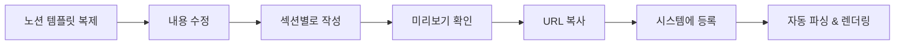
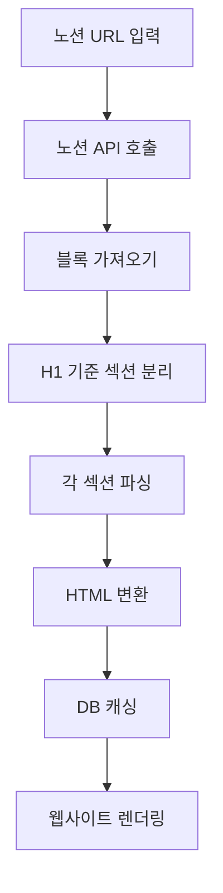

# 노션 페이지 작성 가이드 - 실제 구조와 파싱 규칙

## 1. 노션 페이지 구조 규칙 📝

### 핵심 원칙: H1(#)이 섹션 구분자

```markdown
# 🎯 hero
(이 아래 모든 내용이 hero 섹션)

# 📖 intro  
(이 아래 모든 내용이 intro 섹션)

# 👥 members
(이 아래 모든 내용이 members 섹션)
```

**시스템이 인식하는 섹션 키워드:**
- `hero` → 헤로 섹션
- `intro` → 소개 섹션  
- `members` → 멤버 섹션
- `curriculum` → 커리큘럼 섹션
- `schedule` → 일정/진행방식 섹션
- `journey` → 여정/히스토리 섹션
- `reviews` → 후기 섹션
- `faq` → FAQ 섹션
- `join` → 참가 신청 섹션

## 2. 실제 노션 페이지 예시 (테코테코)

### 노션에서 이렇게 작성하면:

```
# 🎯 hero

## 코드로 무한동력 만드는 사람들
TecoTeco에서 함께 성장해요

함께하기 → [CTA 버튼]

---

# 📖 intro

## 변화하는 세상에서 흔들리지 않을 '나'를 위한 스터디

코딩과 지식의 가치가 흔해지는 시절입니다. AI가 순식간에 코드를 작성하고, 
개발 도구들이 날마다 진화하는 지금. 개발자로서 우리가 정말 집중해야 할 것은 무엇일까요?

### 물고기를 잡는 방법을 익히는 것
우리는 '물고기 그 자체'가 아닌, **'물고기를 잡는 방법'**에 집중합니다. 
단순히 문제를 푸는 것을 넘어서, 문제의 본질을 이해하고 **견고한 사고력과 논리력**을 단련하는 것이 목표입니다.

### 물고기를 '잘' 잡는 방법을 모색하는 것  
AI를 배척하지 않고 **현명하게 활용하는 방법**을 함께 모색합니다.

> 💡 우리가 찾는 건 변화 속에서도 **흔들리지 않을 '나'**, 생각하는 힘이에요.

---

# 👥 members

## 함께하는 사람들

| 이름 | 역할 | 한 마디 |
|------|------|---------|
| 르네 | 리더 | 함께 성장하는 것이 진정한 성장입니다 |
| 크롱 | 멘토 | 코드는 생각의 표현입니다 |
| 브리 | 서포터 | 꾸준함이 답이다 |

### 르네의 이야기
10년차 개발자로서 느낀 것은...
[접기/펼치기 토글에 상세 스토리]

### 크롱의 이야기
AI 시대에 개발자로 살아남기...
[접기/펼치기 토글에 상세 스토리]

---

# 📚 curriculum

## 우리의 학습 로드맵

### 시즌 1: 기초 체력 (8주)
- [ ] 1주차: 시간복잡도와 공간복잡도
- [ ] 2주차: 배열과 문자열
- [ ] 3주차: 스택과 큐
- [ ] 4주차: 재귀와 백트래킹
- [ ] 5주차: 정렬 알고리즘
- [ ] 6주차: 이진 탐색
- [ ] 7주차: 그래프 기초
- [ ] 8주차: 종합 문제 풀이

### 시즌 2: 실전 응용 (8주)
[접기/펼치기로 상세 커리큘럼]

---

# 📅 schedule

## 이렇게 진행해요

### 정규 모임
- **시간**: 매주 토요일 오후 2-5시
- **장소**: 강남역 스터디카페
- **형식**: 오프라인 (온라인 동시 진행)

### 한 주의 흐름
```
월요일: 주제 공지 & 자료 배포
화~금: 개인 학습 & 문제 풀이
토요일: 오프라인 모임 (발표 & 토론)
일요일: 회고 작성
```

### 모임 당일 타임라인
| 시간 | 활동 |
|------|------|
| 14:00-14:30 | 체크인 & 아이스브레이킹 |
| 14:30-15:30 | 문제 풀이 발표 (3명) |
| 15:30-16:30 | 페어 프로그래밍 |
| 16:30-17:00 | 회고 & 다음 주 계획 |

---

# 🚀 journey

## 우리가 걸어온 길

### 📊 현재까지의 성과
- **시작일**: 2024년 3월 1일
- **진행 기간**: 280일
- **해결한 문제**: 500+
- **참여 인원**: 누적 50명

### 시즌별 하이라이트

/2024년 3월 - 시즌 1/
🌱 **씨앗을 뿌리다**
- 첫 모임 8명으로 시작
- 기초 알고리즘 정복
- 첫 그룹 프로젝트 완성

/2024년 6월 - 시즌 2/
🌿 **새싹이 자라다**
- 참여 인원 20명 돌파
- 카카오 코테 합격자 3명 배출
- 스터디 방법론 정립

/2024년 9월 - 시즌 3/
🌳 **나무가 되다**
- 오프라인 정기 모임 시작
- 멘토링 시스템 도입
- 첫 해커톤 참가

---

# 💬 reviews

## 참가자들의 이야기

### ⭐⭐⭐⭐⭐ "인생 스터디를 만났습니다"
> **김개발 (시즌 1 참가자)**
> 
> 혼자 공부할 때는 금방 포기했는데, 테코테코에서는 280일째 개근 중입니다.
> 매주 토요일이 기다려지는 스터디는 처음이에요.

### ⭐⭐⭐⭐⭐ "실력이 눈에 띄게 늘었어요"
> **박코딩 (시즌 2 참가자)**
>
> 3개월 만에 프로그래머스 레벨이 2개나 올랐습니다.
> 무엇보다 코드를 보는 눈이 달라졌어요.

[더 많은 후기 보기 - 노션 데이터베이스 연결]

---

# ❓ faq

## 자주 묻는 질문

### Q: 초보자도 참가할 수 있나요?
**A: 물론입니다!** 시즌 1은 초보자를 위한 커리큘럼입니다. 
기초부터 차근차근 함께 학습합니다.

### Q: 온라인으로만 참가 가능한가요?
**A: 네, 가능합니다.** 모든 모임은 온/오프라인 동시 진행됩니다.
지방이나 해외에서도 참가하실 수 있어요.

### Q: 참가비가 있나요?
**A: 없습니다.** 다만 오프라인 모임 시 카페 비용은 각자 부담입니다.

[접기/펼치기로 더 많은 FAQ]

---

# 🎯 join

## 함께하고 싶다면

### 다음 기수 모집
- **모집 기간**: 2025년 9월 1일 - 9월 15일
- **시작일**: 2025년 9월 21일
- **정원**: 20명

### 지원 자격
✅ 개발에 대한 열정
✅ 매주 5시간 이상 투자 가능
✅ 함께 성장하고 싶은 마음

[지원하기 버튼]
```

## 3. 노션 블록 → 시스템 파싱 규칙

### 파싱 로직 구현

```typescript
interface ParsedSection {
  type: string;
  title?: string;
  content?: string;
  subSections?: Array<{
    title: string;
    content: string;
  }>;
  list?: string[];
  table?: any[][];
  callout?: string;
  toggle?: Array<{
    title: string;
    content: string;
  }>;
}

class NotionParser {
  private sections: Map<string, ParsedSection> = new Map();
  private currentSection: string | null = null;
  
  parseBlocks(blocks: NotionBlock[]): StudyDetail {
    blocks.forEach(block => {
      // H1은 섹션 구분자
      if (block.type === 'heading_1') {
        const sectionName = this.extractSectionName(block);
        this.currentSection = sectionName;
        this.sections.set(sectionName, {
          type: sectionName,
          title: block.heading_1.rich_text[0]?.plain_text
        });
        return;
      }
      
      // 현재 섹션이 없으면 스킵
      if (!this.currentSection) return;
      
      const section = this.sections.get(this.currentSection)!;
      
      // H2는 섹션 제목
      if (block.type === 'heading_2') {
        section.title = block.heading_2.rich_text[0]?.plain_text;
      }
      
      // H3는 서브섹션
      if (block.type === 'heading_3') {
        if (!section.subSections) section.subSections = [];
        section.subSections.push({
          title: block.heading_3.rich_text[0]?.plain_text,
          content: ''
        });
      }
      
      // 일반 텍스트
      if (block.type === 'paragraph') {
        const text = block.paragraph.rich_text
          .map(t => this.formatRichText(t))
          .join('');
        
        if (section.subSections?.length > 0) {
          // 서브섹션에 추가
          const lastSubSection = section.subSections[section.subSections.length - 1];
          lastSubSection.content += text + '\n';
        } else {
          // 메인 콘텐츠에 추가
          section.content = (section.content || '') + text + '\n';
        }
      }
      
      // 리스트
      if (block.type === 'bulleted_list_item' || block.type === 'numbered_list_item') {
        if (!section.list) section.list = [];
        section.list.push(block[block.type].rich_text[0]?.plain_text || '');
      }
      
      // 테이블
      if (block.type === 'table') {
        section.table = this.parseTable(block);
      }
      
      // 콜아웃 (인용구)
      if (block.type === 'callout') {
        section.callout = block.callout.rich_text[0]?.plain_text;
      }
      
      // 토글 (접기/펼치기)
      if (block.type === 'toggle') {
        if (!section.toggle) section.toggle = [];
        section.toggle.push({
          title: block.toggle.rich_text[0]?.plain_text,
          content: '' // 자식 블록에서 채워짐
        });
      }
    });
    
    return this.convertToStudyDetail();
  }
  
  private extractSectionName(block: NotionBlock): string {
    const text = block.heading_1.rich_text[0]?.plain_text.toLowerCase();
    
    // 이모지 제거하고 키워드 추출
    const cleanText = text.replace(/[^\w\s가-힣]/g, '').trim();
    
    // 섹션 매핑
    if (cleanText.includes('hero') || cleanText.includes('헤로')) return 'hero';
    if (cleanText.includes('intro') || cleanText.includes('소개')) return 'intro';
    if (cleanText.includes('member') || cleanText.includes('멤버')) return 'members';
    if (cleanText.includes('curriculum') || cleanText.includes('커리큘럼')) return 'curriculum';
    if (cleanText.includes('schedule') || cleanText.includes('일정') || cleanText.includes('진행')) return 'schedule';
    if (cleanText.includes('journey') || cleanText.includes('여정')) return 'journey';
    if (cleanText.includes('review') || cleanText.includes('후기')) return 'reviews';
    if (cleanText.includes('faq')) return 'faq';
    if (cleanText.includes('join') || cleanText.includes('신청')) return 'join';
    
    // 매칭 안 되면 원본 텍스트 사용
    return cleanText;
  }
  
  private formatRichText(richText: any): string {
    let text = richText.plain_text;
    
    // 노션 포맷팅을 HTML로 변환
    if (richText.annotations.bold) text = `<strong>${text}</strong>`;
    if (richText.annotations.italic) text = `<em>${text}</em>`;
    if (richText.annotations.underline) text = `<u>${text}</u>`;
    if (richText.annotations.strikethrough) text = `<s>${text}</s>`;
    if (richText.annotations.code) text = `<code>${text}</code>`;
    
    // 링크 처리
    if (richText.href) {
      text = `<a href="${richText.href}" target="_blank">${text}</a>`;
    }
    
    return text;
  }
  
  private parseTable(tableBlock: any): any[][] {
    // 노션 테이블 파싱 로직
    // 실제로는 table_row 자식 블록들을 가져와야 함
    return [];
  }
  
  private convertToStudyDetail(): StudyDetail {
    return {
      hero: this.sections.get('hero') || null,
      intro: this.sections.get('intro') || null,
      members: this.sections.get('members') || null,
      curriculum: this.sections.get('curriculum') || null,
      schedule: this.sections.get('schedule') || null,
      journey: this.sections.get('journey') || null,
      reviews: this.sections.get('reviews') || null,
      faq: this.sections.get('faq') || null,
      join: this.sections.get('join') || null,
    };
  }
}
```

## 4. 노션 고급 기능 활용

### 4.1 데이터베이스 연동 (멤버, 후기 등)

```
노션에서:
# 👥 members
[데이터베이스 - 멤버 관리]
- 이 블록을 인라인 데이터베이스로 만들면
- API로 데이터베이스 내용도 가져올 수 있음
```

```typescript
// 데이터베이스 블록 처리
if (block.type === 'child_database') {
  const databaseId = block.id;
  const databaseContent = await notion.databases.query({
    database_id: databaseId,
  });
  
  // 멤버 리스트로 변환
  section.members = databaseContent.results.map(page => ({
    name: page.properties.Name.title[0].plain_text,
    role: page.properties.Role.select?.name,
    story: page.properties.Story.rich_text[0]?.plain_text,
    image: page.properties.Image.files[0]?.file.url
  }));
}
```

### 4.2 동기화 블록 (여러 스터디가 공유)

```
노션에서:
공통 FAQ를 동기화 블록으로 만들면
모든 스터디 페이지에서 자동 업데이트
```

### 4.3 임베드 지원

```
노션에서 지원하는 임베드:
- YouTube 비디오 → 자동으로 iframe 생성
- Google Calendar → 일정 표시
- Figma → 디자인 미리보기
- CodePen → 코드 데모
```

## 5. 운영진을 위한 체크리스트

### 노션 페이지 작성 시 지켜야 할 규칙

✅ **필수 섹션 (최소 요구사항)**
- [ ] `# 🎯 hero` - 메인 타이틀과 CTA
- [ ] `# 📖 intro` - 스터디 소개
- [ ] `# 📅 schedule` - 일정/진행 방식
- [ ] `# 🎯 join` - 참가 방법

✅ **섹션 구분**
- [ ] H1(#)으로만 섹션 구분
- [ ] 섹션 이름에 키워드 포함 (hero, intro, members 등)
- [ ] 이모지는 자유롭게 (시스템이 자동 제거)

✅ **콘텐츠 작성**
- [ ] H2(##)는 섹션 내 메인 제목
- [ ] H3(###)는 소제목
- [ ] 테이블, 리스트, 토글 자유롭게 활용
- [ ] 이미지는 노션에 직접 업로드

✅ **하지 말아야 할 것**
- [ ] H1을 섹션 구분 외 용도로 사용 X
- [ ] 섹션 순서는 자유지만 hero는 항상 첫 번째
- [ ] 코드 블록에 HTML 직접 작성 X (노션 기능만 사용)

## 6. 템플릿 제공

### 스터디 페이지 노션 템플릿

```
운영진에게 제공할 템플릿:
1. 기본 템플릿 (필수 섹션만)
2. 테코테코 템플릿 (전체 섹션)
3. 독서 스터디 템플릿
4. 프로젝트 스터디 템플릿

각 템플릿을 복제해서 시작!
```

### 템플릿 URL
```typescript
const STUDY_TEMPLATES = {
  basic: 'https://notion.so/template-basic-xxx',
  tecoteco: 'https://notion.so/template-tecoteco-xxx',
  book: 'https://notion.so/template-book-xxx',
  project: 'https://notion.so/template-project-xxx'
};

// 템플릿 복제 API
const duplicateTemplate = async (templateType: string) => {
  const templateId = STUDY_TEMPLATES[templateType];
  // 노션 API로 페이지 복제
  const newPage = await notion.pages.create({
    parent: { workspace: true },
    properties: {
      title: '새 스터디 페이지'
    },
    children: await getTemplateBlocks(templateId)
  });
  return newPage.url;
};
```

## 7. 실제 작업 흐름 정리

### 운영진 작업 흐름



### 시스템 처리 흐름



## 결론

**핵심은 단순함:**
1. H1(#)이 섹션 구분자
2. 정해진 키워드 사용 (hero, intro, members...)
3. 나머지는 노션 기능 자유롭게 활용

**운영진은:**
- 노션에서 편하게 작성
- 템플릿 복제해서 시작
- 실시간 협업 가능

**시스템은:**
- H1 찾아서 섹션 분리
- 노션 블록을 HTML로 변환
- 캐싱해서 빠르게 제공

이렇게 하면 **진짜 No-Code** 실현!