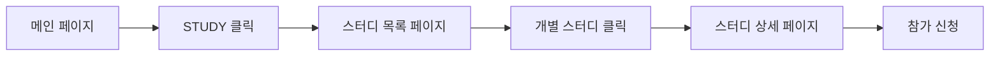

# 스터디 생성/제안 진입점 심층 분석

## 1. 현재 사이트 구조 및 사용자 플로우 분석

### 1.1 네비게이션 구조
```
AsyncSite
├── WHO WE ARE (소개)
├── STUDY (드롭다운)
│   ├── 테코테코 (모집중)
│   ├── 11루틴 (모집중)
│   ├── 데브로그 (모집중)
│   └── 모든 스터디 보기 →
├── IGNITION (점화)
└── LAB (실험실)
```

### 1.2 현재 사용자 여정


**문제점**: 스터디를 "소비"하는 플로우만 있고, "생산"하는 플로우가 없음

### 1.3 사용자 페르소나별 니즈

#### 페르소나 A: 열정적인 리더 (주요 타겟)
- **특징**: 이미 스터디를 운영해본 경험, 커뮤니티 기여 의향
- **동기**: 자신의 지식 공유, 네트워킹, 리더십 경험
- **행동**: 적극적으로 기회를 찾음, 눈에 띄는 CTA 필요

#### 페르소나 B: 수동적 참가자
- **특징**: 스터디 참가만 고려, 리더 역할 부담
- **동기**: 학습, 동료 찾기
- **행동**: 스터디 제안 기능을 무시할 가능성 높음

#### 페르소나 C: 운영진/관리자
- **특징**: 플랫폼 활성화 책임, 콘텐츠 품질 관리
- **동기**: 양질의 스터디 확보, 효율적 관리
- **행동**: 빠른 접근 필요, 관리 도구와 연결

## 2. 경쟁 서비스 벤치마킹

### 2.1 크몽 (프리랜서 마켓플레이스)
```
진입점 전략: 다중 진입점
├── 상단 네비게이션: "전문가 등록"
├── 메인 페이지: "전문가로 활동하기" 섹션
├── 푸터: "판매자 가이드"
└── 사이드 배너: "월 1,000만원 버는 전문가 되기"
```
**인사이트**: 여러 터치포인트로 전환 기회 극대화

### 2.2 탈잉 (재능 공유 플랫폼)
```
진입점 전략: 명확한 역할 분리
├── 헤더 우측: "튜터 등록" 버튼 (항상 고정)
├── 메인 히어로: "당신의 재능을 나눠주세요"
└── 별도 랜딩: /tutor (튜터 전용 페이지)
```
**인사이트**: 역할(튜터/수강생)을 명확히 구분

### 2.3 클래스101
```
진입점 전략: 단계적 유도
├── 초기: 크리에이터 지원 프로그램 공지
├── 중기: 이메일 뉴스레터로 유도
└── 최종: 별도 크리에이터 센터 (/creator)
```
**인사이트**: 준비된 사용자만 유도하는 전략

### 2.4 Meetup
```
진입점 전략: 컨텍스트 기반
├── 스터디 없는 카테고리: "Start a group in [category]"
├── 검색 결과 없을 때: "Create what you're looking for"
└── 프로필 페이지: "Organize a group"
```
**인사이트**: 사용자 니즈가 명확할 때 제안

## 3. 진입점 옵션 심층 분석

### Option 1: 글로벌 네비게이션 추가
```
위치: 헤더 메인 메뉴
형태: WHO WE ARE | STUDY | CREATE | IGNITION | LAB
```

**장점:**
- 🎯 **최고의 발견성**: 모든 페이지에서 접근 가능
- 🔄 **일관된 위치**: 사용자가 예측 가능한 위치
- 📱 **반응형 대응**: 모바일에서도 햄버거 메뉴에 포함

**단점:**
- ❌ **네비게이션 복잡도 증가**: 메뉴 항목 추가로 인지 부담
- ❌ **역할 모호성**: CREATE가 무엇을 생성하는지 불명확
- ❌ **권한 이슈**: 비로그인 사용자에게도 노출

**구현 시 고려사항:**
```typescript
// 조건부 렌더링
{isAuthenticated && (
  <li>
    <Link to="/study/create" className="nav-create">
      CREATE
      <span className="nav-badge">NEW</span>
    </Link>
  </li>
)}
```

### Option 2: STUDY 드롭다운 내 추가
```
STUDY ▼
├── 테코테코 [모집중]
├── 11루틴 [모집중]
├── 데브로그 [모집중]
├── ─────────────────
├── 모든 스터디 보기 →
└── ✨ 스터디 제안하기  // 새로 추가
```

**장점:**
- ✅ **컨텍스트 일치**: STUDY 관련 액션이 한 곳에
- ✅ **기존 구조 유지**: 네비게이션 복잡도 증가 없음
- ✅ **점진적 발견**: 관심 있는 사용자가 자연스럽게 발견

**단점:**
- ❌ **낮은 발견성**: 드롭다운을 열어야만 보임
- ❌ **모바일 접근성**: 2단계 탭 필요
- ❌ **시각적 위계 부족**: 다른 스터디 링크와 동일 레벨

**개선안:**
```css
.nav-dropdown-create {
  border-top: 2px solid #f0f0f0;
  background: linear-gradient(135deg, #667eea 0%, #764ba2 100%);
  color: white;
  font-weight: bold;
}
```

### Option 3: StudyPage 내 다중 진입점
```
StudyPage 레이아웃:
┌─────────────────────────────────────┐
│ STUDY                               │
│ 함께 성장하는 개발자들의 커뮤니티     │
│ [✨ 스터디 제안하기]                 │ <- Hero CTA
├─────────────────────────────────────┤
│ [스터디 목록] [일정] [+ 새 스터디]   │ <- Tab
├─────────────────────────────────────┤
│ 📢 모집 중인 스터디                  │
│ ┌──────┐ ┌──────┐ ┌──────┐        │
│ │테코테코│ │11루틴 │ │데브로그│      │
│ └──────┘ └──────┘ └──────┘        │
├─────────────────────────────────────┤
│              [+] FAB                │ <- Floating Button
└─────────────────────────────────────┘
```

**장점:**
- 🎯 **다중 터치포인트**: 여러 기회로 전환율 증가
- 📱 **디바이스 최적화**: 모바일(FAB), 데스크톱(Hero) 구분
- 🔄 **A/B 테스트 가능**: 각 진입점 효과 측정 가능

**단점:**
- ❌ **UI 과부하**: 너무 많은 CTA로 혼란 가능
- ❌ **일관성 부족**: 같은 액션에 다른 UI
- ❌ **유지보수 복잡**: 여러 컴포넌트 관리

### Option 4: 컨텍스트 기반 동적 제안
```
시나리오별 진입점:
1. 검색 결과 없을 때: "찾는 스터디가 없나요? 직접 만들어보세요!"
2. 모든 스터디 마감: "새로운 스터디를 제안해보세요"
3. 프로필 페이지: "스터디 리더 되기"
4. 스터디 참가 후: "당신도 스터디를 운영해보세요"
```

**장점:**
- 🎯 **높은 관련성**: 사용자 니즈와 정확히 매칭
- 😊 **자연스러운 UX**: 강요하지 않는 제안
- 📈 **높은 전환율**: 적절한 타이밍에 제안

**단점:**
- ❌ **구현 복잡도**: 여러 조건 체크 필요
- ❌ **일관성 부족**: 사용자마다 다른 경험
- ❌ **예측 불가능**: 언제 나타날지 모름

### Option 5: 권한 기반 적응형 UI
```typescript
// 사용자 타입별 다른 UI
const StudyPageHeader = () => {
  const { user } = useAuth();
  
  if (!user) {
    return <CallToAction type="login" />;
  }
  
  if (user.roles.includes('ROLE_ADMIN')) {
    return <AdminQuickActions />; // 즉시 생성
  }
  
  if (user.studiesLed > 0) {
    return <LeaderDashboard />; // 대시보드 + 새 스터디
  }
  
  if (user.studiesJoined > 3) {
    return <SuggestBecomeLeader />; // 리더 유도
  }
  
  return <StandardUserView />; // 제안 버튼
};
```

**장점:**
- 🎯 **개인화된 경험**: 사용자별 최적화
- 📈 **단계별 성장**: 사용자 성숙도에 따른 유도
- 🔐 **권한 명확**: 역할별 기능 차별화

**단점:**
- ❌ **복잡한 로직**: 많은 조건 분기
- ❌ **테스트 어려움**: 다양한 케이스 검증 필요
- ❌ **일관성 부족**: 사용자간 경험 차이

### Option 6: 전용 랜딩 페이지 + 소프트 유도
```
구조:
/study/leader <- 전용 랜딩 페이지
├── 리더가 되어야 하는 이유
├── 성공 사례
├── 가이드라인
└── [시작하기] CTA

유도 전략:
- 이메일 캠페인
- 블로그 포스트
- 스터디 종료 후 제안
```

**장점:**
- 📚 **충분한 정보 제공**: 준비된 리더 양성
- 🎯 **명확한 가치 제안**: Why, What, How 설명
- 📈 **퀄리티 컨트롤**: 진입 장벽으로 품질 유지

**단점:**
- ❌ **낮은 발견성**: 적극적 홍보 필요
- ❌ **긴 퍼널**: 전환까지 단계 많음
- ❌ **초기 콘텐츠 부족**: 성공 사례 필요

## 4. 사용자 시나리오별 최적 진입점

### 시나리오 1: "스터디를 만들고 싶어서 방문"
**사용자 의도**: 명확한 목적
**최적 진입점**: Option 1 (글로벌 네비게이션)
**이유**: 즉시 찾을 수 있는 명확한 위치

### 시나리오 2: "스터디 둘러보다가 아이디어 떠오름"
**사용자 의도**: 탐색 중 영감
**최적 진입점**: Option 3 (StudyPage 다중 진입점)
**이유**: 컨텍스트 유지하며 자연스러운 전환

### 시나리오 3: "찾는 스터디가 없어서 실망"
**사용자 의도**: 충족되지 않은 니즈
**최적 진입점**: Option 4 (컨텍스트 기반)
**이유**: 적절한 타이밍에 대안 제시

### 시나리오 4: "관리자가 긴급히 스터디 개설"
**사용자 의도**: 빠른 작업
**최적 진입점**: Option 5 (권한 기반 적응형)
**이유**: 역할에 맞는 빠른 접근

## 5. 최종 추천: Hybrid Progressive Approach

### Phase 1: MVP (1주차)
```
구현: Option 2 + Option 3의 FAB
- STUDY 드롭다운에 "✨ 스터디 제안하기" 추가
- StudyPage에 모바일 FAB 추가
- 로그인 사용자만 표시
```

**선택 이유:**
- 빠른 구현 가능
- 기존 구조 최소 변경
- 모바일/데스크톱 대응

### Phase 2: 확장 (2-3주차)
```
추가: Option 4 일부
- 검색 결과 없을 때 제안
- 모든 스터디 마감 시 제안
```

**선택 이유:**
- 자연스러운 UX 개선
- 데이터 기반 최적화 가능

### Phase 3: 고도화 (1개월 후)
```
추가: Option 5 + Option 6
- 사용자 타입별 UI 최적화
- 리더 전용 랜딩 페이지
- 이메일 캠페인 연동
```

**선택 이유:**
- 개인화된 경험 제공
- 장기적 성장 전략

## 6. 구현 우선순위 및 기술적 고려사항

### 즉시 구현 (Must Have)
```typescript
// 1. STUDY 드롭다운 수정
<div className="nav-dropdown">
  {/* 기존 스터디 목록 */}
  <div className="nav-dropdown-divider"></div>
  <Link to="/study/create" className="nav-dropdown-create">
    <span className="create-icon">✨</span>
    <span>스터디 제안하기</span>
  </Link>
</div>

// 2. FAB 컴포넌트
const StudyCreateFAB = () => {
  const { user } = useAuth();
  const isMobile = useMediaQuery('(max-width: 768px)');
  
  if (!user || !isMobile) return null;
  
  return (
    <button 
      className="fab-create"
      onClick={() => navigate('/study/create')}
      aria-label="스터디 제안하기"
    >
      <PlusIcon />
    </button>
  );
};
```

### 추후 구현 (Nice to Have)
```typescript
// 컨텍스트 기반 제안
const EmptyStateMessage = ({ searchQuery }) => (
  <div className="empty-state">
    <p>"{searchQuery}"에 대한 스터디가 없습니다.</p>
    <button onClick={() => navigate(`/study/create?preset=${searchQuery}`)}>
      이 주제로 스터디 만들기
    </button>
  </div>
);
```

## 7. 성공 지표

### 단기 지표 (1개월)
- 진입점 클릭률: > 5%
- 폼 시작률: > 60% (클릭 대비)
- 폼 완성률: > 40%

### 중기 지표 (3개월)
- 월간 제안 수: > 20건
- 승인률: > 30%
- 재제안율: > 15%

### 장기 지표 (6개월)
- 사용자 생성 스터디 비율: > 40%
- 리더 전환율: > 10% (활성 사용자 중)
- 스터디 완주율: > 50%

## 8. 리스크 및 대응 방안

### 리스크 1: 낮은 품질의 스터디 범람
**대응**: 
- 검토 프로세스 강화
- 최소 요구사항 설정
- 커뮤니티 평가 시스템

### 리스크 2: 진입점 무시 (Banner Blindness)
**대응**:
- A/B 테스트로 최적화
- 주기적 위치/디자인 변경
- 인센티브 제공

### 리스크 3: 복잡한 프로세스로 이탈
**대응**:
- 단계적 온보딩
- 자동 저장
- 템플릿 제공

## 9. 결론

**최적 진입점 전략:**

1. **즉시**: STUDY 드롭다운 + 모바일 FAB
2. **단기**: 컨텍스트 기반 제안 추가
3. **장기**: 개인화 + 전용 랜딩 페이지

이 접근법은:
- ✅ 빠른 실행 가능
- ✅ 점진적 개선 가능
- ✅ 데이터 기반 최적화 가능
- ✅ 리스크 최소화

**핵심 원칙:**
> "사용자가 필요를 느끼는 순간에, 가장 자연스러운 위치에서, 최소한의 마찰로 스터디 생성을 유도한다."

*작성일: 2025년 8월 7일*
*작성자: AsyncSite Platform Team*