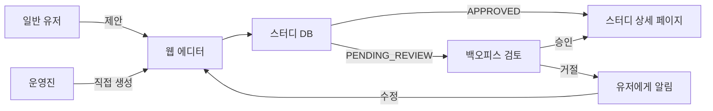

# 스터디 상세 페이지 에디터 구현 전략 분석

## 1. 현황 및 문제 정의

### 1.1 현재 상황
- **백오피스**: 스터디 메타 정보 등록 기능만 구현 (상세 정보 입력 불가)
- **웹 프론트엔드**: 
  - 스터디 상세 정보가 하드코딩됨 (예: 테코테코 페이지)
  - 일반 유저의 스터디 제안 UI 미구현
- **백엔드**: 스터디 상세 정보 저장 구조 필요

### 1.2 스터디 등록 시나리오
1. **일반 유저 시나리오**: 리더가 되고 싶은 유저가 스터디 제안
2. **운영진 시나리오**: 백오피스에서 공식 스터디 개설

### 1.3 핵심 요구사항
- 스터디 상세 정보(커리큘럼, 소개, 일정 등)를 리치 텍스트로 관리
- 일반 유저는 백오피스 접근 불가
- 상세 정보는 설득력 있는 전시용 콘텐츠여야 함

## 2. 고민 포인트 분석

### 2.1 아키텍처 관점
- **코드 중복 vs 재사용성**: 에디터 컴포넌트를 어떻게 공유할 것인가?
- **권한 분리**: 일반 유저와 운영진의 기능 차이를 어떻게 구현할 것인가?
- **데이터 일관성**: 두 경로로 생성된 콘텐츠의 품질과 형식을 어떻게 통일할 것인가?

### 2.2 사용자 경험 관점
- **접근성**: 각 사용자 그룹이 쉽게 접근할 수 있는가?
- **기능 차이**: 운영진과 일반 유저에게 필요한 기능이 다른가?
- **워크플로우**: 스터디 제안→검토→승인 프로세스를 어떻게 구현할 것인가?

### 2.3 개발 및 유지보수 관점
- **개발 효율성**: 한 번 개발해서 두 곳에서 사용 vs 각각 개발
- **유지보수성**: 향후 기능 추가/변경 시 영향 범위
- **테스트 복잡도**: 각 옵션별 테스트 시나리오 복잡도

### 2.4 보안 및 권한 관점
- **접근 제어**: 누가 어떤 기능을 사용할 수 있는가?
- **콘텐츠 검증**: 유저 생성 콘텐츠의 품질 관리
- **승인 프로세스**: 유저 제안 스터디의 검토 및 승인

## 3. 구현 옵션 분석

### 옵션 1: 분산 구현 (웹 + 백오피스 각각)

#### 구조
```
웹 프론트엔드
├── pages/study/propose/     # 유저 스터디 제안
│   └── StudyProposeEditor   # 유저용 에디터
└── components/study/detail/  # 상세 페이지 표시

백오피스
├── pages/study/create/       # 운영진 스터디 생성
│   └── StudyDetailEditor     # 관리자용 에디터
└── pages/study/review/       # 유저 제안 검토
```

#### 장점
- 각 사용자 그룹에 최적화된 UI/UX 제공 가능
- 권한 분리가 명확함
- 각 시스템의 독립성 유지

#### 단점
- 코드 중복 (에디터 컴포넌트, 유효성 검증 등)
- 유지보수 비용 증가 (두 곳 모두 수정 필요)
- 기능 불일치 위험

### 옵션 2: 웹 통합 구현 (웹에 모든 기능 집중)

#### 구조
```
웹 프론트엔드
├── pages/study/
│   ├── propose/              # 일반 유저 제안
│   ├── create/               # 운영진 생성 (권한 체크)
│   └── edit/                 # 공통 편집 (권한별 기능 차이)
└── components/study/
    └── StudyDetailEditor/    # 공통 에디터 컴포넌트
        ├── BasicEditor       # 기본 기능
        └── AdvancedEditor    # 고급 기능 (운영진용)
```

#### 장점
- 코드 재사용성 극대화
- 일관된 사용자 경험
- 유지보수 용이

#### 단점
- 웹에 관리자 기능 노출 (권한 체크 필수)
- 복잡한 권한 관리 로직
- 백오피스의 독립성 저하

### 옵션 3: 공통 에디터 라이브러리 + 각 시스템 구현

#### 구조
```
shared-components (별도 패키지)
└── StudyDetailEditor/        # 공통 에디터 컴포넌트

웹 프론트엔드
├── pages/study/propose/      # shared-components 사용
└── StudyProposeWrapper       # 웹 특화 래퍼

백오피스
├── pages/study/create/       # shared-components 사용
└── StudyCreateWrapper        # 백오피스 특화 래퍼
```

#### 장점
- 핵심 로직 공유, UI는 각 시스템에 맞게 커스터마이징
- 시스템 독립성 유지
- 장기적으로 확장성 우수

#### 단점
- 초기 설정 복잡 (패키지 관리, 빌드 설정 등)
- 배포 프로세스 복잡도 증가
- 현재 프로젝트 구조 변경 필요

### 옵션 4: 하이브리드 접근 (웹 에디터 + 백오피스 검토)

#### 구조
```
웹 프론트엔드
├── pages/study/
│   ├── propose/              # 모든 사용자용 통합 에디터
│   │   └── StudyEditor       # 권한별 기능 활성화
│   └── detail/               # 상세 페이지

백오피스
└── pages/study/
    ├── review/               # 제안된 스터디 검토/승인
    └── manage/               # 기존 스터디 관리
```

#### 장점
- 웹에서 통합 관리로 코드 중복 최소화
- 백오피스는 검토/관리에 집중
- 명확한 역할 분리

#### 단점
- 웹의 복잡도 증가
- 운영진이 두 시스템을 오가야 함

## 4. 추천 방안: 옵션 4 (하이브리드 접근)

### 4.1 추천 이유

#### 실용성
- **즉시 구현 가능**: 현재 코드베이스에 최소한의 변경으로 구현
- **점진적 마이그레이션**: 기존 백오피스 기능을 유지하면서 새 기능 추가

#### 사용자 경험
- **통합된 제작 경험**: 모든 사용자가 동일한 에디터 사용
- **명확한 워크플로우**: 제안→검토→승인의 자연스러운 흐름

#### 개발 효율성
- **코드 재사용**: RichTextEditor 컴포넌트 재활용
- **단일 유지보수 포인트**: 에디터 로직을 한 곳에서 관리

### 4.2 구현 전략

#### Phase 1: 웹 에디터 구현 (2주)
```typescript
// pages/study/propose/StudyProposePage.tsx
interface StudyProposalForm {
  // 메타 정보
  title: string;
  category: string;
  maxMembers: number;
  startDate: Date;
  
  // 상세 정보 (리치 텍스트)
  introduction: string;      // 스터디 소개
  curriculum: string;        // 커리큘럼
  requirements: string;      // 참가 요건
  benefits: string;          // 기대 효과
  
  // 제안자 정보
  proposerRole: 'MEMBER' | 'ADMIN';
}

// 권한별 기능 차이
const StudyEditor = ({ userRole }: { userRole: string }) => {
  const isAdmin = userRole === 'ROLE_ADMIN';
  
  return (
    <>
      <BasicInfoSection />
      <RichTextEditor 
        name="introduction"
        maxLength={isAdmin ? 10000 : 5000}
        features={isAdmin ? ADMIN_FEATURES : USER_FEATURES}
      />
      {isAdmin && <AdvancedOptionsSection />}
    </>
  );
};
```

#### Phase 2: 백엔드 스키마 확장 (1주)
```sql
-- 스터디 상세 정보 테이블
ALTER TABLE studies ADD COLUMN introduction TEXT;
ALTER TABLE studies ADD COLUMN curriculum TEXT;
ALTER TABLE studies ADD COLUMN requirements TEXT;
ALTER TABLE studies ADD COLUMN benefits TEXT;
ALTER TABLE studies ADD COLUMN detail_format VARCHAR(20) DEFAULT 'html';

-- 스터디 제안 상태
ALTER TABLE studies ADD COLUMN proposal_status 
  ENUM('DRAFT', 'PENDING_REVIEW', 'APPROVED', 'REJECTED') 
  DEFAULT 'DRAFT';
ALTER TABLE studies ADD COLUMN proposed_by BIGINT;
ALTER TABLE studies ADD COLUMN reviewed_by BIGINT;
ALTER TABLE studies ADD COLUMN review_comment TEXT;
```

#### Phase 3: 백오피스 검토 기능 (1주)
```typescript
// backoffice/pages/study/review/StudyReviewPage.tsx
const StudyReviewPage = () => {
  const [pendingStudies, setPendingStudies] = useState([]);
  
  return (
    <div>
      <h1>스터디 제안 검토</h1>
      {pendingStudies.map(study => (
        <StudyReviewCard 
          key={study.id}
          study={study}
          onApprove={handleApprove}
          onReject={handleReject}
          onRequestChanges={handleRequestChanges}
        />
      ))}
    </div>
  );
};
```

#### Phase 4: 통합 및 최적화 (1주)
- 권한 기반 라우팅
- 알림 시스템 (제안 승인/거절 알림)
- 임시 저장 기능
- 미리보기 기능

### 4.3 권한 모델

```typescript
enum StudyPermission {
  // 일반 유저
  PROPOSE_STUDY = 'study:propose',
  EDIT_OWN_PROPOSAL = 'study:edit:own',
  VIEW_OWN_PROPOSAL = 'study:view:own',
  
  // 운영진
  CREATE_OFFICIAL_STUDY = 'study:create:official',
  REVIEW_PROPOSALS = 'study:review',
  EDIT_ANY_STUDY = 'study:edit:any',
  PUBLISH_STUDY = 'study:publish',
}

// 권한 체크 미들웨어
const checkStudyPermission = (permission: StudyPermission) => {
  return (req, res, next) => {
    const user = req.user;
    
    if (permission === StudyPermission.PROPOSE_STUDY) {
      // 모든 로그인 유저 가능
      return user ? next() : res.status(401).send();
    }
    
    if (permission.includes('official') || permission.includes('review')) {
      // 운영진만 가능
      return user?.role === 'ADMIN' ? next() : res.status(403).send();
    }
    
    // ... 기타 권한 체크
  };
};
```

### 4.4 데이터 플로우



### 4.5 위험 요소 및 대응 방안

#### 위험 1: 스팸/저품질 제안
- **대응**: 
  - 제안 횟수 제한 (일 3회, 월 10회)
  - 최소 가입 기간 요구 (7일)
  - AI 기반 콘텐츠 품질 체크

#### 위험 2: 운영진 업무 과중
- **대응**:
  - 자동 필터링 (금지어, 스팸 패턴)
  - 커뮤니티 사전 검토 (베타 테스터 그룹)
  - 템플릿 제공으로 품질 향상

#### 위험 3: 기술적 복잡도
- **대응**:
  - 단계별 구현 (MVP → 개선)
  - 기존 RichTextEditor 재사용
  - 충분한 테스트 기간 확보

## 5. 구현 로드맵

### 단기 (1-2주)
1. 웹에 StudyProposePage 구현
2. RichTextEditor를 활용한 상세 정보 입력
3. 백엔드 API 확장 (studies 테이블 스키마 변경)

### 중기 (3-4주)
1. 백오피스 검토 페이지 구현
2. 승인/거절 워크플로우
3. 알림 시스템 연동

### 장기 (1-2개월)
1. 고급 기능 추가 (템플릿, AI 도우미)
2. 분석 대시보드 (제안 통계, 승인률 등)
3. 커뮤니티 기능 (사전 투표, 피드백)

## 6. 성공 지표

### 정량적 지표
- 월간 스터디 제안 수 > 20건
- 제안 승인률 > 30%
- 에디터 로딩 시간 < 1초
- 제안 작성 완료율 > 60%

### 정성적 지표
- 사용자 만족도 (NPS > 7)
- 운영진 업무 효율성 향상
- 스터디 콘텐츠 품질 향상
- 커뮤니티 참여도 증가

## 7. 결론

하이브리드 접근 방식(옵션 4)을 통해:
1. **즉각적인 가치 제공**: 빠른 구현으로 사용자에게 즉시 기능 제공
2. **점진적 개선**: MVP 출시 후 피드백 기반 개선
3. **균형잡힌 복잡도**: 과도한 엔지니어링 없이 실용적 해결
4. **명확한 역할 분리**: 웹(제작) vs 백오피스(관리)의 명확한 구분

이 접근법은 현재 프로젝트 상황과 리소스를 고려할 때 가장 실용적이며, 향후 확장 가능성도 열어둔 균형잡힌 솔루션입니다.

*작성일: 2025년 8월 6일*
*작성자: AsyncSite Platform Team*

---

## 8. 추가 고민 과정과 최종 결론 (2025년 8월 6일 업데이트)

### 8.1 초기 혼란: 기술 선택에 매몰

처음에는 옵션 4(하이브리드 접근)를 추천했지만, 이후 논의가 다른 방향으로 전개되었습니다:

1. **Notion API 통합** - 운영진이 편하게 작성할 수 있는 대안 검토
2. **MDX 도입** - 커스텀 스타일링이 가능한 기술적 해결책 모색  
3. **공통 라이브러리 방식** - 코드 재사용을 위한 아키텍처 변경 고려

이러한 기술적 대안들을 검토하는 과정에서 깨달은 것:
- **함정**: 에디터 기술(TipTap vs MDX vs Notion)에 집중하느라 본질을 놓침
- **깨달음**: 문제는 "어떤 에디터를 쓰느냐"가 아니라 "어디에 구현하느냐"였음

### 8.2 공통 라이브러리 방식 구체화

두 레포(web, backoffice)가 분리된 상황에서 라이브러리 공유 방법:

#### 모노레포 전환 (pnpm workspace)
```
asyncsite/
├── packages/
│   ├── shared-ui/          # 공통 컴포넌트
│   ├── web/               
│   └── backoffice/        
```

#### 독립 NPM 패키지
```bash
# 별도 레포로 관리
@asyncsite/shared-ui → npm registry → web/backoffice에서 설치
```

**하지만 이것도 본질이 아니었습니다.**

### 8.3 진짜 인사이트: 크몽 사례 분석

**핵심 질문**: "크몽에서 관리자가 상품을 올릴 때도 백오피스를 쓸까?"

#### 실제 마켓플레이스 패턴 분석

| 서비스 | 일반 사용자 | 플랫폼 관리자 | 백오피스 역할 |
|--------|------------|--------------|--------------|
| **크몽** | 웹에서 상품 등록 | 똑같은 웹에서 등록 | 검토/승인/관리 |
| **탈잉** | 웹에서 클래스 등록 | 웹에서 특별 클래스 등록 | 검토/정산/통계 |
| **에어비앤비** | 웹/앱에서 숙소 등록 | 웹에서 Airbnb Plus 등록 | 품질 관리/분쟁 해결 |
| **클래스101** | 크리에이터 센터에서 등록 | 같은 도구 사용 | 큐레이션/마케팅 |

**공통 패턴 발견**:
- 콘텐츠 **생산(Creation)**은 웹에서 통합
- 백오피스는 **관리(Management)**에만 집중

### 8.4 패러다임 전환

#### 잘못된 이해
```
백오피스 = 관리자가 콘텐츠를 등록하는 곳
웹 = 일반 사용자만 사용하는 곳
```

#### 올바른 이해
```
웹 = 모든 사용자가 콘텐츠를 생산하는 곳 (Creation)
백오피스 = 콘텐츠를 관리/검토/분석하는 곳 (Management)
```

### 8.5 최종 결론: 역할 기반 통합 에디터

#### 구현 방향
```typescript
// 웹: 통합 스터디 등록 페이지
/study/create (또는 /study/propose)

const StudyCreatePage = () => {
  const { user } = useAuth();
  const isAdmin = user?.role === 'ADMIN';
  
  return (
    <div>
      {/* 동일한 에디터, 권한별 차이는 최소화 */}
      <StudyEditor
        maxLength={isAdmin ? 10000 : 5000}
        autoPublish={isAdmin}  // 관리자는 즉시 게시 가능
      />
    </div>
  );
};
```

#### 백오피스의 진짜 역할
```
/admin/studies
├── /review        # 일반 유저가 제안한 스터디 검토
├── /analytics     # 스터디 통계/성과 분석
├── /moderation    # 신고/문제 관리
└── /bulk-edit     # 일괄 수정/관리
```

### 8.6 이 접근법의 장점

1. **업계 검증된 패턴** - 성공한 플랫폼들이 채택한 방식
2. **코드 재사용 극대화** - 에디터는 한 곳에만 구현
3. **일관된 사용 경험** - 운영진도 같은 도구 사용
4. **명확한 역할 분리** - 생산 vs 관리의 명확한 구분
5. **확장성** - 향후 크리에이터 이코노미로 전환 가능

### 8.7 구현 로드맵 (수정)

#### Phase 1: 웹 통합 에디터 (1-2주)
- 웹에 `/study/create` 페이지 구현
- 권한별 기능 차이 최소화
- 일반 유저 제안 → `PENDING_REVIEW`
- 운영진 생성 → `PUBLISHED` or `DRAFT`

#### Phase 2: 백오피스 관리 도구 (1주)
- 검토 큐 시스템
- 일괄 승인/거절 기능
- 피드백 시스템

#### Phase 3: 고도화 (1개월~)
- 템플릿 시스템
- AI 콘텐츠 검토
- 자동 품질 체크

### 8.8 교훈

> "때로는 더 많은 기술적 옵션을 탐색하는 것보다, 실제 성공 사례를 분석하는 것이 더 나은 해답을 준다."

크몽의 사례를 통해 깨달은 것:
- 백오피스에 별도 에디터를 만드는 것은 불필요한 중복
- 사용자와 관리자의 구분은 '권한'이지 '도구'가 아님
- 진짜 중요한 것은 워크플로우의 효율성

**최종 선택: 웹 통합 에디터 + 백오피스 관리 시스템**

*업데이트: 2025년 8월 6일 - 심화 분석 후 결론*