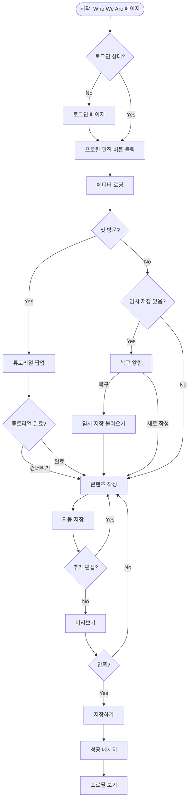
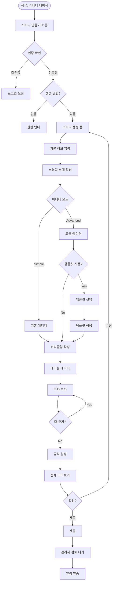
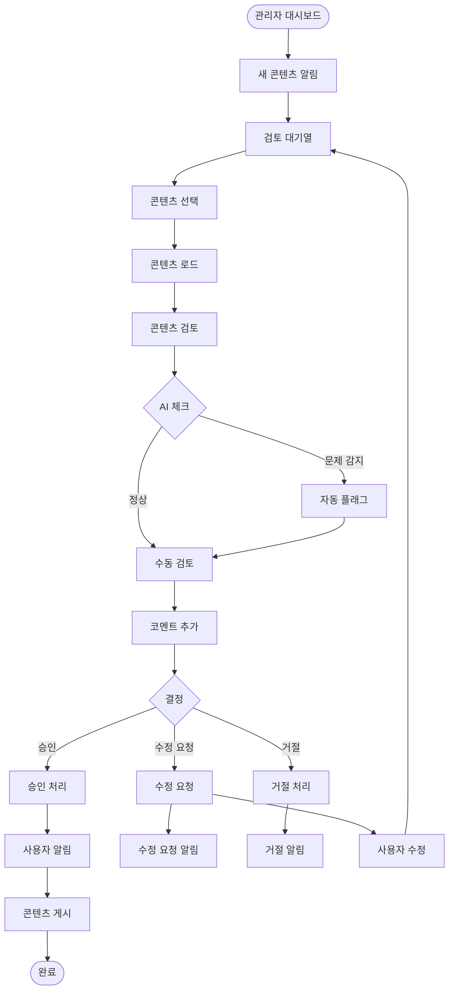
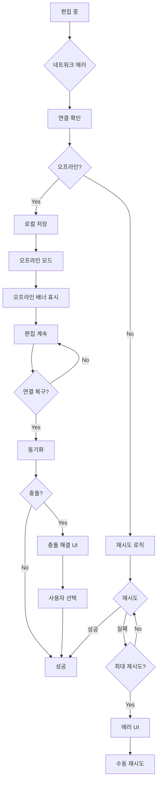
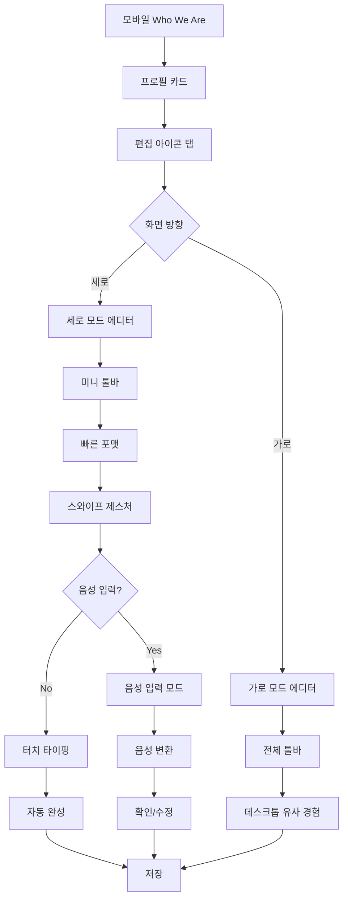
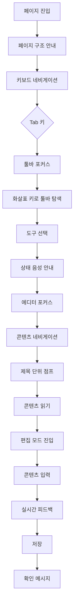
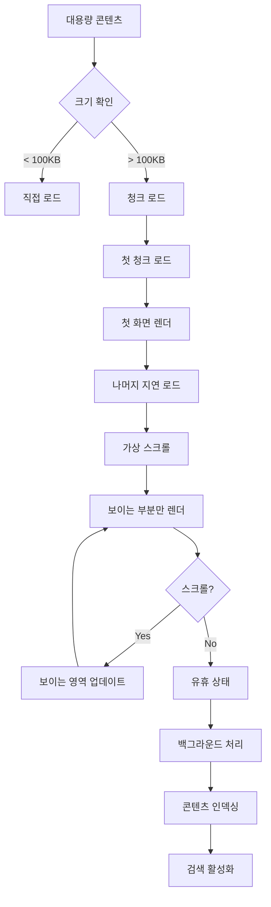
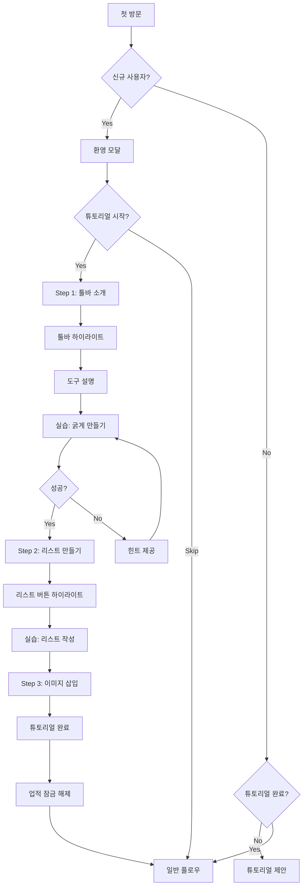
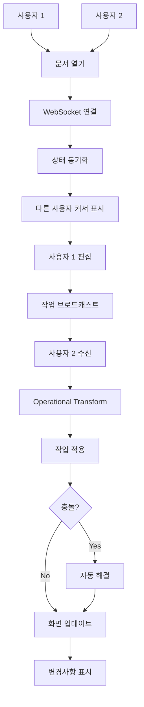

# TipTap Editor 사용자 플로우 시나리오

## Executive Summary

AsyncSite 플랫폼에서 TipTap 에디터를 사용하는 모든 사용자 시나리오와 플로우를 정의합니다. 일반 사용자와 관리자의 전체 여정을 매핑하고, 각 터치포인트에서의 최적 경험을 설계합니다.

## 1. 사용자 페르소나 정의

### 1.1 일반 사용자 페르소나

#### 김개발 (Junior Developer)
```yaml
나이: 26세
경력: 1년차 프론트엔드 개발자
목표: 
  - 자기소개 프로필 작성
  - 스터디 참여 및 활동
  - 네트워킹
기술 수준: 중급
선호 디바이스: 노트북 (80%), 모바일 (20%)
주요 pain points:
  - 복잡한 에디터 인터페이스 부담
  - 모바일에서 긴 글 작성 어려움
```

#### 이시니어 (Senior Developer)
```yaml
나이: 35세
경력: 10년차 풀스택 개발자
목표:
  - 스터디 개설 및 운영
  - 멘토링 활동
  - 지식 공유
기술 수준: 고급
선호 디바이스: 데스크톱 (60%), 태블릿 (30%), 모바일 (10%)
주요 pain points:
  - 구조화된 커리큘럼 작성 필요
  - 테이블, 코드 블록 등 고급 기능 필요
```

### 1.2 관리자 페르소나

#### 박관리 (Community Manager)
```yaml
나이: 30세
역할: 커뮤니티 매니저
목표:
  - 콘텐츠 품질 관리
  - 사용자 지원
  - 커뮤니티 활성화
기술 수준: 중급
선호 디바이스: 데스크톱 (90%), 모바일 (10%)
주요 pain points:
  - 대량의 콘텐츠 검토
  - 빠른 승인/거절 프로세스 필요
  - 사용자와의 커뮤니케이션
```

## 2. 핵심 사용자 플로우

### 2.1 프로필 작성 플로우 (Who We Are)



#### 상세 단계별 설명

**Step 1: 진입점**
```typescript
// Who We Are 페이지에서 프로필 편집 진입
const ProfileEntryPoint = () => {
  const { isAuthenticated, user } = useAuth();
  
  if (!isAuthenticated) {
    return <LoginPrompt message="프로필을 작성하려면 로그인이 필요합니다" />;
  }
  
  if (!user.hasProfile) {
    return <CreateProfileCTA message="나만의 프로필을 작성해보세요!" />;
  }
  
  return <EditProfileButton />;
};
```

**Step 2: 에디터 초기화**
```typescript
// 에디터 로딩 및 초기화
const EditorInitialization = () => {
  const [editorState, setEditorState] = useState<EditorState>('loading');
  const [recoveryData, setRecoveryData] = useState(null);
  
  useEffect(() => {
    // 1. 로컬 스토리지에서 임시 저장 확인
    const draft = localStorage.getItem('profile-draft');
    if (draft) {
      setRecoveryData(JSON.parse(draft));
    }
    
    // 2. 사용자 기존 프로필 로드
    loadUserProfile().then(profile => {
      if (profile) {
        initializeEditor(profile);
      } else {
        initializeEditor(defaultTemplate);
      }
      setEditorState('ready');
    });
  }, []);
  
  if (editorState === 'loading') {
    return <EditorSkeleton />;
  }
  
  if (recoveryData) {
    return <RecoveryPrompt data={recoveryData} />;
  }
  
  return <TipTapEditor />;
};
```

**Step 3: 콘텐츠 작성**
```typescript
// 실시간 편집 경험
const ContentWriting = () => {
  const [content, setContent] = useState('');
  const [saveStatus, setSaveStatus] = useState<SaveStatus>('idle');
  const debouncedSave = useDebouncedCallback(saveContent, 1000);
  
  const handleContentChange = (newContent: string) => {
    setContent(newContent);
    setSaveStatus('typing');
    debouncedSave(newContent);
  };
  
  return (
    <div className="editor-container">
      <EditorHeader>
        <CharacterCount current={content.length} max={500} />
        <SaveIndicator status={saveStatus} />
      </EditorHeader>
      
      <TipTapEditor
        content={content}
        onChange={handleContentChange}
        placeholder="나를 소개하는 글을 작성해보세요..."
      />
      
      <EditorFooter>
        <button onClick={showPreview}>미리보기</button>
        <button onClick={saveProfile} disabled={!content}>
          프로필 저장
        </button>
      </EditorFooter>
    </div>
  );
};
```

### 2.2 스터디 생성 플로우



#### 스터디 생성 단계별 UX

**Step 1: 권한 확인 및 안내**
```typescript
interface StudyCreationGate {
  canCreate: boolean;
  reason?: string;
  requirements?: string[];
}

const StudyCreationEntry = () => {
  const gate = useStudyCreationGate();
  
  if (!gate.canCreate) {
    return (
      <GateMessage>
        <Icon name="lock" />
        <h3>스터디 생성 권한이 필요합니다</h3>
        <p>{gate.reason}</p>
        <RequirementsList items={gate.requirements} />
        <button>권한 신청하기</button>
      </GateMessage>
    );
  }
  
  return <StudyCreationWizard />;
};
```

**Step 2: 위자드 형식의 단계별 작성**
```typescript
const StudyCreationWizard = () => {
  const [currentStep, setCurrentStep] = useState(1);
  const [formData, setFormData] = useState<StudyFormData>({});
  
  const steps = [
    { id: 1, title: '기본 정보', component: BasicInfoStep },
    { id: 2, title: '스터디 소개', component: DescriptionStep },
    { id: 3, title: '커리큘럼', component: CurriculumStep },
    { id: 4, title: '운영 규칙', component: RulesStep },
    { id: 5, title: '검토 및 제출', component: ReviewStep }
  ];
  
  return (
    <div className="wizard-container">
      <ProgressBar current={currentStep} total={steps.length} />
      
      <StepIndicator steps={steps} current={currentStep} />
      
      <div className="step-content">
        {React.createElement(steps[currentStep - 1].component, {
          data: formData,
          onUpdate: setFormData,
          onNext: () => setCurrentStep(prev => prev + 1),
          onBack: () => setCurrentStep(prev => prev - 1)
        })}
      </div>
      
      <NavigationButtons
        showBack={currentStep > 1}
        showNext={currentStep < steps.length}
        showSubmit={currentStep === steps.length}
      />
    </div>
  );
};
```

**Step 3: 커리큘럼 테이블 작성**
```typescript
const CurriculumTableEditor = () => {
  const [weeks, setWeeks] = useState<Week[]>([
    { week: 1, topic: '', assignment: '', resources: [] }
  ]);
  
  return (
    <div className="curriculum-editor">
      <h3>주차별 커리큘럼</h3>
      
      <table className="curriculum-table">
        <thead>
          <tr>
            <th>주차</th>
            <th>주제</th>
            <th>과제</th>
            <th>자료</th>
            <th>액션</th>
          </tr>
        </thead>
        <tbody>
          {weeks.map((week, index) => (
            <CurriculumRow
              key={week.week}
              week={week}
              onUpdate={(updated) => updateWeek(index, updated)}
              onDelete={() => deleteWeek(index)}
            />
          ))}
        </tbody>
      </table>
      
      <button onClick={addWeek} className="add-week-btn">
        + 주차 추가
      </button>
      
      <div className="template-suggestion">
        💡 비슷한 스터디 템플릿을 참고하시겠어요?
        <button>템플릿 보기</button>
      </div>
    </div>
  );
};
```

### 2.3 백오피스 콘텐츠 검토 플로우



#### 관리자 인터페이스 상세

**Step 1: 대시보드 진입**
```typescript
const AdminDashboard = () => {
  const { pendingContent, stats } = useAdminData();
  
  return (
    <div className="admin-dashboard">
      <DashboardHeader>
        <h1>콘텐츠 관리</h1>
        <QuickStats>
          <Stat label="대기 중" value={stats.pending} urgent={stats.pending > 10} />
          <Stat label="오늘 처리" value={stats.todayProcessed} />
          <Stat label="평균 처리 시간" value={`${stats.avgProcessTime}분`} />
        </QuickStats>
      </DashboardHeader>
      
      <ContentQueue>
        <QueueFilters>
          <Filter type="content-type" options={['profile', 'study', 'all']} />
          <Filter type="priority" options={['urgent', 'normal', 'low']} />
          <Sort options={['oldest', 'newest', 'user-reputation']} />
        </QueueFilters>
        
        <QueueList items={pendingContent} />
      </ContentQueue>
    </div>
  );
};
```

**Step 2: 콘텐츠 검토 인터페이스**
```typescript
const ContentReviewInterface = ({ contentId }) => {
  const [content, setContent] = useState(null);
  const [comments, setComments] = useState<Comment[]>([]);
  const [decision, setDecision] = useState<Decision>(null);
  
  return (
    <div className="review-interface">
      <SplitPane>
        <LeftPane>
          <ContentViewer content={content} readOnly />
          <AIAnalysis results={content.aiCheck} />
        </LeftPane>
        
        <RightPane>
          <UserInfo user={content.author} />
          <ReviewHistory user={content.author} />
          
          <CommentSection>
            <h3>검토 코멘트</h3>
            {comments.map(comment => (
              <CommentBubble
                key={comment.id}
                comment={comment}
                onReply={handleReply}
              />
            ))}
            <AddComment onAdd={addComment} />
          </CommentSection>
          
          <DecisionPanel>
            <h3>검토 결정</h3>
            <DecisionOptions>
              <button onClick={() => approve()}>
                ✅ 승인
              </button>
              <button onClick={() => requestEdit()}>
                ✏️ 수정 요청
              </button>
              <button onClick={() => reject()}>
                ❌ 거절
              </button>
            </DecisionOptions>
            
            <DecisionReason>
              <textarea
                placeholder="결정 사유를 입력하세요 (사용자에게 전달됩니다)"
                value={decision?.reason}
                onChange={(e) => setDecision({...decision, reason: e.target.value})}
              />
            </DecisionReason>
          </DecisionPanel>
        </RightPane>
      </SplitPane>
    </div>
  );
};
```

## 3. 에러 및 예외 플로우

### 3.1 네트워크 에러 플로우



### 3.2 충돌 해결 플로우

```typescript
const ConflictResolutionUI = ({ localVersion, serverVersion }) => {
  const [selectedVersion, setSelectedVersion] = useState(null);
  const [mergedContent, setMergedContent] = useState(null);
  
  return (
    <Modal title="콘텐츠 충돌 감지">
      <div className="conflict-explanation">
        <Icon name="warning" />
        <p>서버에 다른 버전이 존재합니다. 어떤 버전을 사용하시겠습니까?</p>
      </div>
      
      <div className="version-comparison">
        <div className="version local">
          <h4>내 버전 (로컬)</h4>
          <time>수정: {localVersion.timestamp}</time>
          <ContentPreview content={localVersion.content} />
          <button onClick={() => setSelectedVersion('local')}>
            이 버전 사용
          </button>
        </div>
        
        <div className="version server">
          <h4>서버 버전</h4>
          <time>수정: {serverVersion.timestamp}</time>
          <ContentPreview content={serverVersion.content} />
          <button onClick={() => setSelectedVersion('server')}>
            이 버전 사용
          </button>
        </div>
      </div>
      
      <div className="merge-option">
        <button onClick={attemptAutoMerge}>
          🔀 자동 병합 시도
        </button>
      </div>
      
      {mergedContent && (
        <div className="merged-preview">
          <h4>병합된 버전</h4>
          <EditablePreview
            content={mergedContent}
            onChange={setMergedContent}
          />
        </div>
      )}
      
      <div className="actions">
        <button onClick={cancel}>취소</button>
        <button onClick={confirm} disabled={!selectedVersion && !mergedContent}>
          확인
        </button>
      </div>
    </Modal>
  );
};
```

## 4. 모바일 특화 플로우

### 4.1 모바일 에디터 진입



### 4.2 모바일 최적화 인터랙션

```typescript
// 모바일 에디터 컴포넌트
const MobileEditor = () => {
  const [keyboardHeight, setKeyboardHeight] = useState(0);
  const [orientation, setOrientation] = useState<'portrait' | 'landscape'>('portrait');
  const [showQuickTools, setShowQuickTools] = useState(false);
  
  // 가상 키보드 높이 감지
  useEffect(() => {
    const handleViewportChange = () => {
      const height = window.innerHeight - window.visualViewport.height;
      setKeyboardHeight(height);
    };
    
    window.visualViewport?.addEventListener('resize', handleViewportChange);
    return () => {
      window.visualViewport?.removeEventListener('resize', handleViewportChange);
    };
  }, []);
  
  // 화면 방향 감지
  useEffect(() => {
    const handleOrientationChange = () => {
      setOrientation(
        window.matchMedia("(orientation: portrait)").matches 
          ? 'portrait' 
          : 'landscape'
      );
    };
    
    window.addEventListener('orientationchange', handleOrientationChange);
    return () => {
      window.removeEventListener('orientationchange', handleOrientationChange);
    };
  }, []);
  
  return (
    <div 
      className={`mobile-editor ${orientation}`}
      style={{ paddingBottom: keyboardHeight }}
    >
      {orientation === 'portrait' ? (
        <CompactToolbar onMoreClick={() => setShowQuickTools(true)} />
      ) : (
        <FullToolbar />
      )}
      
      <EditorContent />
      
      {showQuickTools && (
        <QuickToolsDrawer onClose={() => setShowQuickTools(false)} />
      )}
      
      <FloatingActionButton>
        <button onClick={toggleVoiceInput}>🎤</button>
        <button onClick={insertImage}>📷</button>
        <button onClick={save}>💾</button>
      </FloatingActionButton>
    </div>
  );
};
```

## 5. 접근성 플로우

### 5.1 스크린 리더 사용자 플로우



### 5.2 키보드 전용 사용자 인터페이스

```typescript
// 키보드 네비게이션 관리
const KeyboardNavigationManager = () => {
  const [focusZone, setFocusZone] = useState<'toolbar' | 'editor' | 'footer'>('editor');
  const focusableElements = useRef<HTMLElement[]>([]);
  const currentIndex = useRef(0);
  
  useEffect(() => {
    const handleKeyDown = (e: KeyboardEvent) => {
      // Ctrl+1: 툴바로 이동
      if (e.ctrlKey && e.key === '1') {
        e.preventDefault();
        setFocusZone('toolbar');
        focusFirstInZone('toolbar');
      }
      
      // Ctrl+2: 에디터로 이동
      if (e.ctrlKey && e.key === '2') {
        e.preventDefault();
        setFocusZone('editor');
        focusFirstInZone('editor');
      }
      
      // Ctrl+3: 푸터로 이동
      if (e.ctrlKey && e.key === '3') {
        e.preventDefault();
        setFocusZone('footer');
        focusFirstInZone('footer');
      }
      
      // F6: 다음 영역으로 이동
      if (e.key === 'F6') {
        e.preventDefault();
        cycleZones();
      }
      
      // 툴바 내 화살표 네비게이션
      if (focusZone === 'toolbar') {
        if (e.key === 'ArrowRight') {
          e.preventDefault();
          focusNext();
        } else if (e.key === 'ArrowLeft') {
          e.preventDefault();
          focusPrevious();
        }
      }
    };
    
    document.addEventListener('keydown', handleKeyDown);
    return () => document.removeEventListener('keydown', handleKeyDown);
  }, [focusZone]);
  
  return (
    <div className="keyboard-nav-container">
      <SkipLinks>
        <a href="#toolbar">툴바로 건너뛰기</a>
        <a href="#editor">본문으로 건너뛰기</a>
        <a href="#footer">하단으로 건너뛰기</a>
      </SkipLinks>
      
      <div 
        id="toolbar" 
        role="toolbar" 
        aria-label="서식 도구"
        tabIndex={focusZone === 'toolbar' ? 0 : -1}
      >
        {/* 툴바 내용 */}
      </div>
      
      <div 
        id="editor"
        role="textbox"
        aria-label="텍스트 편집 영역"
        tabIndex={focusZone === 'editor' ? 0 : -1}
      >
        {/* 에디터 내용 */}
      </div>
      
      <div 
        id="footer"
        role="contentinfo"
        tabIndex={focusZone === 'footer' ? 0 : -1}
      >
        {/* 푸터 내용 */}
      </div>
    </div>
  );
};
```

## 6. 성능 최적화 플로우

### 6.1 대용량 콘텐츠 처리



### 6.2 이미지 최적화 플로우

```typescript
// 이미지 업로드 및 최적화 플로우
const ImageUploadFlow = () => {
  const [uploadQueue, setUploadQueue] = useState<File[]>([]);
  const [uploadProgress, setUploadProgress] = useState<Map<string, number>>(new Map());
  
  const handleImageSelect = async (files: FileList) => {
    const images = Array.from(files);
    
    for (const file of images) {
      // 1. 클라이언트 사이드 검증
      if (!validateImage(file)) {
        showError(`${file.name}은(는) 지원하지 않는 형식입니다.`);
        continue;
      }
      
      // 2. 이미지 압축
      const compressed = await compressImage(file, {
        maxWidth: 1920,
        maxHeight: 1080,
        quality: 0.8
      });
      
      // 3. 썸네일 생성
      const thumbnail = await createThumbnail(compressed, {
        width: 200,
        height: 200
      });
      
      // 4. 임시 URL 생성 (즉시 미리보기)
      const tempUrl = URL.createObjectURL(compressed);
      insertTempImage(tempUrl);
      
      // 5. 백그라운드 업로드
      uploadInBackground(compressed, thumbnail);
    }
  };
  
  const uploadInBackground = async (file: Blob, thumbnail: Blob) => {
    const uploadId = generateUploadId();
    
    try {
      // 청크 업로드
      const chunks = createChunks(file, 512 * 1024); // 512KB chunks
      
      for (let i = 0; i < chunks.length; i++) {
        await uploadChunk(chunks[i], uploadId, i, chunks.length);
        setUploadProgress(prev => 
          new Map(prev).set(uploadId, ((i + 1) / chunks.length) * 100)
        );
      }
      
      // 업로드 완료
      const finalUrl = await finalizeUpload(uploadId);
      replaceTempImage(tempUrl, finalUrl);
      
    } catch (error) {
      handleUploadError(error, uploadId);
    }
  };
  
  return (
    <div className="image-upload-container">
      <DropZone onDrop={handleImageSelect}>
        <p>이미지를 드래그하거나 클릭하여 선택하세요</p>
      </DropZone>
      
      {uploadQueue.length > 0 && (
        <UploadProgress>
          {uploadQueue.map(file => (
            <ProgressBar
              key={file.name}
              label={file.name}
              progress={uploadProgress.get(file.name) || 0}
            />
          ))}
        </UploadProgress>
      )}
    </div>
  );
};
```

## 7. 사용자 온보딩 플로우

### 7.1 첫 사용자 튜토리얼



### 7.2 인터랙티브 튜토리얼 구현

```typescript
// 인터랙티브 튜토리얼 시스템
const InteractiveTutorial = () => {
  const [currentStep, setCurrentStep] = useState(0);
  const [completed, setCompleted] = useState<number[]>([]);
  
  const tutorialSteps: TutorialStep[] = [
    {
      id: 'welcome',
      title: '에디터에 오신 것을 환영합니다!',
      content: '간단한 튜토리얼로 에디터 사용법을 익혀보세요.',
      target: null,
      action: null
    },
    {
      id: 'bold',
      title: '텍스트를 굵게 만들기',
      content: '텍스트를 선택하고 B 버튼을 클릭하거나 Ctrl+B를 누르세요.',
      target: '.toolbar-button-bold',
      action: 'bold',
      validation: () => checkForBoldText()
    },
    {
      id: 'list',
      title: '리스트 만들기',
      content: '버튼을 클릭하여 글머리 기호 목록을 만들어보세요.',
      target: '.toolbar-button-bulletList',
      action: 'bulletList',
      validation: () => checkForList()
    },
    {
      id: 'image',
      title: '이미지 추가하기',
      content: '이미지 버튼을 클릭하여 사진을 추가해보세요.',
      target: '.toolbar-button-image',
      action: 'image',
      validation: () => checkForImage()
    }
  ];
  
  const currentStepData = tutorialSteps[currentStep];
  
  return (
    <TutorialOverlay>
      {currentStepData.target && (
        <Spotlight target={currentStepData.target} />
      )}
      
      <TutorialTooltip
        position={getTooltipPosition(currentStepData.target)}
        onClose={() => setCurrentStep(-1)}
      >
        <h4>{currentStepData.title}</h4>
        <p>{currentStepData.content}</p>
        
        <ProgressIndicator
          current={currentStep}
          total={tutorialSteps.length}
        />
        
        <div className="tutorial-actions">
          {currentStep > 0 && (
            <button onClick={() => setCurrentStep(prev => prev - 1)}>
              이전
            </button>
          )}
          
          <button onClick={() => setCurrentStep(-1)}>
            건너뛰기
          </button>
          
          {currentStep < tutorialSteps.length - 1 ? (
            <button
              onClick={() => setCurrentStep(prev => prev + 1)}
              disabled={!completed.includes(currentStep)}
            >
              다음
            </button>
          ) : (
            <button onClick={completeTutorial}>
              완료
            </button>
          )}
        </div>
      </TutorialTooltip>
      
      {/* 실습 영역 */}
      <PracticeArea>
        <MiniEditor
          onChange={() => {
            if (currentStepData.validation?.()) {
              setCompleted(prev => [...prev, currentStep]);
              showSuccess();
            }
          }}
        />
      </PracticeArea>
    </TutorialOverlay>
  );
};
```

## 8. 협업 플로우

### 8.1 실시간 협업 (Future)



## 9. 분석 및 개선 플로우

### 9.1 사용자 행동 분석

```typescript
// 에디터 사용 패턴 추적
const EditorAnalytics = () => {
  const trackEvent = (event: AnalyticsEvent) => {
    // Google Analytics 또는 커스텀 분석
    gtag('event', event.action, {
      event_category: 'editor',
      event_label: event.label,
      value: event.value
    });
  };
  
  // 주요 추적 이벤트
  const analyticsEvents = {
    // 에디터 진입
    editorOpened: (source: string) => {
      trackEvent({
        action: 'editor_opened',
        label: source,
        value: 1
      });
    },
    
    // 도구 사용
    toolUsed: (tool: string) => {
      trackEvent({
        action: 'tool_used',
        label: tool,
        value: 1
      });
    },
    
    // 콘텐츠 저장
    contentSaved: (wordCount: number, timeSpent: number) => {
      trackEvent({
        action: 'content_saved',
        label: 'success',
        value: wordCount
      });
      
      // 작성 시간 추적
      trackEvent({
        action: 'time_spent',
        label: 'editing',
        value: Math.round(timeSpent / 1000) // 초 단위
      });
    },
    
    // 에러 발생
    errorOccurred: (error: Error) => {
      trackEvent({
        action: 'error',
        label: error.name,
        value: 1
      });
    }
  };
  
  return analyticsEvents;
};
```

## 10. 성공 지표 및 KPI

### 10.1 주요 측정 지표

```typescript
interface EditorKPIs {
  // 사용성 지표
  usability: {
    timeToFirstAction: number; // 첫 액션까지 시간
    completionRate: number; // 작성 완료율
    abandonmentRate: number; // 이탈률
    errorRate: number; // 에러 발생률
  };
  
  // 성능 지표
  performance: {
    loadTime: number; // 로드 시간
    typingLatency: number; // 타이핑 지연
    saveSuccessRate: number; // 저장 성공률
    autoSaveReliability: number; // 자동 저장 신뢰도
  };
  
  // 참여도 지표
  engagement: {
    averageSessionDuration: number; // 평균 세션 시간
    actionsPerSession: number; // 세션당 액션 수
    returnRate: number; // 재방문율
    featureAdoption: Map<string, number>; // 기능별 사용률
  };
  
  // 품질 지표
  quality: {
    averageContentLength: number; // 평균 콘텐츠 길이
    richContentUsage: number; // 리치 콘텐츠 사용률
    revisionCount: number; // 평균 수정 횟수
  };
}
```

## 결론

이 문서는 AsyncSite 플랫폼의 TipTap 에디터 통합을 위한 완전한 사용자 플로우를 정의합니다. 각 플로우는 사용자 중심으로 설계되었으며, 실제 구현 시 참고할 수 있는 구체적인 코드 예시를 포함합니다.

### 핵심 원칙
1. **단순성**: 복잡한 기능도 단순한 인터페이스로
2. **일관성**: 플랫폼 전반의 일관된 경험
3. **접근성**: 모든 사용자가 사용 가능
4. **성능**: 빠르고 반응적인 인터페이스
5. **신뢰성**: 데이터 손실 없는 안정적인 시스템

*최종 업데이트: 2025년 1월 6일*