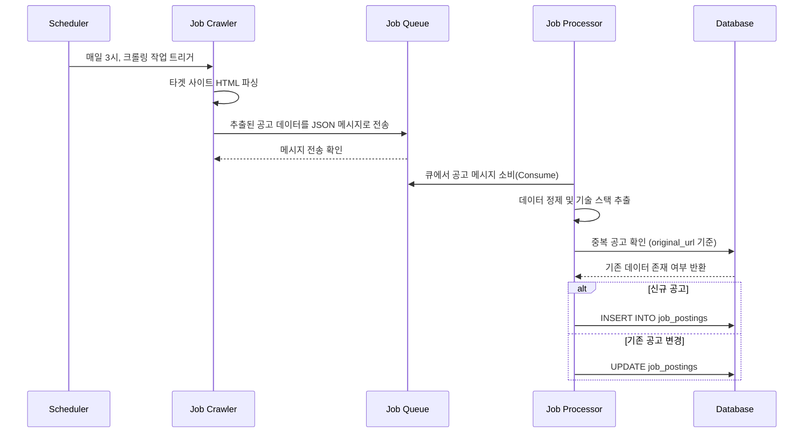
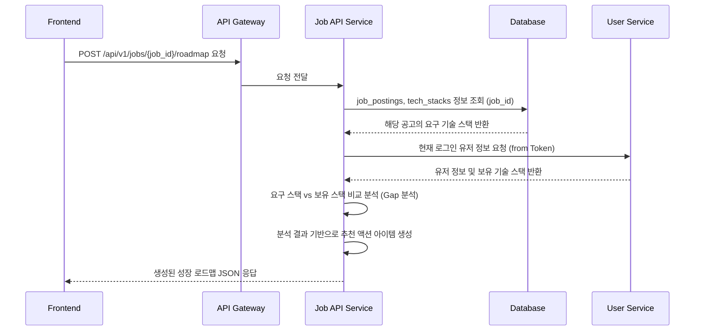

## **Ignition Service 기획 문서: 커리어 네비게이터 (Career Navigator)**

### 1. 서비스(프로덕트) 정의

### 1.1. 서비스명

**커리어 네비게이터 (Career Navigator)**

### 1.2. 서비스 한 줄 정의

단순한 채용 공고 모음집이 아닌, **사용자의 현재 역량과 목표 공고를 분석하여 최적의 성장 경로(로드맵)를 제시하는 개인 맞춤형 커리어 설계 도구.**

### 1.3. 핵심 컨셉

기존 채용 사이트가 '무엇(What)'이 있는지를 보여주는 '게시판'이었다면, 커리어 네비게이터는 '어떻게(How)' 그곳에 도달할 수 있는지를 알려주는 **'GPS'** 입니다. 우리는 정보의 홍수 속에서 방향을 잃은 개발자에게 '나만의 지도'를 쥐여주는 것을 목표로 합니다.

> Our Slogan: "공고를 넘어, 당신의 다음 커리어 여정을 설계합니다."
> 

---

### 2. 핵심 목표 (Key Objectives)

- **For User (사용자 가치)**
    - **정보 과부하 해소:** 흩어져 있는 양질의 공고를 한곳에 모아 탐색의 피로를 줄인다.
    - **명확한 방향성 제시:** 목표 공고와 나의 역량 사이의 '갭(Gap)'을 명확히 인지시킨다.
    - **실행 가능한 계획 제공:** 부족한 역량을 채우기 위한 구체적인 학습 계획(스터디, 커뮤니티 참여)을 제공하여 '성취'로 연결한다.
- **For Business (AsyncSite 가치)**
    - **초기 트래픽 확보:** '네이버 신입 채용' 등 핵심 키워드를 통한 강력한 SEO 효과 및 오가닉 유입 증대.
    - **사용자 리텐션 강화:** 취업/이직 준비생들의 주기적인 재방문을 유도하고, 플랫폼의 다른 기능으로 자연스럽게 연결.
    - **데이터 기반 서비스 기획:** 시장의 기술 수요 트렌드를 정확히 파악하여, 수요에 맞는 스터디나 멘토링 프로그램을 기획하는 핵심 데이터 자산 확보.

---

### 3. 타겟 고객 및 페인 포인트

- **주요 타겟**
    1. **성장을 갈망하는 신입/주니어 개발자 (1~4년 차):** 어떤 기술을, 어떻게 공부해야 좋은 기업에 갈 수 있는지 막막한 개발자.
    2. **성공적인 이직을 준비하는 경력 개발자:** 현재 자신의 시장 가치를 확인하고, 더 나은 기회를 위해 전략적으로 움직이고 싶은 개발자.
- **핵심 페인 포인트**
    - "요즘 어떤 기술이 뜨는지, 뭘 공부해야 할지 모르겠어요."
    - "가고 싶은 회사는 있는데, 제 실력으로 될지, 뭘 더 준비해야 할지 감이 안 와요."
    - "여기저기 흩어진 공고를 찾아다니는 게 너무 피곤해요."
    - "같은 공고에 지원하는 다른 사람들은 어떻게 준비하는지 궁금해요."

---

### 4. 핵심 기능 및 차별화 전략

단순 크롤링을 넘어, **'분석'과 '연결'** 을 통해 압도적인 차별점을 만듭니다.

### 4.1. 기본 기능 (Table Stakes)

- **채용 공고 자동 수집:** 주요 IT 기업의 개발자 채용 공고를 주기적으로 수집하여 최신 상태 유지.
- **강력한 검색 및 필터링:** 회사, 직무, 기술 스택, 경력, 지역 등 다양한 조건으로 공고를 탐색할 수 있는 기능.

### 4.2. **핵심 차별화 기능 (The Navigator's Edge)** ✨

1. **`공고-역량 매칭 분석 엔진`**
    - 사용자가 관심 공고를 선택하면, AI(초기에는 정교한 Rule-based)가 공고의 요구사항(자격요건, 우대사항 텍스트 분석)과 사용자 프로필(향후 구축될 AsyncSite 내 개인 프로필)을 비교 분석합니다.
    - **"이 공고는 당신의 역량과 75% 일치합니다"** 와 같이 정량적인 매칭률을 제시하고, 어떤 역량이 부족한지 시각적으로 보여줍니다.
2. **`개인 맞춤 성장 로드맵 자동 생성`**
    - 위 분석 결과를 바탕으로, 부족한 역량을 채울 수 있는 **구체적인 액션 아이템**을 로드맵 형태로 자동 생성합니다.
    - **로드맵 예시:**
        
        > [Naver Webtoon] 서버 개발자 경력직 로드맵
        > 
        > 1. **[필수 역량]** Kafka 경험이 필요합니다.
        >     - 🚀 **추천 액션:** `[실전 카프카 스터디 3기]` 참여하기
        > 2. **[우대 역량]** 대규모 트래픽 처리 경험을 어필해야 합니다.
        >     - 🚀 **추천 액션:** `[Genesis Project]` 참여하여 포트폴리오 강화하기
        > 3. **[기본기]** 코딩 테스트 준비가 필요합니다.
        >     - 🚀 **추천 액션:** `[알고리즘 문제풀이 모임]` 참여하기
        > 4. **[정보]** 관련 기술에 대한 이해도를 높여보세요.
        >     - 🚀 **추천 액션:** `[아티클] Kafka 왜 쓸까? 메시지 큐 완벽 정리` 읽어보기
3. **`관심 공고 기반 '작전 회의실' 자동 생성`**
    - 특정 공고에 '관심 있음'을 표시한 사용자가 일정 수(e.g., 5명) 이상 모이면, 해당 공고만을 위한 임시 비공개 채널('작전 회의실')을 자동으로 생성합니다.
    - 참여자들은 이곳에서 서로 정보를 교환하고, 면접 스터디를 꾸리는 등 **집단 지성을 통해 함께 '성취'를 준비**하게 됩니다. 이는 AsyncSite의 커뮤니티 가치를 극대화하는 강력한 장치입니다.
4. **`실시간 기술 트렌드 대시보드`**
    - 수집된 모든 공고 데이터를 분석하여, "지난 분기 가장 수요가 많았던 백엔드 기술 TOP 5", "최근 3개월간 'gRPC' 언급량 변화" 등 **인사이트가 담긴 대시보드**를 제공합니다.
    - 이는 사용자에게는 귀중한 시장 정보를, AsyncSite에게는 데이터 기반 콘텐츠 기획의 근거를 제공합니다.

---

### 5. 데이터 수집 전략 (Hybrid Approach)

크롤링의 불안정성을 최소화하고 데이터 품질을 보장하기 위해 하이브리드 전략을 채택합니다.

- **Phase 1 (MVP): 수동 + RSS 우선**
    - **수동 입력:** 팀원들이 직접 '이번 주 가장 HOT한 공고 10선'과 같이 가장 중요한 공고를 선별하여 수동으로 입력하고 관리합니다. (품질 보장)
    - **RSS 활용:** 채용 공고 RSS 피드를 제공하는 기업(e.g., 카카오)이 있다면, 최우선으로 활용하여 안정적으로 데이터를 확보합니다.
- **Phase 2 (고도화): 타겟 크롤러 개발**
    - RSS가 없는 핵심 타겟 기업(e.g., 네이버, 쿠팡, 배민 등 5~10곳)을 대상으로 Python(Scrapy/Playwright) 기반의 크롤러를 개발합니다.
    - **핵심:** 크롤러 실패 시 즉시 슬랙으로 알림을 보내는 **모니터링 시스템**을 처음부터 함께 구축하여 유지보수 비용을 최소화합니다.
- **Phase 3 (확장): 점진적 확장 및 API 탐색**
    - 사용자 요청과 데이터 분석을 기반으로 크롤링 대상을 점진적으로 확장합니다.
    - 원티드, 사람인 등 채용 플랫폼에서 제공하는 3rd-party API가 있다면, 비용 및 효율성을 검토하여 연동을 고려합니다.

---

### 6. 기술 아키텍처 구상 (Conceptual)

이 서비스는 기존 AsyncSite 아키텍처에 새로운 마이크로서비스를 추가하는 형태로 설계합니다.

```bash
┌────────────────────┐      ┌─────────────────────┐      ┌─────────────────────────┐
│                    │      │                     │      │                         │
│ Job Crawler Service│      │  Job Database (DB)  │      │ Job API Service (New)   │
│  (Python/Lambda)   │──────►  (PostgreSQL/Mongo) │◄─────┤    (Spring Boot)        │
│                    │      │                     │      │ - Search, Filter        │
└─────────▲──────────┘      └─────────────────────┘      │ - Analysis Engine       │
          │                                              │ - Roadmap Generation    │
┌─────────┴──────────┐                                 └──────────┬──────────────┘
│                    │                                              │ REST API
│ Scheduler (Cron)   │                                              ▼
│  (매일 새벽 3시)     │                                   ┌────────────────┐
│                    │                                   │                │
└────────────────────┘                                   │  API Gateway   │
                                                         │                │
                                                         └────────┬────────┘
                                                                  │
                                                         ┌────────▼────────┐
                                                         │                 │
                                                         │ Frontend (React)│
                                                         │ (Ignition Tab)  │
                                                         └─────────────────┘
```

- **Job Crawler Service:** 특정 시간에 독립적으로 실행되는 크롤링 전담 서비스. 비용 효율성을 위해 AWS Lambda + EventBridge 스케줄러 조합이 이상적입니다.
- **Job Database:** 크롤링한 원본 데이터와 가공된 데이터를 저장할 별도의 DB. 스키마 변경이 잦을 수 있으므로 NoSQL(MongoDB)도 좋은 선택지입니다.
- **Job API Service:** 수집된 공고를 외부에 제공하고, 분석/로드맵 생성 등 핵심 비즈니스 로직을 처리하는 새로운 마이크로서비스.

---

### 7. 주요 리스크 및 대응 방안

- **기술적 리스크 (크롤러 유지보수)**
    - **대응:** ①시작부터 모니터링/알림 시스템 구축 ②핵심 소수 기업에 집중 ③수동/RSS 등 대체 수단 확보.
- **법적/윤리적 리스크 (과도한 트래픽)**
    - **대응:** ①`robots.txt` 준수 ②요청 간 User-Agent 명시(`AsyncSite-Bot/1.0`) ③합리적인 요청 간격(delay) 설정 등 '착한 크롤러' 정책 수립 및 공개.
- **전략적 리스크 (경쟁사 대비 차별화 실패)**
    - **대응:** 이 기획의 핵심. 단순히 공고를 모으는 '기본 기능'에 매몰되지 않고, **'분석'과 '로드맵 생성', '커뮤니티 연결'이라는 핵심 차별화 기능 개발에 리소스를 집중**해야만 성공할 수 있습니다.

---

### 8. 성공 지표 (KPIs)

- **트래픽:** '커리어 네비게이터' 페이지의 월간 순 방문자 수(MAU) 및 오가닉 검색 유입 비율.
- **사용자 참여:** '성장 로드맵' 생성 수, 공고 즐겨찾기 수.
- **커뮤니티 활성화:** '작전 회의실' 생성 수 및 채널당 평균 메시지 수.
- **플랫폼 기여도:** '성장 로드맵'을 통해 다른 스터디/멘토링 페이지로 전환되는 비율.

---


## **설계 문서: 커리어 네비게이터 (Career Navigator)**

### 1. 문서 개요

본 문서는 '커리어 네비게이터' 서비스의 기술적 설계 명세를 정의합니다. 기획 문서에서 정의된 요구사항을 바탕으로 시스템 구성 요소, 데이터 모델, 핵심 로직의 동작 흐름, API 명세를 구체화하여 개발의 기반을 마련합니다.

### 2. 시스템 아키텍처 및 구성 요소

기획 단계의 아키텍처를 구체화하고, 시스템의 안정성과 확장성을 위해 메시지 큐를 도입한 아키텍처를 제안합니다.

```mermaid
graph TD
    subgraph "Scheduler (AWS EventBridge or Cron)"
        A[매일 새벽 3시 실행] --> B{Job Crawler};
    end

    subgraph "Job Crawler Service (Python / AWS Lambda)"
        B -- 크롤링 대상 전달 --> C[Scrapy/Playwright Spider];
        C -- 표준 JSON 형태로 추출 --> D[Job Queue];
    end

    subgraph "Message Queue (RabbitMQ or AWS SQS)"
        D;
    end
    
    subgraph "Backend (Spring Boot / Kotlin)"
        E[Job Processor] -- 메시지 소비 --> D;
        E -- 데이터 정제/가공 --> F[Database];
        F[Database (PostgreSQL)];
        G[Job API Service] -- 데이터 조회/분석 --> F;
    end

    subgraph "User Interaction"
        H[API Gateway] <--> G;
        I[Frontend (React)] <--> H;
    end

    style B fill:#f9f,stroke:#333,stroke-width:2px
    style E fill:#ccf,stroke:#333,stroke-width:2px
```

**핵심 구성 요소 상세 역할:**

1. **Job Crawler (크롤러):**
    - **역할:** 스케줄러에 의해 트리거되어, 타겟 웹사이트(네카라쿠배 등)에서 채용 공고 정보를 수집(Scrape)합니다.
    - **책임:** 각기 다른 HTML 구조를 파싱하여 `회사명`, `공고 제목`, `URL`, `본문 내용` 등 표준화된 JSON 객체로 변환한 후, **Job Queue**에 메시지로 전송합니다.
    - **구현:** Python 기반, 사이트별 'Spider' 모듈로 분리하여 관리.
2. **Job Queue (메시지 큐):**
    - **역할:** 크롤러와 프로세서를 분리(Decoupling)하는 중간 다리. 크롤러가 수집한 공고 데이터를 임시 저장합니다.
    - **책임:** 크롤링 된 공고 메시지를 받아 순차적으로 **Job Processor**가 처리할 수 있도록 대기시킵니다.
    - **기대효과:** 크롤링 폭주 시에도 프로세서가 안정적으로 처리 가능하며, 프로세서 장애 시 데이터 유실을 방지하여 시스템 안정성을 크게 높입니다.
3. **Job Processor (데이터 처리기):**
    - **역할:** Job Queue에 쌓인 메시지를 하나씩 소비(Consume)하여 데이터를 정제하고 DB에 저장합니다.
    - **책임:**
        - **데이터 정제:** HTML 태그 제거, 줄바꿈 정규화 등.
        - **정보 추출:** 본문 내용에서 기술 스택(e.g., 'Java', 'Kotlin', 'MSA')을 추출하고 태깅.
        - **중복 검증:** 이미 DB에 있는 공고인지 확인 후, 변경 사항만 업데이트.
        - **DB 저장:** 정제된 데이터를 최종적으로 `job_postings` 테이블에 저장/업데이트.
4. **Job API Service (API 서버):**
    - **역할:** 프론트엔드에 필요한 데이터를 제공하고, 핵심 비즈니스 로직을 수행합니다.
    - **책임:** 공고 검색/필터링, `공고-역량 매칭 분석`, `성장 로드맵 생성` 등 핵심 로직을 담당.

### 3. 데이터 모델링 (Database Schema)

PostgreSQL 기준으로 주요 테이블을 설계합니다.

**1. `job_postings`** (채용 공고)

| Column Name | Data Type | Constraints | Description |
| --- | --- | --- | --- |
| `id` | `BIGINT` | `PK` | 공고 ID |
| `company_name` | `VARCHAR(100)` | `NOT NULL` | 회사명 |
| `title` | `VARCHAR(255)` | `NOT NULL` | 공고 제목 |
| `original_url` | `VARCHAR(2048)` | `NOT NULL, UNIQUE` | 원본 공고 URL (중복 체크 기준) |
| `status` | `VARCHAR(20)` | `NOT NULL` | 공고 상태 (OPEN, CLOSED) |
| `job_type` | `VARCHAR(50)` |  | 근무 형태 (정규직, 계약직, 인턴) |
| `experience_level` | `VARCHAR(50)` |  | 요구 경력 (신입, 경력, 무관) |
| `location` | `VARCHAR(100)` |  | 근무지 |
| `content_raw` | `TEXT` |  | 크롤링한 원본 HTML/Text |
| `content_processed` | `TEXT` |  | 정제된 공고 내용 |
| `deadline_at` | `TIMESTAMP` |  | 마감일 (YYYY-MM-DD HH:MI:SS) |
| `created_at` | `TIMESTAMP` | `DEFAULT now()` | 생성일 |
| `updated_at` | `TIMESTAMP` |  | 수정일 |

**2. `tech_stacks`** (기술 스택)

| Column Name | Data Type | Constraints | Description |
| --- | --- | --- | --- |
| `id` | `INT` | `PK` | 기술 스택 ID |
| `name` | `VARCHAR(50)` | `NOT NULL, UNIQUE` | 기술 스택 이름 (e.g., Java, Spring Boot) |

**3. `job_posting_tech_stacks`** (공고-기술 스택 연결, M:N)

| Column Name | Data Type | Constraints | Description |
| --- | --- | --- | --- |
| `job_posting_id` | `BIGINT` | `FK (job_postings)` | 공고 ID |
| `tech_stack_id` | `INT` | `FK (tech_stacks)` | 기술 스택 ID |

*(이 외 `users`, `user_tech_stacks`, `war_rooms` 등 관련 테이블은 기획에 맞춰 추가될 수 있습니다.)*

### 4. 핵심 기능별 시퀀스 다이어그램

**1. 시나리오: 일일 채용 공고 수집 및 처리**

코드 스니펫



**2. 시나리오: 사용자 '성장 로드맵' 요청**

코드 스니펫



### 5. API 명세 (API Specification)

**Base URL:** `/api/v1`

---

**`GET /jobs` - 채용 공고 목록 조회**

- **Description:** 다양한 필터 조건에 맞는 채용 공고 목록을 조회합니다.
- **Query Parameters:**
    - `q` (string, optional): 검색어 (회사명, 공고 제목)
    - `tech_stack` (string, optional): 기술 스택 (e.g., `java,spring`)
    - `exp_level` (string, optional): 경력 수준 (e.g., `신입`)
    - `page` (int, optional, default: `0`): 페이지 번호
    - `size` (int, optional, default: `20`): 페이지 당 개수
- **Success Response (200 OK):**JSON
    
    ```bash
    {
      "content": [
        {
          "id": 1,
          "companyName": "네이버웹툰",
          "title": "서버 개발자 경력 채용",
          "techStacks": ["Java", "Kotlin", "MSA"],
          "deadlineAt": "2025-08-31T23:59:59"
        }
      ],
      "pageable": { "pageNumber": 0, "pageSize": 20 },
      "totalPages": 10,
      "totalElements": 200
    }
    ```
    

---

**`GET /jobs/{id}` - 채용 공고 상세 조회**

- **Description:** 특정 채용 공고의 상세 정보를 조회합니다.
- **Success Response (200 OK):**JSON
    
    ```bash
    {
      "id": 1,
      "companyName": "네이버웹툰",
      "title": "서버 개발자 경력 채용",
      "originalUrl": "...",
      "contentProcessed": "...",
      "requiredTechStacks": ["Java", "Spring Boot", "JPA"],
      "optionalTechStacks": ["Kotlin", "MSA", "Kafka"]
    }
    ```
    

---

**`POST /jobs/{id}/roadmap` - 개인 맞춤 성장 로드맵 생성**

- **Description:** 특정 공고에 대해 현재 로그인한 사용자의 성장 로드맵을 생성합니다. (인증 필요)
- **Success Response (200 OK):**JSON
    
    ```bash
    {
      "jobTitle": "서버 개발자 경력 채용",
      "matchRate": 75.0,
      "roadmapItems": [
        {
          "type": "REQUIRED_SKILL_GAP",
          "skillName": "Kafka",
          "description": "필수 역량인 Kafka 경험이 부족합니다.",
          "recommendedAction": {
            "type": "STUDY",
            "title": "[실전 카프카 스터디 3기]",
            "url": "/studies/123"
          }
        },
        // ... 다른 로드맵 아이템들
      ]
    }
    ```
    

---

**`GET /jobs/trends` - 기술 트렌드 조회**

- **Description:** 채용 공고 데이터를 기반으로 한 기술 트렌드 정보를 조회합니다.
- **Success Response (200 OK):**JSON
    
    ```bash
    {
      "top5BackendSkills": [
        {"name": "Java", "count": 150},
        {"name": "Spring Boot", "count": 145},
        ...
      ]
    }
    ```
    

### 6. 비기능적 요구사항

- **성능:** API 평균 응답 시간 200ms 이하를 목표로 합니다. 크롤러는 대상 서버에 부하를 주지 않도록 `request` 사이에 최소 1-2초의 `delay`를 설정합니다.
- **확장성:** 큐 기반 아키텍처를 통해 크롤링 대상 사이트가 늘어나더라도 Job Processor 인스턴스를 수평적으로 확장하여 대응할 수 있도록 설계합니다.
- **보안:** 사용자 개인정보(프로필)를 다루는 로드맵 생성 API는 반드시 JWT 토큰 기반의 인증/인가 절차를 거칩니다.

---


## **화면(UX/UI) 설계 문서: 커리어 네비게이터**

### 1. 문서 개요

본 문서는 '커리어 네비게이터' 서비스의 주요 화면에 대한 구조(Layout)와 사용자 인터페이스(UI) 구성 요소, 그리고 사용자 경험(UX) 흐름을 정의합니다. 와이어프레임(Wireframe)을 통해 각 화면의 정보 계층 구조와 기능 배치를 시각적으로 설명합니다.

### 2. 핵심 사용자 여정 (Core User Journey)

사용자는 다음과 같은 흐름을 통해 서비스의 핵심 가치를 경험하게 됩니다.

1. **발견 (Discovery):**
    - `Ignition` 탭을 통해 **[커리어 네비게이터]**에 진입합니다.
2. **탐색 (Exploration):**
    - *[공고 목록 페이지]**에서 최신 채용 공고들을 둘러봅니다.
    - 검색 및 필터 기능을 사용하여 자신에게 맞는 공고를 탐색합니다.
3. **분석 (Analysis):**
    - 관심 있는 공고를 클릭하여 **[공고 상세 페이지]**로 이동합니다.
    - 상세 내용을 확인 후, 가장 중요한 액션인 **`[내 성장 로드맵 받기]`** 버튼을 클릭합니다.
4. **가이드 (Guidance):**
    - *[성장 로드맵 모달]**이 나타나고, 시스템이 분석한 역량 매칭률과 개인 맞춤형 성장 계획을 확인합니다.
5. **행동 (Action):**
    - 로드맵에 제시된 `추천 액션`(e.g., 스터디 참여) 버튼을 클릭하여 AsyncSite 내의 다른 성장 기회로 즉시 연결됩니다.
6. **커뮤니티 (Community):**
    - *[공고 상세 페이지]**에서 `['작전 회의실' 참여하기]`를 통해 같은 목표를 가진 다른 사용자들과 협력합니다.

---

### 3. 와이어프레임 및 화면 설계

### 3.1. 화면 1: 공고 목록 페이지 (`/ignition/navigator`)

- **목표:** 사용자가 원하는 공고를 쉽고 빠르게 찾을 수 있도록 돕고, 서비스의 다른 기능(트렌드 대시보드)으로 관심을 유도합니다.

```bash
+-------------------------------------------------------------+
| [AsyncSite 헤더: 스터디 | Ignition(활성) | 커뮤니티]         |
+-------------------------------------------------------------+
|                                                             |
|  # 커리어 네비게이터                                          |
|  <공고를 넘어, 당신의 다음 커리어 여정을 설계합니다.>           |
|                                                             |
|  +-------------------------------------------------------+  |
|  | [🔍 검색어 입력 (회사, 직무, 기술...)] [검색 버튼]       |  |
|  +-------------------------------------------------------+  |
|  | [필터: 🏢회사별 ▼] [💻기술 스택 ▼] [📈경력 ▼]           |  |
|  |                                                         |  |
|  |                                [📈 최신 기술 트렌드 보기 ➔] |  |
|  +-------------------------------------------------------+  |
|                                                             |
|  +--[Job Posting Card]-----------------------------------+  |
|  | [네이버 로고]                                           |  |
|  | ### 백엔드 서버 개발자 (네이버웹툰)                      |  |
|  |                                                         |  |
|  | [#Java] [#Kotlin] [#MSA] [#Spring]                    |  |
|  |                                                         |  |
|  | 🏢 경력 (3년 이상)    | 📍 분당    | 📅 ~ 2025.08.31   |  |
|  +-------------------------------------------------------+  |
|                                                             |
|  +--[Job Posting Card]-----------------------------------+  |
|  | [카카오 로고]                                           |  |
|  | ### 카카오페이 결제 서버 개발자                          |  |
|  | ...                                                     |  |
|  +-------------------------------------------------------+  |
|                                                             |
|  [ 1 ] [ 2 ] [ 3 ] ... [10] [ > ] (페이지네이션)             |
|                                                             |
+-------------------------------------------------------------+
```

---

### 3.2. 화면 2: 공고 상세 페이지 (`/ignition/navigator/{job_id}`)

- **목표:** 공고의 핵심 정보를 명확히 전달하고, 사용자가 가장 중요한 행동(`로드맵 받기`)을 하도록 유도합니다.

```bash
+-------------------------------------------------------------+
| [AsyncSite 헤더]                                            |
+-------------------------------------------------------------+
|                                                             |
|  < 목록으로 돌아가기                                        |
|                                                             |
|  ## 백엔드 서버 개발자 (네이버웹툰)                          |
|                                                             |
|  +-------------------------------------------------------+  |
|  | [🚀 내 성장 로드맵 받기 (가장 중요한 CTA 버튼)]          |  |
|  +-------------------------------------------------------+  |
|                                                             |
|  --- (구분선) ---                                           |
|                                                             |
|  **[주요 정보]** |
|  - **마감일**: 2025.08.31                                   |
|  - **경력**: 3년 이상                                       |
|  - **근무 형태**: 정규직                                    |
|  - **근무지**: 경기도 성남시 분당구                            |
|                                                             |
|  **[요구 기술 스택]** |
|  [#Java] [#Spring Boot] [#JPA] [#MySQL] [#Kotlin]         |
|                                                             |
|  **[상세 내용]** |
|  네이버웹툰의 글로벌 서비스를 함께 만들어갈 역량있는...       |
|  (스크롤 가능한 상세 본문)                                   |
|  ...                                                        |
|                                                             |
|  --- (구분선) ---                                           |
|                                                             |
|  +--['작전 회의실' 컴포넌트]-------------------------------+  |
|  | 👥 이 공고, 12명이 함께 준비 중입니다!                    |  |
|  | 지금 바로 '작전 회의실'에 참여하여 정보를 나누고          |  |
|  | 함께 면접을 준비하세요.                                   |  |
|  |                                                         |  |
|  |                     [ 참여하기 (Discord 초대 링크) ➔ ]   |  |
|  +-------------------------------------------------------+  |
|                                                             |
+-------------------------------------------------------------+
```

---

### 3.3. 화면 3: 성장 로드맵 결과 (모달)

- **목표:** 분석 결과를 직관적으로 보여주고, 사용자가 다음 행동(스터디 참여 등)으로 쉽게 나아가도록 돕습니다.

```bash
+-------------------------------------------------------------+
|                                                             |
|  [ (X) 닫기 버튼 ]                                          |
|  ### 네이버웹툰 서버 개발자 | 맞춤 성장 로드맵                 |
|  --- (구분선) ---                                           |
|                                                             |
|  "현재 회원님의 역량과 **75%** 일치합니다."                    |
|  +--[그래프/게이지 바]=====--- (75%) -------------------+  |
|                                                             |
|  **[성장을 위한 추천 액션]** |
|                                                             |
|  +--[Roadmap Item Card]----------------------------------+  |
|  | ❗️ **[필수 역량 부족]** Kafka 경험                      |  |
|  | 필수 역량인 Apache Kafka 활용 경험이 부족합니다.         |  |
|  |                                  [실전 카프카 스터디 ➔]   |  |
|  +-------------------------------------------------------+  |
|                                                             |
|  +--[Roadmap Item Card]----------------------------------+  |
|  | ✨ **[우대 역량 강화]** MSA 설계 능력                  |  |
|  | 대규모 트래픽 경험을 통해 MSA 설계 역량을 어필하세요.      |  |
|  |                                  [Genesis Project ➔]    |  |
|  +-------------------------------------------------------+  |
|                                                             |
|  ... (다른 아이템들)                                        |
|                                                             |
|  +-------------------------------------------------------+  |
|  |                [ 닫기 ]                                 |  |
|  +-------------------------------------------------------+  |
|                                                             |
+-------------------------------------------------------------+
```

---

### 3.4. 화면 4: 기술 트렌드 대시보드 (`/ignition/navigator/trends`)

- **목표:** 데이터를 시각화하여 사용자에게 시장에 대한 인사이트를 제공하고, AsyncSite의 전문성을 부각합니다.

```bash
+-------------------------------------------------------------+
| [AsyncSite 헤더]                                            |
+-------------------------------------------------------------+
|                                                             |
|  # 실시간 기술 트렌드 대시보드                                |
|  <데이터로 보는 채용 시장의 흐름 (2025년 3분기 기준)>        |
|                                                             |
|  --- (구분선) ---                                           |
|                                                             |
|  +--[주요 지표]------------------------------------------+  |
|  | 총 1,234개 공고 분석 | 벡엔드 60% | 프론트엔드 30% ...    |  |
|  +-------------------------------------------------------+  |
|                                                             |
|  ### 💾 지난 분기 백엔드 채용 요구 기술 Top 10              |
|  +--[막대 그래프]-----------------------------------------+  |
|  | Java      [==============================] 150        |  |
|  | Spring    [============================  ] 145        |  |
|  | Kotlin    [===========                 ] 80         |  |
|  | ...                                                     |  |
|  +-------------------------------------------------------+  |
|                                                             |
|  ### 📈 주요 기술 언급량 변화                              |
|  +--[선 그래프]-------------------------------------------+  |
|  |       / (Kotlin)                                        |  |
|  |      /                                                  |  |
|  | ----/------ (Java)                                      |  |
|  |    /                                                    |  |
|  | --/-------- (Go)                                        |  |
|  | 5월      6월      7월                                  |  |
|  +-------------------------------------------------------+  |
|                                                             |
|  💡 **AsyncSite Insight:** 최근 MSA 관련 공고에서 gRPC ... |
|                                                             |
+-------------------------------------------------------------+
```

### 4. 핵심 컴포넌트 정의

- **Job Posting Card:** 공고 목록에 사용되는 재사용 가능한 카드. 마우스 호버 시 약간의 그림자 효과를 주어 상호작용성을 높입니다.
- **Tech Stack Tag:** `#Java` 와 같이 표시되는 태그. 클릭 시 해당 기술 스택으로 필터링되는 기능을 제공합니다.
- **Roadmap Item Card:** 로드맵 모달에 사용되는 정보 카드. 액션의 종류(역량 부족, 강화, 정보)에 따라 아이콘이나 색상을 다르게 표시하여 가시성을 높입니다.
- **Main CTA Button:** `🚀 내 성장 로드맵 받기` 와 같이 사용자의 핵심 행동을 유도하는 버튼. 가장 눈에 띄는 색상과 크기로 디자인합니다.
