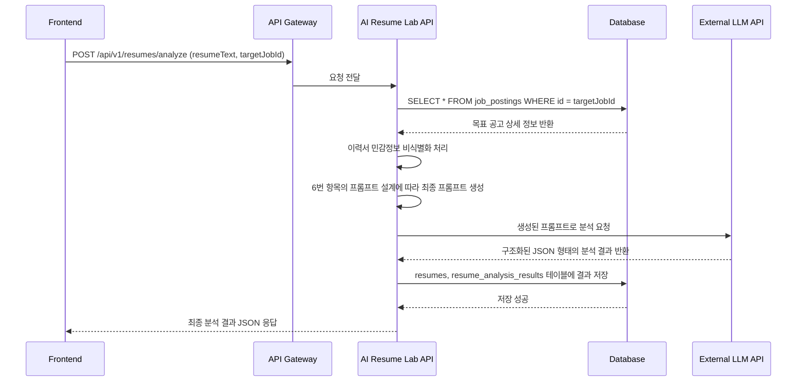

## **Ignition Service 기획 문서: AI 레쥬메 랩 (AI Resume Lab)**

### 1. 서비스(프로덕트) 정의

### 1.1. 서비스명

**AI 레쥬메 랩 (AI Resume Lab)**

### 1.2. 서비스 한 줄 정의

목표 채용 공고와 시장 트렌드 데이터를 기반으로 이력서의 강점과 약점을 진단하고, 구체적인 개선 방향과 표현을 제안하는 **AI 기반 이력서 최적화 실험실.**

### 1.3. 핵심 컨셉

이력서 리뷰는 단순히 '점수를 매기는 평가'가 되어서는 안 됩니다. 끊임없이 실험하고 다듬어 최상의 결과물을 만들어내는 **'개인 맞춤 트레이닝'** 이어야 합니다. AI 레쥬메 랩은 사용자의 경험을 단순 나열하는 것을 넘어, 채용 담당자의 눈길을 사로잡는 '성취의 언어'로 번역하고 재구성하는 역할을 합니다.

> Our Slogan: "당신의 경험을 '성취'의 언어로 번역합니다."
> 

---

### 2. 핵심 목표 (Key Objectives)

- **For User (사용자 가치)**
    - **객관적인 진단:** 나의 이력서가 시장에서 어떤 수준인지, 목표 공고에 얼마나 부합하는지 데이터 기반으로 진단받는다.
    - **자신감 획득:** 막연했던 이력서 작성의 방향성을 잡고, 나의 경험을 어떻게 매력적으로 표현할지에 대한 자신감을 얻는다.
    - **서류 통과율 향상:** 구체적인 개선 제안을 통해 이력서의 완성도를 높여, 실제 서류 합격률을 높이는 것을 목표로 한다.
- **For Business (AsyncSite 가치)**
    - **서비스 시너지 극대화:** `커리어 네비게이터`로 목표를 설정하고, `AI 레쥬메 랩`으로 서류를 완성하며, `제네시스 프로젝트`로 경험을 쌓는 완벽한 사용자 여정(Funnel)을 구축한다.
    - **사용자 Lock-in 강화:** 이력서를 저장하고, 버전을 관리하며, 개선 과정을 추적하는 기능을 통해 사용자가 플랫폼에 머무를 이유를 제공한다.
    - **프리미엄 서비스 연결:** AI의 진단만으로 해결하기 어려운 근본적인 스토리텔링이나 경험 부족 문제를 `프리미엄 멘토링` 서비스로 자연스럽게 연결한다.

---

### 3. 타겟 고객 및 페인 포인트

- **주요 타겟**
    1. **첫 이력서를 작성하는 신입 개발자:** 무엇을 어떻게 써야 할지 막막하고, 사소한 실수 하나가 탈락으로 이어질까 두려운 사람.
    2. **이직을 준비하는 주니어/미드 레벨 개발자:** 자신의 프로젝트 경험을 더 인상적으로 포장하고 싶지만, 객관적인 피드백을 받을 곳이 마땅치 않은 사람.
- **핵심 페인 포인트**
    - "제가 한 프로젝트 경험, 이렇게 쓰는 게 맞나요? 너무 평범해 보여요."
    - "이력서를 냈는데 계속 서류에서 떨어져요. 어디가 문제인지 모르겠어요."
    - "채용 공고의 '자격요건'과 '우대사항'을 제 이력서에 어떻게 녹여내야 할지 모르겠어요."
    - "주변 선배한테 이력서 리뷰 부탁하기가 너무 눈치 보이고 부담스러워요."

---

### 4. 핵심 기능 및 차별화 전략

시장의 일반적인 맞춤법 검사기나 표면적인 리뷰를 넘어, **'맥락(Context)'** 과 **'실행(Action)'** 을 중심으로 차별화합니다.

### 4.1. **핵심 차별화 기능 (The Lab's Edge)** ✨

1. **`목표 공고 기반 '핏(Fit)' 분석` (The Killer Feature)**
    - 사용자는 이력서(PDF, Markdown, 텍스트)를 업로드할 때, **`커리어 네비게이터`에서 찾은 목표 공고를 함께 선택**합니다.
    - AI는 이력서 내용과 선택된 공고의 직무 기술서(JD)를 비교 분석하여, 단순 문법이 아닌 **'직무 적합도'** 관점에서 리뷰를 제공합니다.
    - **결과 예시:** "지원하신 '네이버웹툰 서버 개발자' 직무는 'MSA 경험'을 중요하게 보는데, 이력서의 '쇼핑몰 프로젝트'에서 관련 경험을 더 부각할 필요가 있습니다."
2. **`STAR 기법 기반 프로젝트 분석 및 재구성 제안`**
    - 개발자의 성과를 가장 잘 보여주는 **STAR 기법(Situation, Task, Action, Result)** 에 기반하여 프로젝트 경험을 분석합니다.
    - 특히 **'Result(결과)'** 부분에 정량적 성과(e.g., 성능 개선 수치, 사용자 증가율)가 부족할 경우, 이를 보완하도록 구체적으로 지적하고 **개선된 문장을 AI가 직접 제안**합니다.
    - **결과 예시:**
        
        > [기존 문장] "Redis를 도입하여 캐싱을 적용함."
        > 
        > 
        > [AI 개선 제안] "반복적인 DB 조회로 인한 지연 시간(500ms)을 개선하기 위해 Redis 캐시를 도입하여, 평균 응답 시간을 150ms로 70% 단축하고 서버 부하를 줄인 경험이 있습니다."
        > 
3. **`핵심 키워드 추출 및 비교 분석`**
    - 목표 공고에서 요구하는 핵심 기술/역량 키워드와 사용자 이력서에 포함된 키워드를 각각 추출하여 시각적으로 비교합니다.
    - **결과 예시:**
        - **[공고 요구 키워드]:** `Kotlin`, `MSA`, `gRPC`, `Kafka`
        - **[내 이력서 키워드]:** `Java`, `Spring Boot`, `JPA`
        - **[AI 진단]:** "핵심 요구 역량인 `Kotlin`, `MSA` 관련 경험이 누락되었습니다. 관련 사이드 프로젝트나 학습 경험이 있다면 추가하는 것을 권장합니다."
4. **`개선 제안 및 버전 관리 시스템`**
    - 사용자는 AI의 제안을 바탕으로 이력서를 수정하고, 여러 버전을 저장하며 개선 과정을 추적할 수 있습니다.
    - 버전별 '직무 적합도' 점수 변화를 그래프로 보여주어 성장의 경험을 시각화합니다.
5. **`성장 로드맵 연동 및 프리미엄 멘토링 연결`**
    - 분석 결과, 특정 기술이나 경험 자체가 부족하다고 판단될 경우, **`커리어 네비게이터`의 성장 로드맵 기능을 호출**하여 관련 스터디나 아티클을 추천합니다.
    - 이력서의 구조나 스토리텔링 등 근본적인 개선이 필요할 경우, **`프리미엄 멘토링`** 서비스의 '1:1 이력서 클리닉'으로 자연스럽게 연결하여 상위 서비스로의 전환을 유도합니다.

---

### 5. AI 모델 및 데이터 전략

- **AI 모델 활용:** 자체 모델 개발이 아닌, **GPT-4, Gemini 등 검증된 외부 LLM(대규모 언어 모델)의 API를 활용**합니다. 핵심 경쟁력은 모델 자체가 아니라, 모델을 활용하는 방식에 있습니다.
- **핵심 전략: `프롬프트 엔지니어링` + `RAG (검색 증강 생성)`**
    1. **고도로 구조화된 프롬프트:** LLM에게 "당신은 15년차 IT 리크루터입니다. (A)채용 공고의 요구사항을 바탕으로 (B)이력서를 STAR 기법과 키워드 관점에서 분석하고, 강점, 약점, 구체적인 개선 제안을 JSON 형식으로 응답해주세요." 와 같이 매우 구체적이고 정교한 명령을 내립니다.
    2. **RAG (Retrieval-Augmented Generation):** AI에게 단순히 이력서만 주는 것이 아니라, **`커리어 네비게이터` DB에서 가져온 채용 공고 데이터를 '맥락(Context)'으로 함께 제공**합니다. 이 맥락 정보가 AI의 분석을 일반적인 수준에서 '직무 맞춤형' 수준으로 끌어올리는 핵심 열쇠입니다.

---

### 6. 기술 아키텍처 구상 (Conceptual)

이 서비스는 `Ignition` 탭의 다른 서비스와 상호작용하는 새로운 마이크로서비스로 설계합니다.

```bash
┌────────────────────┐      ┌─────────────────────────┐      ┌─────────────────────────┐
│                    │      │                         │      │                         │
│  Frontend (React)  ├─────►│  AI Resume Lab API Svc  ├─────►│  External LLM API       │
│  (Ignition Tab)    │      │    (Spring Boot)        │      │  (OpenAI, Google)       │
│ - 이력서/공고 ID 전송│      │ - Prompt 생성           │      │                         │
└──────────┬─────────┘      │ - LLM API 호출          │      └────────────▲────────────┘
           │                │ - 결과 저장/반환        │                   │
           │                └──────────┬──────────────┘                   │
           ▼                           │                                  │
┌────────────────────┐      ┌──────────▼──────────────┐                   │
│                    │      │                         │                   │
│ Career Navigator   │      │   Database (PostgreSQL) │                   │
│ (Job Posting DB)   │◄─────┤   - job_postings        │                   │
│                    │      │   - resume_versions     │                   │
└────────────────────┘      │   - analysis_results    │───────────────────┘
                            └─────────────────────────┘
```

- **AI Resume Lab API Service:** 프론트로부터 이력서 텍스트와 목표 공고 ID를 받아, `커리어 네비게이터` DB에서 공고 정보를 조회하고, 정교한 프롬프트를 구성하여 외부 LLM API를 호출하는 비즈니스 로직의 중심입니다.

### 7. 주요 리스크 및 대응 방안

- **AI의 할루시네이션(환각) 및 부정확한 피드백**
    - **대응:** ①고도로 구조화된 프롬프트와 RAG를 통해 결과물의 품질 제어 ②결과물에 "AI에 의해 생성된 제안이며, 참고용으로 활용하세요"라는 명확한 Disclaimer 포함 ③사용자 피드백을 수집하여 지속적으로 프롬프트 개선.
- **높은 API 비용**
    - **대응:** ①사용자별 월 리뷰 횟수 제한(e.g., 3회 무료) ②추가 리뷰는 유료 상품으로 판매하거나, 프리미엄 멤버십 혜택으로 제공하여 수익 모델과 연결.
- **민감 정보(이력서) 처리 문제**
    - **대응:** ①개인정보 처리방침 및 서비스 이용약관에 AI 분석을 위한 데이터 활용 명시 ②LLM API 호출 시 개인을 식별할 수 있는 정보(이름, 연락처 등)는 사전에 비식별화 처리하는 로직 추가.

### 8. 성공 지표 (KPIs)

- **서비스 사용률:** 월간 이력서 분석 요청 수, 재분석 비율.
- **사용자 만족도:** 분석 결과에 대한 '유용해요/유용하지 않아요' 평가 및 점수.
- **개선 효과:** 사용자가 버전을 업데이트하며 '직무 적합도' 점수가 얼마나 향상되었는지 추적.
- **생태계 기여도:** 분석 결과 페이지에서 '스터디 참여', '멘토링 신청' 등 추천 액션으로의 전환율.

---

---

## **설계 문서: AI 레쥬메 랩 (AI Resume Lab)**

### 1. 문서 개요

본 문서는 'AI 레쥬메 랩' 서비스의 기술적 설계 명세를 정의합니다. 서비스의 주요 구성 요소, 데이터 모델, 핵심 로직의 동작 흐름, API 명세, 그리고 AI 상호작용의 핵심인 프롬프트 설계를 구체화하여 개발의 명확한 가이드를 제공합니다.

### 2. 시스템 아키텍처 및 구성 요소

AI 레쥬메 랩은 새로운 마이크로서비스로 설계되며, 외부 LLM API 및 기존 데이터베이스와 상호작용합니다.

```mermaid
graph TD
    subgraph "Client"
        A[Frontend (React)]
    end

    subgraph "AsyncSite Backend"
        B[API Gateway]
        C[AI Resume Lab API Service (Spring/Kotlin)]
        D[Database (PostgreSQL)]
    end

    subgraph "External Service"
        E[External LLM API (e.g., OpenAI, Google)]
    end

    A -- 1. 이력서/목표공고ID 전송 (REST API) --> B
    B -- 2. 요청 라우팅 --> C
    C -- 3. 목표 공고 정보 조회 --> D
    D -- 4. 공고 정보 반환 --> C
    C -- 5. 프롬프트 구성 후 LLM에 분석 요청 --> E
    E -- 6. 분석 결과(JSON) 반환 --> C
    C -- 7. 분석 결과 DB 저장 --> D
    C -- 8. 최종 결과 클라이언트에 전송 --> B
    B -- 9. 최종 결과 전송 --> A

    style C fill:#ccf,stroke:#333,stroke-width:2px
```

**핵심 구성 요소 상세 역할:**

1. **Frontend (React):**
    - **역할:** 사용자가 이력서를 입력(텍스트 붙여넣기, 파일 업로드)하고, `커리어 네비게이터`의 목표 공고를 선택하는 UI를 제공합니다.
    - **책임:** AI 분석이 진행되는 동안 비동기 로딩 상태를 처리하고, 서버로부터 받은 구조화된 분석 결과를 시각적으로 렌더링합니다.
2. **AI Resume Lab API Service (핵심 로직 서버):**
    - **역할:** 이 서비스의 두뇌. 모든 비즈니스 로직을 처리합니다.
    - **책임:**
        - **데이터 조회:** DB에서 목표 공고의 상세 내용을 조회합니다.
        - **전처리:** 사용자 이력서에서 이름, 연락처 등 민감 정보를 비식별화 처리합니다.
        - **프롬프트 생성:** 정교하게 설계된 프롬프트를 동적으로 생성합니다. (👉 **6. 프롬프트 엔지니어링 설계** 참고)
        - **LLM API 통신:** 외부 LLM API를 호출하고, 타임아웃/에러를 처리합니다.
        - **결과 처리:** LLM이 반환한 JSON 응답을 파싱하고, DB에 분석 결과를 저장합니다.
3. **External LLM API (외부 AI 모델):**
    - **역할:** 주어진 프롬프트에 따라 실제 자연어 분석을 수행하는 제3자 서비스.
    - **책임:** 텍스트 분석 및 구조화된 JSON 형식의 결과 생성.

### 3. 데이터 모델링 (Database Schema)

이력서와 분석 결과를 저장하기 위한 새로운 테이블을 설계합니다.

**1. `resumes`** (사용자 이력서 버전 관리)

| Column Name | Data Type | Constraints | Description |
| --- | --- | --- | --- |
| `id` | `BIGINT` | `PK` | 이력서 ID |
| `user_id` | `BIGINT` | `FK (users)` | 사용자 ID |
| `title` | `VARCHAR(255)` | `NOT NULL` | 이력서 제목 (e.g., "네이버 지원용 v2") |
| `content` | `TEXT` | `NOT NULL` | 이력서 전체 내용 (Markdown or Text) |
| `created_at` | `TIMESTAMP` | `DEFAULT now()` | 생성일 |

**2. `resume_analysis_results`** (AI 분석 결과)

| Column Name | Data Type | Constraints | Description |
| --- | --- | --- | --- |
| `id` | `BIGINT` | `PK` | 분석 결과 ID |
| `resume_id` | `BIGINT` | `FK (resumes)` | 분석 대상 이력서 ID |
| `target_job_id` | `BIGINT` | `FK (job_postings)` | 비교 분석한 목표 공고 ID |
| `match_score` | `FLOAT` |  | 직무 적합도 점수 (0-100) |
| `feedback_json` | `JSONB` | `NOT NULL` | LLM이 반환한 구조화된 피드백 |
| `raw_llm_response` | `TEXT` |  | 디버깅용 LLM 원본 응답 |
| `created_at` | `TIMESTAMP` | `DEFAULT now()` | 분석일 |
- **`feedback_json` 저장 예시:**JSON
    
    ```json
    {
      "strengths": "MSA 기반 프로젝트 경험을 구체적으로 서술한 점이 강점입니다.",
      "weaknesses": "프로젝트 성과에 대한 정량적 표현이 부족합니다.",
      "keywordAnalysis": {
        "matching": ["Java", "Spring Boot"],
        "missing": ["Kotlin", "MSA"]
      },
      "projectImprovements": [
        {
          "projectName": "쇼핑몰 프로젝트",
          "originalText": "...",
          "suggestion": "결과 부분에 '응답 속도 70% 개선'과 같은 수치를 추가하세요.",
          "rewrittenText": "..."
        }
      ]
    }
    ```
    

### 4. 핵심 기능 시퀀스 다이어그램

**시나리오: 사용자가 이력서 분석을 요청할 때**

코드 스니펫



### 5. API 명세 (API Specification)

**Base URL:** `/api/v1`

---

**`POST /resumes/analyze` - 이력서 분석 요청**

- **Description:** 이력서 텍스트와 목표 공고 ID를 받아 AI 분석을 실행하고 결과를 반환합니다. (인증 필요)
- **Request Body:**JSON
    
    ```json
    {
      "resumeTitle": "카카오 지원용 v1",
      "resumeContent": "## 주요 기술\n- Java, Spring Boot...",
      "targetJobId": 123
    }
    ```
    
- **Success Response (200 OK):** `resume_analysis_results` 테이블에 저장된 `feedback_json`을 포함한 분석 결과 전체. (위 3번 항목 예시 참고)
- **Error Response:** `429 Too Many Requests` (사용량 초과 시)

---

**`GET /resumes` - 내 이력서 목록 조회**

- **Description:** 현재 로그인한 사용자가 저장한 모든 이력서 버전 목록을 조회합니다. (인증 필요)
- **Success Response (200 OK):**JSON
    
    ```json
    [
      { "id": 1, "title": "네이버 지원용 v2", "createdAt": "..." },
      { "id": 2, "title": "카카오 지원용 v1", "createdAt": "..." }
    ]
    ```
    

---

**`GET /resumes/analysis/{resume_id}` - 특정 이력서의 모든 분석 결과 조회**

- **Description:** 특정 이력서에 대해 수행된 모든 분석 결과 목록을 조회합니다. (인증 필요)

---

### 6. 프롬프트 엔지니어링 설계 (Prompt Engineering Design)

LLM의 성능을 극대화하고 일관된 결과물을 얻기 위한 프롬프트 구조 설계입니다.

Plaintext

```json
### SYSTEM PROMPT (ROLE) ###
당신은 대한민국 최고의 IT 기업에서 15년 이상 근무한 시니어 개발자 출신 채용 전문가 '커리어 멘토'입니다. 당신의 임무는 주니어 개발자의 이력서를 매우 날카롭고 구체적으로 분석하여, 합격률을 높일 수 있는 실행 가능한 피드백을 제공하는 것입니다. 반드시 아래 [RESPONSE_FORMAT]에 맞춰 JSON 형식으로만 응답해야 합니다.

### USER PROMPT (TASK & CONTEXT) ###

아래 [JOB_DESCRIPTION]을 완벽히 숙지한 후, [RESUME] 내용이 해당 직무에 얼마나 적합한지 분석하고 개선점을 제안해 주십시오.

---
**[JOB_DESCRIPTION]**
{여기에 DB에서 조회한 `job_postings.content_processed` 내용 전체가 들어갑니다.}
---
**[RESUME]**
{여기에 사용자가 입력하고 민감정보가 제거된 `resumeContent`가 들어갑니다.}
---

**[INSTRUCTIONS]**
1.  **matchScore**: [JOB_DESCRIPTION] 대비 [RESUME]의 직무 적합도를 0에서 100 사이의 점수로 평가합니다.
2.  **strengths / weaknesses**: 이력서의 가장 큰 강점과 가장 시급히 개선해야 할 약점을 각각 한 문장으로 요약합니다.
3.  **keywordAnalysis**: [JOB_DESCRIPTION]에 명시된 핵심 기술/역량 키워드 중, [RESUME]에 포함된 `matching` 키워드와 누락된 `missing` 키워드를 배열로 추출합니다.
4.  **projectImprovements**: [RESUME]에 기술된 각 프로젝트에 대해, STAR 기법(특히 정량적인 Result) 관점에서 분석하고, 개선이 필요한 경우 `suggestion`(개선 제안)과 `rewrittenText`(AI가 직접 수정한 문장 예시)를 제공합니다.

---
**[RESPONSE_FORMAT]**
{여기에 3번 항목의 `feedback_json`과 같은 JSON 구조를 명시합니다.}
```

### 7. 비기능적 요구사항

- **응답 시간:** 외부 LLM API의 응답 속도가 전체 성능을 좌우합니다 (평균 5~15초 예상). 프론트엔드는 이 시간을 고려하여 "AI가 분석 중입니다...", "프로젝트 경험을 평가 중입니다..." 와 같이 진행 상태를 알려주는 UI/UX를 반드시 구현해야 합니다.
- **비용 관리:** LLM API 호출 비용을 추적하고, 사용자별/일별 API 호출 횟수를 제한(Rate Limiting)하는 로직을 구현합니다.
- **개인정보보호:** 사용자 이력서 원문을 LLM에 전달하기 전, 이름/이메일/전화번호 등 개인 식별 정보(PII)를 정규 표현식 등을 통해 마스킹하는 전처리 과정을 반드시 거칩니다.

---

---

## **화면(UX/UI) 설계 문서: AI 레쥬메 랩 (AI Resume Lab)**

### 1. 문서 개요

본 문서는 'AI 레쥬메 랩' 서비스의 사용자 경험(UX) 흐름과 주요 화면의 인터페이스(UI) 구조를 정의합니다. 와이어프레임을 통해 정보의 계층 구조와 기능 배치를 시각화하여, 사용자가 AI의 복잡한 분석 과정을 쉽고 직관적으로 경험할 수 있도록 설계하는 것을 목표로 합니다.

### 2. 핵심 사용자 여정 (Core User Journey)

1. **진입 (Entry):** `Ignition` 탭에서 **[AI 레쥬메 랩]** 메뉴를 선택하여 서비스에 진입합니다.
2. **입력 (Input):**
    - *[분석 시작 페이지]**에서 자신의 이력서 내용을 붙여넣거나 파일을 업로드합니다.
    - `[목표 공고 선택하기]` 버튼을 통해 **`커리어 네비게이터`*와 연동된 모달에서 분석의 기준이 될 목표 공고를 선택합니다.
3. **실행 (Initiation):**
    - 이력서와 목표 공고가 모두 선택되면 활성화되는 `[AI 분석 시작하기]` 버튼을 클릭합니다.
4. **처리 (Processing):**
    - *[분석 중 로딩 화면]**이 나타납니다. 약 5~15초의 대기 시간 동안 AI의 분석 단계를 시각적으로 보여주어 지루함을 줄이고 신뢰도를 높입니다.
5. **결과 확인 (Review):**
    - 분석이 완료되면 **[분석 결과 페이지]**로 이동하여, 직무 적합도 점수, 프로젝트별 상세 피드백 등 종합 리포트를 확인합니다.
6. **개선 및 행동 (Iteration & Action):**
    - AI의 제안에 따라 이력서를 수정하고 '새 버전으로 저장'합니다.
    - '다음 스텝 제안' 섹션의 CTA 버튼을 클릭하여 스터디 참여나 멘토링 신청 등 구체적인 행동으로 나아갑니다.

### 3. 와이어프레임 및 화면 설계

### 3.1. 화면 1: 분석 시작 페이지 (`/ignition/resume-lab`)

- **목표:** 사용자가 분석에 필요한 정보(이력서, 목표 공고)를 쉽고 명확하게 입력하도록 안내합니다.

```json
+-------------------------------------------------------------+
| [AsyncSite 헤더: 스터디 | Ignition(활성) | 커뮤니티]         |
+-------------------------------------------------------------+
|                                                             |
|  # AI 레쥬메 랩                                             |
|  <당신의 경험을 '성취'의 언어로 번역합니다.>                  |
|                                                             |
|  --- (구분선) ---                                           |
|                                                             |
|  **STEP 1: 분석할 이력서를 입력해주세요.** |
|  +--[이력서 제목 입력]------------------------------------+  |
|  | 이력서 제목 (예: 네이버웹툰 지원용 v1)                     |  |
|  +-------------------------------------------------------+  |
|  +--[이력서 내용 입력]------------------------------------+  |
|  | 여기에 이력서 내용을 붙여넣어 주세요.                      |  |
|  | (Markdown 형식 지원)                                   |  |
|  |                                                         |  |
|  |                                                         |  |
|  | 또는 [파일 업로드 (PDF, DOCX)]                           |  |
|  +-------------------------------------------------------+  |
|                                                             |
|  **STEP 2: 분석 기준이 될 목표 공고를 선택해주세요.** |
|  +--[목표 공고 선택]--------------------------------------+  |
|  | [ + 목표 공고 선택하기 ]  (클릭 시 공고 검색 모달 오픈)  |  |
|  | -> 선택 후: [네이버웹툰] 백엔드 서버 개발자 [변경] [삭제]   |  |
|  +-------------------------------------------------------+  |
|                                                             |
|  --- (구분선) ---                                           |
|                                                             |
|  +--[분석 시작 CTA 버튼]----------------------------------+  |
|  | [ 🚀 AI 분석 시작하기 (예상 소요 시간: 약 15초) ]       |  |
|  |            (이력서와 목표 공고 입력 시 활성화)            |  |
|  +-------------------------------------------------------+  |
|  <오늘 2회 더 분석할 수 있습니다.> (사용량 안내)              |
|                                                             |
+-------------------------------------------------------------+
```

---

### 3.2. 화면 2: 분석 중 로딩 화면 (모달 또는 전체 화면)

- **목표:** AI 분석에 소요되는 시간 동안 사용자의 이탈을 막고, 과정에 대한 신뢰감을 형성합니다.

```json
+-------------------------------------------------------------+
|                                                             |
|  (Lottie 같은 부드러운 애니메이션 배경)                       |
|                                                             |
|  ## AI가 회원님의 이력서를 분석하고 있습니다.                 |
|                                                             |
|  +--[Progress Bar]---------------------------------------+  |
|  | [===>        (25%)                                  ]  |  |
|  +-------------------------------------------------------+  |
|  | 텍스트: "이력서의 기본 구조를 파악하고 있습니다..."         |  |
|                                                             |
|  (시간이 지나면서 아래와 같이 텍스트와 Progress Bar 변경)   |
|                                                             |
|  +--[Progress Bar]---------------------------------------+  |
|  | [=========>  (75%)                                  ]  |  |
|  +-------------------------------------------------------+  |
|  | 텍스트: "프로젝트 경험을 STAR 기법에 맞춰 평가 중입니다..." |  |
|                                                             |
+-------------------------------------------------------------+
```

---

### 3.3. 화면 3: 분석 결과 페이지 (`/ignition/resume-lab/results/{result_id}`)

- **목표:** 복잡한 분석 결과를 사용자가 이해하기 쉽도록 구조화하여 제공하고, 다음 행동을 명확하게 제안합니다.

```json
+-------------------------------------------------------------+
| [AsyncSite 헤더]                                            |
+-------------------------------------------------------------+
|                                                             |
|  < 내 이력서 목록으로                                        |
|  ### '네이버 지원용 v1' 이력서 분석 리포트                    |
|  <목표 공고: 네이버웹툰 서버 개발자>                          |
|                                                             |
|  --- (구분선) ---                                           |
|                                                             |
|  **[종합 분석]** |
|  +--[분석 요약 카드]--------------------------------------+  |
|  | +--[게이지 차트]--+  **강점** |  |
|  | | 직무 적합도     |  MSA 기반 프로젝트 경험을 구체적으  |  |
|  | |      75점      |  로 서술한 점이 좋습니다.           |  |
|  | +---------------+  **약점** |  |
|  |                    프로젝트 성과에 대한 정량적 표현이 |  |
|  |                    부족하여 성취가 잘 드러나지 않습...|  |
|  +-------------------------------------------------------+  |
|                                                             |
|  **[상세 분석 탭]** |
|  [ **프로젝트 개선** | 키워드 분석 ] (탭 메뉴)                 |
|  +--[프로젝트 1: 쇼핑몰 프로젝트]-------------------------+  |
|  | **[원본 내용]** |  |
|  | "Redis를 도입하여 캐싱을 적용함."                       |  |
|  | **[AI 제안]** 💡 결과에 수치를 더해 성과를 보여주세요.    |  |
|  | **[AI 수정 예시]** "반복적인 DB 조회로 인한 지연 시간... |  |
|  | ...70% 단축하고 서버 부하를 줄인 경험이 있습니다."        |  |
|  |                                    [ ✨ 제안 복사하기 ]   |  |
|  +-------------------------------------------------------+  |
|                                                             |
|  --- (구분선) ---                                           |
|                                                             |
|  **[다음 스텝 제안]** |
|  +--[Next Step Card]-------------------------------------+  |
|  | ❗️ **부족한 역량 채우기** |  |
|  | 'Kotlin'과 'MSA' 경험을 보강하여 합격률을 높여보세요.   |  |
|  |                               [관련 스터디/멘토링 찾기 ➔]|  |
|  +-------------------------------------------------------+  |
|                                                             |
|  [ 🖨️ PDF로 내보내기 ]  [ 💾 새 버전으로 저장 ]               |
|                                                             |
+-------------------------------------------------------------+
```

### 4. 핵심 컴포넌트 정의

- **Job Selector Modal:** `[+ 목표 공고 선택하기]` 클릭 시 나타나는 모달 창. `커리어 네비게이터`의 검색/필터 기능을 재활용하여 사용자가 쉽게 공고를 찾고 선택할 수 있도록 합니다.
- **Analysis Progress:** 로딩 화면에 사용되는 프로그레스 바와 동적 텍스트 컴포넌트.
- **Gauge Chart:** 직무 적합도 점수를 시각적으로 보여주는 원형 게이지 또는 반원형 차트.
- **Feedback Card:** `프로젝트 개선`, `다음 스텝 제안` 등 구조화된 피드백을 담는 카드 형태의 UI. 각 카드에는 명확한 제목, 설명, 그리고 실행 가능한 버튼(CTA)이 포함됩니다.
