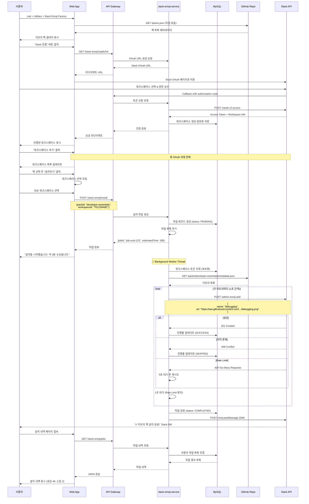

# Slack Emoji Factory - 프로젝트 제안서

## 📋 목차
1. [프로젝트 개요](#프로젝트-개요)
2. [문제 정의](#문제-정의)
3. [솔루션 아키텍처](#솔루션-아키텍처)
4. [GitHub 기반 이모지 저장소](#github-기반-이모지-저장소)
5. [시스템 플로우](#시스템-플로우)
6. [기술 스택](#기술-스택)
7. [구현 계획](#구현-계획)
8. [보안 및 제약사항](#보안-및-제약사항)
9. [확장 가능성](#확장-가능성)

---

## 프로젝트 개요

### 프로젝트명
**Slack Emoji Factory** - 원클릭 슬랙 이모지 팩 설치 서비스

### 핵심 가치
슬랙 워크스페이스에 큐레이션된 이모지 팩을 **한 번의 클릭으로 일괄 설치**할 수 있게 하여, 팀의 커뮤니케이션 문화를 즉시 풍부하게 만드는 서비스

### 타겟 사용자
- **Primary**: 슬랙 워크스페이스 관리자/소유자
- **Secondary**: 팀 리더, 커뮤니티 매니저, 문화 담당자

---

## 문제 정의

### 현재 슬랙의 한계
1. **반복적인 수동 작업**: 이모지를 한 번에 하나씩만 추가 가능
2. **시간 낭비**: 50개 이모지 추가 시 약 10-15분 소요
3. **일관성 부재**: 여러 워크스페이스에 동일한 이모지 세트 배포 어려움
4. **발견의 어려움**: 좋은 이모지 팩을 찾아도 적용이 번거로움

### 해결하고자 하는 핵심 문제
> "좋은 이모지 팩을 발견해도, 실제로 우리 팀에 적용하기까지의 **마찰(friction)**이 너무 크다"

---

## 솔루션 아키텍처

### 핵심 설계 원칙

1. **GitHub as a CDN**: 모든 이모지 이미지는 GitHub Public Repository에 저장
2. **서버리스 우선**: 인프라 관리 최소화
3. **비동기 처리**: Rate Limiting 대응을 위한 백그라운드 작업
4. **독립 서비스**: 기존 시스템과 완전 분리된 마이크로서비스

### 시스템 구성도

```
┌─────────────────────────────────────────────────────────────┐
│                         사용자 Layer                         │
├─────────────────────────────────────────────────────────────┤
│  React Web App  │  Lab > Utilities > Slack Emoji Factory   │
└────────────────┬────────────────────────────────────────────┘
                 │
┌────────────────▼────────────────────────────────────────────┐
│                      API Gateway                            │
└────────────────┬────────────────────────────────────────────┘
                 │
┌────────────────▼────────────────────────────────────────────┐
│              slack-emoji-service (Spring Boot)              │
│  ┌──────────┐  ┌──────────┐  ┌──────────┐  ┌──────────┐   │
│  │  OAuth   │  │   Pack   │  │   Job    │  │  Worker  │   │
│  │ Handler  │  │ Manager  │  │  Queue   │  │  Thread  │   │
│  └──────────┘  └──────────┘  └──────────┘  └──────────┘   │
└───────┬──────────────┬──────────────┬──────────────────────┘
        │              │              │
┌───────▼──────┐ ┌─────▼──────┐ ┌────▼─────────────────────┐
│    MySQL     │ │   GitHub   │ │      Slack API           │
│              │ │ Repository │ │  (OAuth + Emoji Admin)   │
└──────────────┘ └────────────┘ └──────────────────────────┘
```

---

## GitHub 기반 이모지 저장소

### 저장소 구조

```
slack-emoji-packs/                    # GitHub Public Repository
│
├── README.md                         # 저장소 설명 및 기여 가이드
├── packs.json                        # 모든 팩의 메타데이터
│
├── packs/
│   ├── developer-essentials/         # 개발자 필수 팩
│   │   ├── metadata.json            # 팩 정보
│   │   ├── debugging.png            # 128KB 이하
│   │   ├── deploy.gif               
│   │   ├── code-review.png
│   │   └── ...
│   │
│   ├── korean-reactions/            # 한국어 리액션 팩
│   │   ├── metadata.json
│   │   ├── daebak.gif
│   │   ├── fighting.png
│   │   └── ...
│   │
│   └── project-status/               # 프로젝트 상태 팩
│       ├── metadata.json
│       ├── in-progress.png
│       ├── blocked.png
│       ├── completed.png
│       └── ...
│
└── scripts/
    ├── validate.js                   # 이모지 검증 스크립트
    └── optimize.sh                   # 이미지 최적화 스크립트
```

### metadata.json 구조

```json
{
  "id": "developer-essentials",
  "name": "개발자 필수 이모지 팩",
  "description": "개발팀을 위한 필수 이모지 모음",
  "version": "2.0.0",
  "author": "asyncsite",
  "category": "development",
  "tags": ["dev", "programming", "tech"],
  "preview_emojis": ["debugging", "deploy", "code-review"],
  "created_at": "2024-01-15",
  "updated_at": "2024-03-20",
  "emojis": [
    {
      "name": "debugging",
      "filename": "debugging.png",
      "aliases": ["debug", "bug-hunt"],
      "keywords": ["bug", "fix", "debug"]
    },
    {
      "name": "deploy",
      "filename": "deploy.gif",
      "aliases": ["ship", "release"],
      "keywords": ["deployment", "production", "ship"]
    }
  ],
  "stats": {
    "total_emojis": 24,
    "animated_count": 5,
    "total_size_kb": 1847
  }
}
```

### GitHub 활용 전략

1. **Raw URL 직접 사용**
   ```
   https://raw.githubusercontent.com/{username}/slack-emoji-packs/main/packs/developer-essentials/debugging.png
   ```

2. **버전 관리**
   - Git 태그로 팩 버전 관리
   - 이전 버전 롤백 가능

3. **커뮤니티 기여**
   - Pull Request로 새 이모지 제안
   - Issue로 버그 리포트

---

## 시스템 플로우

### 전체 사용자 플로우



### 주요 API 엔드포인트

| Method | Endpoint | 설명 |
|--------|----------|------|
| GET | `/slack-emoji/oauth/init` | OAuth URL 생성 |
| GET | `/slack-emoji/oauth/callback` | OAuth 콜백 처리 |
| GET | `/slack-emoji/workspaces` | 연결된 워크스페이스 목록 |
| POST | `/slack-emoji/workspaces` | 워크스페이스 추가 |
| DELETE | `/slack-emoji/workspaces/{id}` | 워크스페이스 연결 해제 |
| POST | `/slack-emoji/install` | 팩 설치 작업 생성 |
| GET | `/slack-emoji/jobs` | 작업 내역 조회 |
| GET | `/slack-emoji/jobs/{id}` | 특정 작업 상태 조회 |

---

## 기술 스택

### Frontend
- **Framework**: React 19 + TypeScript
- **Routing**: React Router v7
- **State**: Context API
- **Styling**: CSS Modules
- **HTTP**: Fetch API
- **위치**: `/lab/utilities/slack-emoji-factory`

### Backend (slack-emoji-service)
- **Framework**: Spring Boot 3.x
- **Language**: Java 21
- **Database**: MySQL 8.0
- **Queue**: Spring @Async + ThreadPoolExecutor
- **Security**: AES-256 for token encryption
- **HTTP Client**: RestTemplate / WebClient

### Infrastructure
- **Image Storage**: GitHub Public Repository
- **Deployment**: Docker + Kubernetes
- **API Gateway**: 기존 Gateway 활용
- **Monitoring**: Prometheus + Grafana
- **Logging**: ELK Stack

---

## 구현 계획

### Phase 1: MVP (1주)
- [ ] GitHub 저장소 구성
- [ ] 기본 이모지 팩 3개 준비
- [ ] Spring Boot 서비스 스켈레톤
- [ ] OAuth 인증 플로우
- [ ] 단일 이모지 추가 테스트

### Phase 2: 핵심 기능 (1주)
- [ ] 비동기 작업 큐 구현
- [ ] Rate Limiting 대응 로직
- [ ] 프론트엔드 UI 개발
- [ ] 워크스페이스 관리 기능

### Phase 3: 사용자 경험 (3일)
- [ ] 설치 진행률 표시
- [ ] 설치 내역 페이지
- [ ] 에러 핸들링 개선
- [ ] Slack DM 알림

### Phase 4: 최적화 (3일)
- [ ] 이미지 최적화 스크립트
- [ ] 캐싱 전략 구현
- [ ] 모니터링 대시보드
- [ ] 문서화

---

## 보안 및 제약사항

### 보안 고려사항

1. **토큰 관리**
   - AES-256 암호화로 DB 저장
   - 토큰 자동 만료 처리
   - 환경변수로 암호화 키 관리

2. **권한 최소화**
   - `emoji:write` 권한만 요청
   - 워크스페이스별 격리

3. **Rate Limiting 대응**
   - 초당 1개 이모지 추가
   - 429 응답 시 지수 백오프
   - 워크스페이스별 큐 분리

### Slack API 제약사항

| 제약 | 대응 방안 |
|------|----------|
| 파일 크기: 128KB | GitHub 업로드 시 검증 |
| 파일 형식: PNG, JPG, GIF | 메타데이터에 명시 |
| Rate Limit: 분당 20개 | 1초 간격 순차 처리 |
| 이름 중복 불가 | 409 에러 우아하게 처리 |

### 시스템 한계

1. **설치 시간**: 50개 이모지 = 약 1-2분
2. **실시간 피드백 제한**: Polling 방식의 한계
3. **대용량 팩 제한**: 100개 이상 팩은 분할 권장

---

## 확장 가능성

### 단기 확장 (3개월)
1. **팩 마켓플레이스**
   - 사용자 제작 팩 업로드
   - 인기 팩 랭킹
   - 팩 리뷰 및 평점

2. **기업 기능**
   - 조직 전체 일괄 배포
   - 커스텀 기업 팩 관리
   - 사용 통계 대시보드

3. **자동화**
   - 정기 팩 업데이트
   - 신규 입사자 자동 설치
   - Slack 워크플로우 연동

### 장기 비전 (1년)
1. **AI 기능**
   - 텍스트 → 이모지 생성
   - 이모지 추천 엔진
   - 감정 분석 기반 이모지 제안

2. **플랫폼 확장**
   - Discord 지원
   - Microsoft Teams 지원
   - 자체 이모지 생성 도구

3. **수익 모델**
   - 프리미엄 팩 판매
   - 기업 라이선스
   - 커스텀 팩 제작 서비스

---

## 성공 지표

### 핵심 지표 (KPI)
- **MAU**: 월간 활성 사용자 수
- **설치 성공률**: 성공적으로 완료된 설치 비율
- **평균 설치 시간**: 작업 시작부터 완료까지
- **재방문율**: 30일 내 재방문 비율

### 목표 (6개월)
- 1,000개 워크스페이스 연결
- 50,000개 이모지 설치
- 95% 이상 설치 성공률
- 평균 2분 이내 설치 완료

---

## 결론

**Slack Emoji Factory**는 단순하지만 명확한 가치를 제공하는 서비스입니다:

1. **명확한 문제 해결**: 반복적인 수동 작업을 자동화
2. **낮은 기술 부채**: GitHub 기반으로 인프라 부담 최소화
3. **확장 가능한 구조**: 커뮤니티 기여 가능한 오픈 생태계
4. **즉각적인 가치**: 첫 사용부터 시간 절약 체감

이 서비스는 "작지만 확실한 행복"을 제공하며, 팀의 커뮤니케이션 문화를 풍부하게 만드는 데 기여할 것입니다.

---

## 부록

### A. 예상 FAQ

**Q: 왜 WebSocket 대신 Polling을 사용하나요?**
A: 설치 작업이 2-3분 걸리는 긴 작업이라 WebSocket 연결 유지가 불필요합니다. Polling이 더 단순하고 안정적입니다.

**Q: 사용자가 직접 이모지를 업로드할 수 있나요?**
A: MVP에서는 큐레이션된 팩만 제공합니다. 추후 마켓플레이스 기능으로 확장 예정입니다.

**Q: 여러 워크스페이스에 동시 설치가 가능한가요?**
A: 각 워크스페이스별로 별도 인증이 필요하며, Rate Limiting 때문에 순차 처리를 권장합니다.

### B. 기술 참고 문서

- [Slack OAuth 2.0 Guide](https://api.slack.com/authentication/oauth-v2)
- [Slack Admin API - emoji.add](https://api.slack.com/methods/admin.emoji.add)
- [GitHub Raw Content URL](https://docs.github.com/en/repositories/working-with-files/using-files/viewing-a-file#viewing-the-raw-file)
- [Spring Boot Async Processing](https://spring.io/guides/gs/async-method/)

### C. 연락처

- Project Lead: AsyncSite Team
- Repository: https://github.com/asyncsite/slack-emoji-packs
- Email: team@asyncsite.com